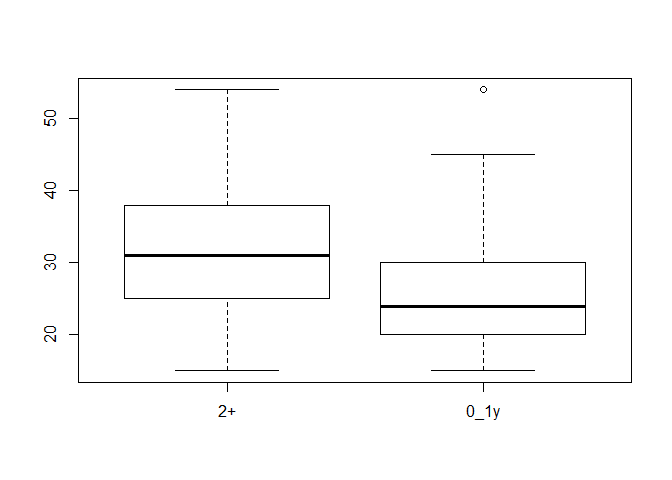

Logistic Analysis Report for ZWE
================
Esteban Correa
November, 2019

    0_1y   2+ 
     506 6679 

    15-19 20-24 25-29 30-34 35-39 40-44 45-49 50-54 55-59 60-64 
     1859  1200   983   944   786   678   438   297     0     0 

    The following `from` values were not present in `x`: 55-59

    15-24 25-34 35-44   45+ 
     3059  1927  1464   735 

    Middle/Richer        Poorer 
             4960          2225 

      No  Yes 
    6290  895 

            No        Yes Don't know       NA's 
          3432       1621          0       2132 

            No        Yes Don't know 
          4895        152          6 

             0          1         10         11         12         13         15 
             0       4036          4          3          1          1          3 
            18          2         20         28          3         30          4 
             1        861          2          1         70          1         29 
             5          6          7          8          9         95 Don't know 
            14          7          1          6          3          1          2 
            99 
             0 

     0_1   2+ 
    4036 1009 

      No  Yes 
    1220 3825 

             1         10         11         12         13         14         15 
           782        216         29         62         19         14        101 
            16         17         18         19          2         20         21 
            17          9         14          1        786         93          7 
            22         23         24         25         26         27         28 
             4          2          8         31          6          3          4 
            29          3         30         31         32         33         35 
             4        876         50          2          4          2          4 
            36         38          4         40         42         44         45 
             2          1        515         21          1          3          5 
            46         48          5         50         52         54         55 
             5          1        495         14          1          1          6 
            56         58         59          6         60         61         62 
             2          1          1        265          9          0          1 
            64         66         67          7         70         76          8 
             1          1          1        191          4          1        141 
            80         88         89          9         90        95+ Don't know 
             6          1          2         39          1         29        127 

             1         10         11         12         13         14         15 
           782        216         29         62         19         14        101 
            16         17         18         19          2         20         21 
            17          9         14          1        786         93          7 
            22         23         24         25         26         27         28 
             4          2          8         31          6          3          4 
            29          3         30         31         32         33         35 
             4        876         50          2          4          2          4 
            36         38          4         40         42         44         45 
             2          1        515         21          1          3          5 
            46         48          5         50         52         54         55 
             5          1        495         14          1          1          6 
            56         58         59          6         60         61         62 
             2          1          1        265          9          0          1 
            64         66         67          7         70         76          8 
             1          1          1        191          4          1        141 
            80         88         89          9         90        95+ Don't know 
             6          1          2         39          1         29        127 

     0_1   2+ 
     782 4136 

    re-encoding from CP1252

               0            1           10           11           12           13 
             806          548          300          154          172          174 
              14           15           16           17           18           19 
             141          271          107          109           88           68 
               2           20           21           22           23           24 
             449           99           62           54           47           47 
              25           26           27           28           29            3 
              41           33           23           33           11          500 
              30           31           32           33           34           35 
              27            6           13           16            6           12 
              36           37           38           39            4           40 
               6            0            2            1          385            7 
              45           46           47           49            5            6 
               1            2            1            0          449          286 
               7            8            9       Always      Visitor Inconsistent 
             302          245          186         2480          199            0 
      Don't know 
               0 

               0            1           10           11           12           13 
             806          548          300          154          172          174 
              14           15           16           17           18           19 
             141          271          107          109           88           68 
               2           20           21           22           23           24 
             449           99           62           54           47           47 
              25           26           27           28           29            3 
              41           33           23           33           11          500 
              30           31           32           33           34           35 
              27            6           13           16            6           12 
              36           37           38           39            4           40 
               6            0            2            1          385            7 
              45           46           47           49            5            6 
               1            2            1            0          449          286 
               7            8            9       Always      Visitor Inconsistent 
             302          245          186         2480          199            0 
      Don't know 
               0 

    0_1y   2+ 
     806 7796 

    15-19 20-24 25-29 30-34 35-39 40-44 45-49 
     1932  1569  1460  1385  1050   712   494 

    The following `from` values were not present in `x`: 50-54, 55-59

    15-24 25-34 35-44   45+ 
     3501  2845  1762   494 

    Middle/Richer        Poorer 
             5998          2604 

      No  Yes 
    7596 1006 

            No        Yes Don't know       NA's 
          4949       1242          0       2411 

            No        Yes Don't know 
          6023        155         13 

             0          1          2          3          4          5         50 
             0       6062         93          8          1          3          3 
             6          8         95 Don't know         99 
             1          1          2          4          0 

     0_1   2+ 
    6062  112 

      No  Yes 
     427 5747 

             1         10         11         12         15         16         19 
          3684         19          3          3          9          2          1 
             2         20         25          3         30         36          4 
          1392         11          0        610          1          0        222 
             5         50          6         65          7          8          9 
           121          3         41          0         18         10          2 
           95+ Don't know 
             6         16 

             1         10         11         12         15         16         19 
          3684         19          3          3          9          2          1 
             2         20         25          3         30         36          4 
          1392         11          0        610          1          0        222 
             5         50          6         65          7          8          9 
           121          3         41          0         18         10          2 
           95+ Don't know 
             6         16 

     0_1   2+ 
    3684 2474 

<!-- -->

     100kms 100kms+   50kms 
         88     221      91 

<!-- -->

      1hr  2hrs 2hrs+ 
      214    96    90 

    [1] "100kms+" "100kms"  "50kms"  

<table class="table table-striped table-hover table-condensed table-responsive" style="width: auto !important; margin-left: auto; margin-right: auto;">
<tbody>
<tr>
<td style="text-align:left;font-weight: bold;">
Observations
</td>
<td style="text-align:right;">
11076
</td>
</tr>
<tr>
<td style="text-align:left;font-weight: bold;">
Dependent variable
</td>
<td style="text-align:right;">
migstatus
</td>
</tr>
<tr>
<td style="text-align:left;font-weight: bold;">
Type
</td>
<td style="text-align:right;">
Survey-weighted generalized linear model
</td>
</tr>
<tr>
<td style="text-align:left;font-weight: bold;">
Family
</td>
<td style="text-align:right;">
quasibinomial
</td>
</tr>
<tr>
<td style="text-align:left;font-weight: bold;">
Link
</td>
<td style="text-align:right;">
logit
</td>
</tr>
</tbody>
</table>
<table class="table table-striped table-hover table-condensed table-responsive" style="width: auto !important; margin-left: auto; margin-right: auto;">
<tbody>
<tr>
<td style="text-align:left;font-weight: bold;">
Pseudo-R² (Cragg-Uhler)
</td>
<td style="text-align:right;">
0.05
</td>
</tr>
<tr>
<td style="text-align:left;font-weight: bold;">
Pseudo-R² (McFadden)
</td>
<td style="text-align:right;">
0.08
</td>
</tr>
<tr>
<td style="text-align:left;font-weight: bold;">
AIC
</td>
<td style="text-align:right;">
NA
</td>
</tr>
</tbody>
</table>
<table class="table table-striped table-hover table-condensed table-responsive" style="width: auto !important; margin-left: auto; margin-right: auto;border-bottom: 0;">
<thead>
<tr>
<th style="text-align:left;">
</th>
<th style="text-align:right;">
exp(Est.)
</th>
<th style="text-align:right;">
2.5%
</th>
<th style="text-align:right;">
97.5%
</th>
<th style="text-align:right;">
t val.
</th>
<th style="text-align:right;">
p
</th>
<th style="text-align:right;">
VIF
</th>
</tr>
</thead>
<tbody>
<tr>
<td style="text-align:left;font-weight: bold;">
(Intercept)
</td>
<td style="text-align:right;">
0.12
</td>
<td style="text-align:right;">
0.07
</td>
<td style="text-align:right;">
0.21
</td>
<td style="text-align:right;">
-7.25
</td>
<td style="text-align:right;">
0.00
</td>
<td style="text-align:right;">
NA
</td>
</tr>
<tr>
<td style="text-align:left;font-weight: bold;">
hivStatushiv+
</td>
<td style="text-align:right;">
1.30
</td>
<td style="text-align:right;">
1.01
</td>
<td style="text-align:right;">
1.67
</td>
<td style="text-align:right;">
2.01
</td>
<td style="text-align:right;">
0.05
</td>
<td style="text-align:right;">
1.32
</td>
</tr>
<tr>
<td style="text-align:left;font-weight: bold;">
sexFemale
</td>
<td style="text-align:right;">
1.37
</td>
<td style="text-align:right;">
1.10
</td>
<td style="text-align:right;">
1.69
</td>
<td style="text-align:right;">
2.87
</td>
<td style="text-align:right;">
0.00
</td>
<td style="text-align:right;">
2.02
</td>
</tr>
<tr>
<td style="text-align:left;font-weight: bold;">
agegroup25-34
</td>
<td style="text-align:right;">
0.41
</td>
<td style="text-align:right;">
0.34
</td>
<td style="text-align:right;">
0.50
</td>
<td style="text-align:right;">
-9.36
</td>
<td style="text-align:right;">
0.00
</td>
<td style="text-align:right;">
2.00
</td>
</tr>
<tr>
<td style="text-align:left;font-weight: bold;">
agegroup35-44
</td>
<td style="text-align:right;">
0.20
</td>
<td style="text-align:right;">
0.15
</td>
<td style="text-align:right;">
0.27
</td>
<td style="text-align:right;">
-11.08
</td>
<td style="text-align:right;">
0.00
</td>
<td style="text-align:right;">
2.00
</td>
</tr>
<tr>
<td style="text-align:left;font-weight: bold;">
agegroup45+
</td>
<td style="text-align:right;">
0.18
</td>
<td style="text-align:right;">
0.11
</td>
<td style="text-align:right;">
0.28
</td>
<td style="text-align:right;">
-7.59
</td>
<td style="text-align:right;">
0.00
</td>
<td style="text-align:right;">
2.00
</td>
</tr>
<tr>
<td style="text-align:left;font-weight: bold;">
educationNo education/Primary
</td>
<td style="text-align:right;">
0.87
</td>
<td style="text-align:right;">
0.56
</td>
<td style="text-align:right;">
1.35
</td>
<td style="text-align:right;">
-0.62
</td>
<td style="text-align:right;">
0.53
</td>
<td style="text-align:right;">
1.84
</td>
</tr>
<tr>
<td style="text-align:left;font-weight: bold;">
educationSecondary
</td>
<td style="text-align:right;">
1.04
</td>
<td style="text-align:right;">
0.72
</td>
<td style="text-align:right;">
1.49
</td>
<td style="text-align:right;">
0.20
</td>
<td style="text-align:right;">
0.84
</td>
<td style="text-align:right;">
1.84
</td>
</tr>
<tr>
<td style="text-align:left;font-weight: bold;">
WealthindexcombinedPoorer
</td>
<td style="text-align:right;">
0.65
</td>
<td style="text-align:right;">
0.50
</td>
<td style="text-align:right;">
0.85
</td>
<td style="text-align:right;">
-3.21
</td>
<td style="text-align:right;">
0.00
</td>
<td style="text-align:right;">
1.56
</td>
</tr>
<tr>
<td style="text-align:left;font-weight: bold;">
healthInsuredYes
</td>
<td style="text-align:right;">
0.67
</td>
<td style="text-align:right;">
0.45
</td>
<td style="text-align:right;">
0.99
</td>
<td style="text-align:right;">
-2.03
</td>
<td style="text-align:right;">
0.04
</td>
<td style="text-align:right;">
1.55
</td>
</tr>
<tr>
<td style="text-align:left;font-weight: bold;">
maritalStatusMarried/Living with partner
</td>
<td style="text-align:right;">
0.77
</td>
<td style="text-align:right;">
0.55
</td>
<td style="text-align:right;">
1.07
</td>
<td style="text-align:right;">
-1.55
</td>
<td style="text-align:right;">
0.12
</td>
<td style="text-align:right;">
3.09
</td>
</tr>
<tr>
<td style="text-align:left;font-weight: bold;">
maritalStatusDivorced/separated
</td>
<td style="text-align:right;">
2.01
</td>
<td style="text-align:right;">
1.44
</td>
<td style="text-align:right;">
2.80
</td>
<td style="text-align:right;">
4.08
</td>
<td style="text-align:right;">
0.00
</td>
<td style="text-align:right;">
3.09
</td>
</tr>
<tr>
<td style="text-align:left;font-weight: bold;">
placeTypeRural
</td>
<td style="text-align:right;">
1.56
</td>
<td style="text-align:right;">
1.16
</td>
<td style="text-align:right;">
2.10
</td>
<td style="text-align:right;">
2.97
</td>
<td style="text-align:right;">
0.00
</td>
<td style="text-align:right;">
2.29
</td>
</tr>
<tr>
<td style="text-align:left;font-weight: bold;">
condomLastTimeYes
</td>
<td style="text-align:right;">
0.82
</td>
<td style="text-align:right;">
0.65
</td>
<td style="text-align:right;">
1.02
</td>
<td style="text-align:right;">
-1.76
</td>
<td style="text-align:right;">
0.08
</td>
<td style="text-align:right;">
1.90
</td>
</tr>
<tr>
<td style="text-align:left;font-weight: bold;">
previousSTIYes
</td>
<td style="text-align:right;">
1.04
</td>
<td style="text-align:right;">
0.62
</td>
<td style="text-align:right;">
1.74
</td>
<td style="text-align:right;">
0.15
</td>
<td style="text-align:right;">
0.88
</td>
<td style="text-align:right;">
1.48
</td>
</tr>
<tr>
<td style="text-align:left;font-weight: bold;">
hivtestedYes
</td>
<td style="text-align:right;">
0.81
</td>
<td style="text-align:right;">
0.60
</td>
<td style="text-align:right;">
1.09
</td>
<td style="text-align:right;">
-1.38
</td>
<td style="text-align:right;">
0.17
</td>
<td style="text-align:right;">
1.63
</td>
</tr>
<tr>
<td style="text-align:left;font-weight: bold;">
sexPartnersLast122+
</td>
<td style="text-align:right;">
1.17
</td>
<td style="text-align:right;">
0.90
</td>
<td style="text-align:right;">
1.52
</td>
<td style="text-align:right;">
1.14
</td>
<td style="text-align:right;">
0.25
</td>
<td style="text-align:right;">
1.32
</td>
</tr>
<tr>
<td style="text-align:left;font-weight: bold;">
lifetimePartners2+
</td>
<td style="text-align:right;">
1.27
</td>
<td style="text-align:right;">
1.04
</td>
<td style="text-align:right;">
1.57
</td>
<td style="text-align:right;">
2.30
</td>
<td style="text-align:right;">
0.02
</td>
<td style="text-align:right;">
1.56
</td>
</tr>
<tr>
<td style="text-align:left;font-weight: bold;">
Distance2Borders100kms
</td>
<td style="text-align:right;">
0.65
</td>
<td style="text-align:right;">
0.50
</td>
<td style="text-align:right;">
0.86
</td>
<td style="text-align:right;">
-3.05
</td>
<td style="text-align:right;">
0.00
</td>
<td style="text-align:right;">
1.56
</td>
</tr>
<tr>
<td style="text-align:left;font-weight: bold;">
Distance2Borders50kms
</td>
<td style="text-align:right;">
0.96
</td>
<td style="text-align:right;">
0.75
</td>
<td style="text-align:right;">
1.22
</td>
<td style="text-align:right;">
-0.33
</td>
<td style="text-align:right;">
0.74
</td>
<td style="text-align:right;">
1.56
</td>
</tr>
<tr>
<td style="text-align:left;font-weight: bold;">
TravelTimes2hrs
</td>
<td style="text-align:right;">
1.11
</td>
<td style="text-align:right;">
0.84
</td>
<td style="text-align:right;">
1.47
</td>
<td style="text-align:right;">
0.75
</td>
<td style="text-align:right;">
0.45
</td>
<td style="text-align:right;">
2.13
</td>
</tr>
<tr>
<td style="text-align:left;font-weight: bold;">
TravelTimes1hr
</td>
<td style="text-align:right;">
1.48
</td>
<td style="text-align:right;">
1.08
</td>
<td style="text-align:right;">
2.04
</td>
<td style="text-align:right;">
2.41
</td>
<td style="text-align:right;">
0.02
</td>
<td style="text-align:right;">
2.13
</td>
</tr>
</tbody>
<tfoot>
<tr>
<td style="padding: 0; " colspan="100%">
 Standard errors: Robust
</td>
</tr>
</tfoot>
</table>
<table class="table table-striped table-hover table-condensed table-responsive" style="width: auto !important; margin-left: auto; margin-right: auto;">
<tbody>
<tr>
<td style="text-align:left;font-weight: bold;">
Observations
</td>
<td style="text-align:right;">
10994
</td>
</tr>
<tr>
<td style="text-align:left;font-weight: bold;">
Dependent variable
</td>
<td style="text-align:right;">
migstatus
</td>
</tr>
<tr>
<td style="text-align:left;font-weight: bold;">
Type
</td>
<td style="text-align:right;">
Survey-weighted generalized linear model
</td>
</tr>
<tr>
<td style="text-align:left;font-weight: bold;">
Family
</td>
<td style="text-align:right;">
quasibinomial
</td>
</tr>
<tr>
<td style="text-align:left;font-weight: bold;">
Link
</td>
<td style="text-align:right;">
logit
</td>
</tr>
</tbody>
</table>
<table class="table table-striped table-hover table-condensed table-responsive" style="width: auto !important; margin-left: auto; margin-right: auto;">
<tbody>
<tr>
<td style="text-align:left;font-weight: bold;">
Pseudo-R² (Cragg-Uhler)
</td>
<td style="text-align:right;">
0.05
</td>
</tr>
<tr>
<td style="text-align:left;font-weight: bold;">
Pseudo-R² (McFadden)
</td>
<td style="text-align:right;">
0.08
</td>
</tr>
<tr>
<td style="text-align:left;font-weight: bold;">
AIC
</td>
<td style="text-align:right;">
NA
</td>
</tr>
</tbody>
</table>
<table class="table table-striped table-hover table-condensed table-responsive" style="width: auto !important; margin-left: auto; margin-right: auto;border-bottom: 0;">
<thead>
<tr>
<th style="text-align:left;">
</th>
<th style="text-align:right;">
exp(Est.)
</th>
<th style="text-align:right;">
2.5%
</th>
<th style="text-align:right;">
97.5%
</th>
<th style="text-align:right;">
t val.
</th>
<th style="text-align:right;">
p
</th>
<th style="text-align:right;">
VIF
</th>
</tr>
</thead>
<tbody>
<tr>
<td style="text-align:left;font-weight: bold;">
(Intercept)
</td>
<td style="text-align:right;">
0.12
</td>
<td style="text-align:right;">
0.06
</td>
<td style="text-align:right;">
0.21
</td>
<td style="text-align:right;">
-7.25
</td>
<td style="text-align:right;">
0.00
</td>
<td style="text-align:right;">
NA
</td>
</tr>
<tr>
<td style="text-align:left;font-weight: bold;">
hivStatushiv+
</td>
<td style="text-align:right;">
1.28
</td>
<td style="text-align:right;">
0.99
</td>
<td style="text-align:right;">
1.65
</td>
<td style="text-align:right;">
1.87
</td>
<td style="text-align:right;">
0.06
</td>
<td style="text-align:right;">
1.32
</td>
</tr>
<tr>
<td style="text-align:left;font-weight: bold;">
sexFemale
</td>
<td style="text-align:right;">
1.40
</td>
<td style="text-align:right;">
1.13
</td>
<td style="text-align:right;">
1.74
</td>
<td style="text-align:right;">
3.09
</td>
<td style="text-align:right;">
0.00
</td>
<td style="text-align:right;">
2.03
</td>
</tr>
<tr>
<td style="text-align:left;font-weight: bold;">
agegroup25-34
</td>
<td style="text-align:right;">
0.42
</td>
<td style="text-align:right;">
0.34
</td>
<td style="text-align:right;">
0.50
</td>
<td style="text-align:right;">
-9.18
</td>
<td style="text-align:right;">
0.00
</td>
<td style="text-align:right;">
1.99
</td>
</tr>
<tr>
<td style="text-align:left;font-weight: bold;">
agegroup35-44
</td>
<td style="text-align:right;">
0.20
</td>
<td style="text-align:right;">
0.15
</td>
<td style="text-align:right;">
0.27
</td>
<td style="text-align:right;">
-10.99
</td>
<td style="text-align:right;">
0.00
</td>
<td style="text-align:right;">
1.99
</td>
</tr>
<tr>
<td style="text-align:left;font-weight: bold;">
agegroup45+
</td>
<td style="text-align:right;">
0.18
</td>
<td style="text-align:right;">
0.12
</td>
<td style="text-align:right;">
0.29
</td>
<td style="text-align:right;">
-7.40
</td>
<td style="text-align:right;">
0.00
</td>
<td style="text-align:right;">
1.99
</td>
</tr>
<tr>
<td style="text-align:left;font-weight: bold;">
educationNo education/Primary
</td>
<td style="text-align:right;">
0.89
</td>
<td style="text-align:right;">
0.56
</td>
<td style="text-align:right;">
1.40
</td>
<td style="text-align:right;">
-0.52
</td>
<td style="text-align:right;">
0.60
</td>
<td style="text-align:right;">
1.84
</td>
</tr>
<tr>
<td style="text-align:left;font-weight: bold;">
educationSecondary
</td>
<td style="text-align:right;">
1.07
</td>
<td style="text-align:right;">
0.74
</td>
<td style="text-align:right;">
1.56
</td>
<td style="text-align:right;">
0.36
</td>
<td style="text-align:right;">
0.72
</td>
<td style="text-align:right;">
1.84
</td>
</tr>
<tr>
<td style="text-align:left;font-weight: bold;">
WealthindexcombinedPoorer
</td>
<td style="text-align:right;">
0.66
</td>
<td style="text-align:right;">
0.51
</td>
<td style="text-align:right;">
0.86
</td>
<td style="text-align:right;">
-3.08
</td>
<td style="text-align:right;">
0.00
</td>
<td style="text-align:right;">
1.59
</td>
</tr>
<tr>
<td style="text-align:left;font-weight: bold;">
healthInsuredYes
</td>
<td style="text-align:right;">
0.66
</td>
<td style="text-align:right;">
0.44
</td>
<td style="text-align:right;">
0.98
</td>
<td style="text-align:right;">
-2.04
</td>
<td style="text-align:right;">
0.04
</td>
<td style="text-align:right;">
1.52
</td>
</tr>
<tr>
<td style="text-align:left;font-weight: bold;">
maritalStatusMarried/Living with partner
</td>
<td style="text-align:right;">
0.76
</td>
<td style="text-align:right;">
0.54
</td>
<td style="text-align:right;">
1.07
</td>
<td style="text-align:right;">
-1.59
</td>
<td style="text-align:right;">
0.11
</td>
<td style="text-align:right;">
3.04
</td>
</tr>
<tr>
<td style="text-align:left;font-weight: bold;">
maritalStatusDivorced/separated
</td>
<td style="text-align:right;">
1.95
</td>
<td style="text-align:right;">
1.39
</td>
<td style="text-align:right;">
2.73
</td>
<td style="text-align:right;">
3.90
</td>
<td style="text-align:right;">
0.00
</td>
<td style="text-align:right;">
3.04
</td>
</tr>
<tr>
<td style="text-align:left;font-weight: bold;">
placeTypeRural
</td>
<td style="text-align:right;">
1.55
</td>
<td style="text-align:right;">
1.15
</td>
<td style="text-align:right;">
2.10
</td>
<td style="text-align:right;">
2.87
</td>
<td style="text-align:right;">
0.00
</td>
<td style="text-align:right;">
2.32
</td>
</tr>
<tr>
<td style="text-align:left;font-weight: bold;">
condomLastTimeYes
</td>
<td style="text-align:right;">
0.81
</td>
<td style="text-align:right;">
0.64
</td>
<td style="text-align:right;">
1.01
</td>
<td style="text-align:right;">
-1.85
</td>
<td style="text-align:right;">
0.07
</td>
<td style="text-align:right;">
1.93
</td>
</tr>
<tr>
<td style="text-align:left;font-weight: bold;">
previousSTIYes
</td>
<td style="text-align:right;">
1.08
</td>
<td style="text-align:right;">
0.65
</td>
<td style="text-align:right;">
1.79
</td>
<td style="text-align:right;">
0.28
</td>
<td style="text-align:right;">
0.78
</td>
<td style="text-align:right;">
1.44
</td>
</tr>
<tr>
<td style="text-align:left;font-weight: bold;">
hivtestedYes
</td>
<td style="text-align:right;">
0.81
</td>
<td style="text-align:right;">
0.60
</td>
<td style="text-align:right;">
1.09
</td>
<td style="text-align:right;">
-1.39
</td>
<td style="text-align:right;">
0.17
</td>
<td style="text-align:right;">
1.66
</td>
</tr>
<tr>
<td style="text-align:left;font-weight: bold;">
sexPartnersLast122+
</td>
<td style="text-align:right;">
1.17
</td>
<td style="text-align:right;">
0.89
</td>
<td style="text-align:right;">
1.52
</td>
<td style="text-align:right;">
1.13
</td>
<td style="text-align:right;">
0.26
</td>
<td style="text-align:right;">
1.35
</td>
</tr>
<tr>
<td style="text-align:left;font-weight: bold;">
lifetimePartners2+
</td>
<td style="text-align:right;">
1.28
</td>
<td style="text-align:right;">
1.04
</td>
<td style="text-align:right;">
1.58
</td>
<td style="text-align:right;">
2.34
</td>
<td style="text-align:right;">
0.02
</td>
<td style="text-align:right;">
1.51
</td>
</tr>
<tr>
<td style="text-align:left;font-weight: bold;">
Distance2Borders100kms
</td>
<td style="text-align:right;">
0.64
</td>
<td style="text-align:right;">
0.48
</td>
<td style="text-align:right;">
0.84
</td>
<td style="text-align:right;">
-3.18
</td>
<td style="text-align:right;">
0.00
</td>
<td style="text-align:right;">
1.55
</td>
</tr>
<tr>
<td style="text-align:left;font-weight: bold;">
Distance2Borders50kms
</td>
<td style="text-align:right;">
0.95
</td>
<td style="text-align:right;">
0.74
</td>
<td style="text-align:right;">
1.21
</td>
<td style="text-align:right;">
-0.45
</td>
<td style="text-align:right;">
0.65
</td>
<td style="text-align:right;">
1.55
</td>
</tr>
<tr>
<td style="text-align:left;font-weight: bold;">
TravelTimes2hrs
</td>
<td style="text-align:right;">
1.11
</td>
<td style="text-align:right;">
0.84
</td>
<td style="text-align:right;">
1.48
</td>
<td style="text-align:right;">
0.73
</td>
<td style="text-align:right;">
0.47
</td>
<td style="text-align:right;">
2.18
</td>
</tr>
<tr>
<td style="text-align:left;font-weight: bold;">
TravelTimes1hr
</td>
<td style="text-align:right;">
1.49
</td>
<td style="text-align:right;">
1.08
</td>
<td style="text-align:right;">
2.07
</td>
<td style="text-align:right;">
2.40
</td>
<td style="text-align:right;">
0.02
</td>
<td style="text-align:right;">
2.18
</td>
</tr>
</tbody>
<tfoot>
<tr>
<td style="padding: 0; " colspan="100%">
 Standard errors: Robust
</td>
</tr>
</tfoot>
</table>

## Unadjusted

<table class="table table-striped table-hover table-condensed table-responsive" style="width: auto !important; margin-left: auto; margin-right: auto;">
<tbody>
<tr>
<td style="text-align:left;font-weight: bold;">
Observations
</td>
<td style="text-align:right;">
11076
</td>
</tr>
<tr>
<td style="text-align:left;font-weight: bold;">
Dependent variable
</td>
<td style="text-align:right;">
migstatus
</td>
</tr>
<tr>
<td style="text-align:left;font-weight: bold;">
Type
</td>
<td style="text-align:right;">
Survey-weighted generalized linear model
</td>
</tr>
<tr>
<td style="text-align:left;font-weight: bold;">
Family
</td>
<td style="text-align:right;">
quasibinomial
</td>
</tr>
<tr>
<td style="text-align:left;font-weight: bold;">
Link
</td>
<td style="text-align:right;">
logit
</td>
</tr>
</tbody>
</table>
<table class="table table-striped table-hover table-condensed table-responsive" style="width: auto !important; margin-left: auto; margin-right: auto;">
<tbody>
<tr>
<td style="text-align:left;font-weight: bold;">
Pseudo-R² (Cragg-Uhler)
</td>
<td style="text-align:right;">
0.00
</td>
</tr>
<tr>
<td style="text-align:left;font-weight: bold;">
Pseudo-R² (McFadden)
</td>
<td style="text-align:right;">
0.00
</td>
</tr>
<tr>
<td style="text-align:left;font-weight: bold;">
AIC
</td>
<td style="text-align:right;">
NA
</td>
</tr>
</tbody>
</table>
<table class="table table-striped table-hover table-condensed table-responsive" style="width: auto !important; margin-left: auto; margin-right: auto;border-bottom: 0;">
<thead>
<tr>
<th style="text-align:left;">
</th>
<th style="text-align:right;">
exp(Est.)
</th>
<th style="text-align:right;">
2.5%
</th>
<th style="text-align:right;">
97.5%
</th>
<th style="text-align:right;">
t val.
</th>
<th style="text-align:right;">
p
</th>
</tr>
</thead>
<tbody>
<tr>
<td style="text-align:left;font-weight: bold;">
(Intercept)
</td>
<td style="text-align:right;">
0.08
</td>
<td style="text-align:right;">
0.07
</td>
<td style="text-align:right;">
0.09
</td>
<td style="text-align:right;">
-40.32
</td>
<td style="text-align:right;">
0.00
</td>
</tr>
<tr>
<td style="text-align:left;font-weight: bold;">
hivStatushiv+
</td>
<td style="text-align:right;">
1.05
</td>
<td style="text-align:right;">
0.84
</td>
<td style="text-align:right;">
1.31
</td>
<td style="text-align:right;">
0.43
</td>
<td style="text-align:right;">
0.67
</td>
</tr>
</tbody>
<tfoot>
<tr>
<td style="padding: 0; " colspan="100%">
 Standard errors: Robust
</td>
</tr>
</tfoot>
</table>
<table class="table table-striped table-hover table-condensed table-responsive" style="width: auto !important; margin-left: auto; margin-right: auto;">
<tbody>
<tr>
<td style="text-align:left;font-weight: bold;">
Observations
</td>
<td style="text-align:right;">
11076
</td>
</tr>
<tr>
<td style="text-align:left;font-weight: bold;">
Dependent variable
</td>
<td style="text-align:right;">
migstatus
</td>
</tr>
<tr>
<td style="text-align:left;font-weight: bold;">
Type
</td>
<td style="text-align:right;">
Survey-weighted generalized linear model
</td>
</tr>
<tr>
<td style="text-align:left;font-weight: bold;">
Family
</td>
<td style="text-align:right;">
quasibinomial
</td>
</tr>
<tr>
<td style="text-align:left;font-weight: bold;">
Link
</td>
<td style="text-align:right;">
logit
</td>
</tr>
</tbody>
</table>
<table class="table table-striped table-hover table-condensed table-responsive" style="width: auto !important; margin-left: auto; margin-right: auto;">
<tbody>
<tr>
<td style="text-align:left;font-weight: bold;">
Pseudo-R² (Cragg-Uhler)
</td>
<td style="text-align:right;">
0.00
</td>
</tr>
<tr>
<td style="text-align:left;font-weight: bold;">
Pseudo-R² (McFadden)
</td>
<td style="text-align:right;">
0.00
</td>
</tr>
<tr>
<td style="text-align:left;font-weight: bold;">
AIC
</td>
<td style="text-align:right;">
NA
</td>
</tr>
</tbody>
</table>
<table class="table table-striped table-hover table-condensed table-responsive" style="width: auto !important; margin-left: auto; margin-right: auto;border-bottom: 0;">
<thead>
<tr>
<th style="text-align:left;">
</th>
<th style="text-align:right;">
exp(Est.)
</th>
<th style="text-align:right;">
2.5%
</th>
<th style="text-align:right;">
97.5%
</th>
<th style="text-align:right;">
t val.
</th>
<th style="text-align:right;">
p
</th>
</tr>
</thead>
<tbody>
<tr>
<td style="text-align:left;font-weight: bold;">
(Intercept)
</td>
<td style="text-align:right;">
0.07
</td>
<td style="text-align:right;">
0.06
</td>
<td style="text-align:right;">
0.08
</td>
<td style="text-align:right;">
-34.45
</td>
<td style="text-align:right;">
0.00
</td>
</tr>
<tr>
<td style="text-align:left;font-weight: bold;">
sexFemale
</td>
<td style="text-align:right;">
1.28
</td>
<td style="text-align:right;">
1.09
</td>
<td style="text-align:right;">
1.51
</td>
<td style="text-align:right;">
2.97
</td>
<td style="text-align:right;">
0.00
</td>
</tr>
</tbody>
<tfoot>
<tr>
<td style="padding: 0; " colspan="100%">
 Standard errors: Robust
</td>
</tr>
</tfoot>
</table>
<table class="table table-striped table-hover table-condensed table-responsive" style="width: auto !important; margin-left: auto; margin-right: auto;">
<tbody>
<tr>
<td style="text-align:left;font-weight: bold;">
Observations
</td>
<td style="text-align:right;">
11076
</td>
</tr>
<tr>
<td style="text-align:left;font-weight: bold;">
Dependent variable
</td>
<td style="text-align:right;">
migstatus
</td>
</tr>
<tr>
<td style="text-align:left;font-weight: bold;">
Type
</td>
<td style="text-align:right;">
Survey-weighted generalized linear model
</td>
</tr>
<tr>
<td style="text-align:left;font-weight: bold;">
Family
</td>
<td style="text-align:right;">
quasibinomial
</td>
</tr>
<tr>
<td style="text-align:left;font-weight: bold;">
Link
</td>
<td style="text-align:right;">
logit
</td>
</tr>
</tbody>
</table>
<table class="table table-striped table-hover table-condensed table-responsive" style="width: auto !important; margin-left: auto; margin-right: auto;">
<tbody>
<tr>
<td style="text-align:left;font-weight: bold;">
Pseudo-R² (Cragg-Uhler)
</td>
<td style="text-align:right;">
0.03
</td>
</tr>
<tr>
<td style="text-align:left;font-weight: bold;">
Pseudo-R² (McFadden)
</td>
<td style="text-align:right;">
0.05
</td>
</tr>
<tr>
<td style="text-align:left;font-weight: bold;">
AIC
</td>
<td style="text-align:right;">
NA
</td>
</tr>
</tbody>
</table>
<table class="table table-striped table-hover table-condensed table-responsive" style="width: auto !important; margin-left: auto; margin-right: auto;border-bottom: 0;">
<thead>
<tr>
<th style="text-align:left;">
</th>
<th style="text-align:right;">
exp(Est.)
</th>
<th style="text-align:right;">
2.5%
</th>
<th style="text-align:right;">
97.5%
</th>
<th style="text-align:right;">
t val.
</th>
<th style="text-align:right;">
p
</th>
</tr>
</thead>
<tbody>
<tr>
<td style="text-align:left;font-weight: bold;">
(Intercept)
</td>
<td style="text-align:right;">
0.16
</td>
<td style="text-align:right;">
0.14
</td>
<td style="text-align:right;">
0.19
</td>
<td style="text-align:right;">
-26.56
</td>
<td style="text-align:right;">
0.00
</td>
</tr>
<tr>
<td style="text-align:left;font-weight: bold;">
agegroup25-34
</td>
<td style="text-align:right;">
0.41
</td>
<td style="text-align:right;">
0.34
</td>
<td style="text-align:right;">
0.49
</td>
<td style="text-align:right;">
-9.67
</td>
<td style="text-align:right;">
0.00
</td>
</tr>
<tr>
<td style="text-align:left;font-weight: bold;">
agegroup35-44
</td>
<td style="text-align:right;">
0.20
</td>
<td style="text-align:right;">
0.16
</td>
<td style="text-align:right;">
0.26
</td>
<td style="text-align:right;">
-12.40
</td>
<td style="text-align:right;">
0.00
</td>
</tr>
<tr>
<td style="text-align:left;font-weight: bold;">
agegroup45+
</td>
<td style="text-align:right;">
0.17
</td>
<td style="text-align:right;">
0.11
</td>
<td style="text-align:right;">
0.26
</td>
<td style="text-align:right;">
-8.32
</td>
<td style="text-align:right;">
0.00
</td>
</tr>
</tbody>
<tfoot>
<tr>
<td style="padding: 0; " colspan="100%">
 Standard errors: Robust
</td>
</tr>
</tfoot>
</table>
<table class="table table-striped table-hover table-condensed table-responsive" style="width: auto !important; margin-left: auto; margin-right: auto;">
<tbody>
<tr>
<td style="text-align:left;font-weight: bold;">
Observations
</td>
<td style="text-align:right;">
11076
</td>
</tr>
<tr>
<td style="text-align:left;font-weight: bold;">
Dependent variable
</td>
<td style="text-align:right;">
migstatus
</td>
</tr>
<tr>
<td style="text-align:left;font-weight: bold;">
Type
</td>
<td style="text-align:right;">
Survey-weighted generalized linear model
</td>
</tr>
<tr>
<td style="text-align:left;font-weight: bold;">
Family
</td>
<td style="text-align:right;">
quasibinomial
</td>
</tr>
<tr>
<td style="text-align:left;font-weight: bold;">
Link
</td>
<td style="text-align:right;">
logit
</td>
</tr>
</tbody>
</table>
<table class="table table-striped table-hover table-condensed table-responsive" style="width: auto !important; margin-left: auto; margin-right: auto;">
<tbody>
<tr>
<td style="text-align:left;font-weight: bold;">
Pseudo-R² (Cragg-Uhler)
</td>
<td style="text-align:right;">
0.00
</td>
</tr>
<tr>
<td style="text-align:left;font-weight: bold;">
Pseudo-R² (McFadden)
</td>
<td style="text-align:right;">
0.00
</td>
</tr>
<tr>
<td style="text-align:left;font-weight: bold;">
AIC
</td>
<td style="text-align:right;">
NA
</td>
</tr>
</tbody>
</table>
<table class="table table-striped table-hover table-condensed table-responsive" style="width: auto !important; margin-left: auto; margin-right: auto;border-bottom: 0;">
<thead>
<tr>
<th style="text-align:left;">
</th>
<th style="text-align:right;">
exp(Est.)
</th>
<th style="text-align:right;">
2.5%
</th>
<th style="text-align:right;">
97.5%
</th>
<th style="text-align:right;">
t val.
</th>
<th style="text-align:right;">
p
</th>
</tr>
</thead>
<tbody>
<tr>
<td style="text-align:left;font-weight: bold;">
(Intercept)
</td>
<td style="text-align:right;">
0.05
</td>
<td style="text-align:right;">
0.04
</td>
<td style="text-align:right;">
0.07
</td>
<td style="text-align:right;">
-18.97
</td>
<td style="text-align:right;">
0.00
</td>
</tr>
<tr>
<td style="text-align:left;font-weight: bold;">
educationNo education/Primary
</td>
<td style="text-align:right;">
1.37
</td>
<td style="text-align:right;">
0.96
</td>
<td style="text-align:right;">
1.97
</td>
<td style="text-align:right;">
1.72
</td>
<td style="text-align:right;">
0.09
</td>
</tr>
<tr>
<td style="text-align:left;font-weight: bold;">
educationSecondary
</td>
<td style="text-align:right;">
1.78
</td>
<td style="text-align:right;">
1.31
</td>
<td style="text-align:right;">
2.42
</td>
<td style="text-align:right;">
3.70
</td>
<td style="text-align:right;">
0.00
</td>
</tr>
</tbody>
<tfoot>
<tr>
<td style="padding: 0; " colspan="100%">
 Standard errors: Robust
</td>
</tr>
</tfoot>
</table>
<table class="table table-striped table-hover table-condensed table-responsive" style="width: auto !important; margin-left: auto; margin-right: auto;">
<tbody>
<tr>
<td style="text-align:left;font-weight: bold;">
Observations
</td>
<td style="text-align:right;">
11076
</td>
</tr>
<tr>
<td style="text-align:left;font-weight: bold;">
Dependent variable
</td>
<td style="text-align:right;">
migstatus
</td>
</tr>
<tr>
<td style="text-align:left;font-weight: bold;">
Type
</td>
<td style="text-align:right;">
Survey-weighted generalized linear model
</td>
</tr>
<tr>
<td style="text-align:left;font-weight: bold;">
Family
</td>
<td style="text-align:right;">
quasibinomial
</td>
</tr>
<tr>
<td style="text-align:left;font-weight: bold;">
Link
</td>
<td style="text-align:right;">
logit
</td>
</tr>
</tbody>
</table>
<table class="table table-striped table-hover table-condensed table-responsive" style="width: auto !important; margin-left: auto; margin-right: auto;">
<tbody>
<tr>
<td style="text-align:left;font-weight: bold;">
Pseudo-R² (Cragg-Uhler)
</td>
<td style="text-align:right;">
0.00
</td>
</tr>
<tr>
<td style="text-align:left;font-weight: bold;">
Pseudo-R² (McFadden)
</td>
<td style="text-align:right;">
0.00
</td>
</tr>
<tr>
<td style="text-align:left;font-weight: bold;">
AIC
</td>
<td style="text-align:right;">
NA
</td>
</tr>
</tbody>
</table>
<table class="table table-striped table-hover table-condensed table-responsive" style="width: auto !important; margin-left: auto; margin-right: auto;border-bottom: 0;">
<thead>
<tr>
<th style="text-align:left;">
</th>
<th style="text-align:right;">
exp(Est.)
</th>
<th style="text-align:right;">
2.5%
</th>
<th style="text-align:right;">
97.5%
</th>
<th style="text-align:right;">
t val.
</th>
<th style="text-align:right;">
p
</th>
</tr>
</thead>
<tbody>
<tr>
<td style="text-align:left;font-weight: bold;">
(Intercept)
</td>
<td style="text-align:right;">
0.09
</td>
<td style="text-align:right;">
0.08
</td>
<td style="text-align:right;">
0.10
</td>
<td style="text-align:right;">
-34.27
</td>
<td style="text-align:right;">
0.00
</td>
</tr>
<tr>
<td style="text-align:left;font-weight: bold;">
WealthindexcombinedPoorer
</td>
<td style="text-align:right;">
0.70
</td>
<td style="text-align:right;">
0.55
</td>
<td style="text-align:right;">
0.88
</td>
<td style="text-align:right;">
-3.10
</td>
<td style="text-align:right;">
0.00
</td>
</tr>
</tbody>
<tfoot>
<tr>
<td style="padding: 0; " colspan="100%">
 Standard errors: Robust
</td>
</tr>
</tfoot>
</table>
<table class="table table-striped table-hover table-condensed table-responsive" style="width: auto !important; margin-left: auto; margin-right: auto;">
<tbody>
<tr>
<td style="text-align:left;font-weight: bold;">
Observations
</td>
<td style="text-align:right;">
11076
</td>
</tr>
<tr>
<td style="text-align:left;font-weight: bold;">
Dependent variable
</td>
<td style="text-align:right;">
migstatus
</td>
</tr>
<tr>
<td style="text-align:left;font-weight: bold;">
Type
</td>
<td style="text-align:right;">
Survey-weighted generalized linear model
</td>
</tr>
<tr>
<td style="text-align:left;font-weight: bold;">
Family
</td>
<td style="text-align:right;">
quasibinomial
</td>
</tr>
<tr>
<td style="text-align:left;font-weight: bold;">
Link
</td>
<td style="text-align:right;">
logit
</td>
</tr>
</tbody>
</table>
<table class="table table-striped table-hover table-condensed table-responsive" style="width: auto !important; margin-left: auto; margin-right: auto;">
<tbody>
<tr>
<td style="text-align:left;font-weight: bold;">
Pseudo-R² (Cragg-Uhler)
</td>
<td style="text-align:right;">
0.00
</td>
</tr>
<tr>
<td style="text-align:left;font-weight: bold;">
Pseudo-R² (McFadden)
</td>
<td style="text-align:right;">
0.00
</td>
</tr>
<tr>
<td style="text-align:left;font-weight: bold;">
AIC
</td>
<td style="text-align:right;">
NA
</td>
</tr>
</tbody>
</table>
<table class="table table-striped table-hover table-condensed table-responsive" style="width: auto !important; margin-left: auto; margin-right: auto;border-bottom: 0;">
<thead>
<tr>
<th style="text-align:left;">
</th>
<th style="text-align:right;">
exp(Est.)
</th>
<th style="text-align:right;">
2.5%
</th>
<th style="text-align:right;">
97.5%
</th>
<th style="text-align:right;">
t val.
</th>
<th style="text-align:right;">
p
</th>
</tr>
</thead>
<tbody>
<tr>
<td style="text-align:left;font-weight: bold;">
(Intercept)
</td>
<td style="text-align:right;">
0.08
</td>
<td style="text-align:right;">
0.07
</td>
<td style="text-align:right;">
0.09
</td>
<td style="text-align:right;">
-41.51
</td>
<td style="text-align:right;">
0.00
</td>
</tr>
<tr>
<td style="text-align:left;font-weight: bold;">
healthInsuredYes
</td>
<td style="text-align:right;">
0.53
</td>
<td style="text-align:right;">
0.38
</td>
<td style="text-align:right;">
0.74
</td>
<td style="text-align:right;">
-3.69
</td>
<td style="text-align:right;">
0.00
</td>
</tr>
</tbody>
<tfoot>
<tr>
<td style="padding: 0; " colspan="100%">
 Standard errors: Robust
</td>
</tr>
</tfoot>
</table>
<table class="table table-striped table-hover table-condensed table-responsive" style="width: auto !important; margin-left: auto; margin-right: auto;">
<tbody>
<tr>
<td style="text-align:left;font-weight: bold;">
Observations
</td>
<td style="text-align:right;">
11076
</td>
</tr>
<tr>
<td style="text-align:left;font-weight: bold;">
Dependent variable
</td>
<td style="text-align:right;">
migstatus
</td>
</tr>
<tr>
<td style="text-align:left;font-weight: bold;">
Type
</td>
<td style="text-align:right;">
Survey-weighted generalized linear model
</td>
</tr>
<tr>
<td style="text-align:left;font-weight: bold;">
Family
</td>
<td style="text-align:right;">
quasibinomial
</td>
</tr>
<tr>
<td style="text-align:left;font-weight: bold;">
Link
</td>
<td style="text-align:right;">
logit
</td>
</tr>
</tbody>
</table>
<table class="table table-striped table-hover table-condensed table-responsive" style="width: auto !important; margin-left: auto; margin-right: auto;">
<tbody>
<tr>
<td style="text-align:left;font-weight: bold;">
Pseudo-R² (Cragg-Uhler)
</td>
<td style="text-align:right;">
0.01
</td>
</tr>
<tr>
<td style="text-align:left;font-weight: bold;">
Pseudo-R² (McFadden)
</td>
<td style="text-align:right;">
0.02
</td>
</tr>
<tr>
<td style="text-align:left;font-weight: bold;">
AIC
</td>
<td style="text-align:right;">
NA
</td>
</tr>
</tbody>
</table>
<table class="table table-striped table-hover table-condensed table-responsive" style="width: auto !important; margin-left: auto; margin-right: auto;border-bottom: 0;">
<thead>
<tr>
<th style="text-align:left;">
</th>
<th style="text-align:right;">
exp(Est.)
</th>
<th style="text-align:right;">
2.5%
</th>
<th style="text-align:right;">
97.5%
</th>
<th style="text-align:right;">
t val.
</th>
<th style="text-align:right;">
p
</th>
</tr>
</thead>
<tbody>
<tr>
<td style="text-align:left;font-weight: bold;">
(Intercept)
</td>
<td style="text-align:right;">
0.14
</td>
<td style="text-align:right;">
0.11
</td>
<td style="text-align:right;">
0.17
</td>
<td style="text-align:right;">
-18.22
</td>
<td style="text-align:right;">
0.00
</td>
</tr>
<tr>
<td style="text-align:left;font-weight: bold;">
maritalStatusMarried/Living with partner
</td>
<td style="text-align:right;">
0.44
</td>
<td style="text-align:right;">
0.34
</td>
<td style="text-align:right;">
0.56
</td>
<td style="text-align:right;">
-6.65
</td>
<td style="text-align:right;">
0.00
</td>
</tr>
<tr>
<td style="text-align:left;font-weight: bold;">
maritalStatusDivorced/separated
</td>
<td style="text-align:right;">
1.29
</td>
<td style="text-align:right;">
0.99
</td>
<td style="text-align:right;">
1.68
</td>
<td style="text-align:right;">
1.92
</td>
<td style="text-align:right;">
0.06
</td>
</tr>
</tbody>
<tfoot>
<tr>
<td style="padding: 0; " colspan="100%">
 Standard errors: Robust
</td>
</tr>
</tfoot>
</table>
<table class="table table-striped table-hover table-condensed table-responsive" style="width: auto !important; margin-left: auto; margin-right: auto;">
<tbody>
<tr>
<td style="text-align:left;font-weight: bold;">
Observations
</td>
<td style="text-align:right;">
11076
</td>
</tr>
<tr>
<td style="text-align:left;font-weight: bold;">
Dependent variable
</td>
<td style="text-align:right;">
migstatus
</td>
</tr>
<tr>
<td style="text-align:left;font-weight: bold;">
Type
</td>
<td style="text-align:right;">
Survey-weighted generalized linear model
</td>
</tr>
<tr>
<td style="text-align:left;font-weight: bold;">
Family
</td>
<td style="text-align:right;">
quasibinomial
</td>
</tr>
<tr>
<td style="text-align:left;font-weight: bold;">
Link
</td>
<td style="text-align:right;">
logit
</td>
</tr>
</tbody>
</table>
<table class="table table-striped table-hover table-condensed table-responsive" style="width: auto !important; margin-left: auto; margin-right: auto;">
<tbody>
<tr>
<td style="text-align:left;font-weight: bold;">
Pseudo-R² (Cragg-Uhler)
</td>
<td style="text-align:right;">
0.00
</td>
</tr>
<tr>
<td style="text-align:left;font-weight: bold;">
Pseudo-R² (McFadden)
</td>
<td style="text-align:right;">
0.00
</td>
</tr>
<tr>
<td style="text-align:left;font-weight: bold;">
AIC
</td>
<td style="text-align:right;">
NA
</td>
</tr>
</tbody>
</table>
<table class="table table-striped table-hover table-condensed table-responsive" style="width: auto !important; margin-left: auto; margin-right: auto;border-bottom: 0;">
<thead>
<tr>
<th style="text-align:left;">
</th>
<th style="text-align:right;">
exp(Est.)
</th>
<th style="text-align:right;">
2.5%
</th>
<th style="text-align:right;">
97.5%
</th>
<th style="text-align:right;">
t val.
</th>
<th style="text-align:right;">
p
</th>
</tr>
</thead>
<tbody>
<tr>
<td style="text-align:left;font-weight: bold;">
(Intercept)
</td>
<td style="text-align:right;">
0.07
</td>
<td style="text-align:right;">
0.06
</td>
<td style="text-align:right;">
0.09
</td>
<td style="text-align:right;">
-27.26
</td>
<td style="text-align:right;">
0.00
</td>
</tr>
<tr>
<td style="text-align:left;font-weight: bold;">
placeTypeRural
</td>
<td style="text-align:right;">
1.05
</td>
<td style="text-align:right;">
0.83
</td>
<td style="text-align:right;">
1.33
</td>
<td style="text-align:right;">
0.42
</td>
<td style="text-align:right;">
0.68
</td>
</tr>
</tbody>
<tfoot>
<tr>
<td style="padding: 0; " colspan="100%">
 Standard errors: Robust
</td>
</tr>
</tfoot>
</table>
<table class="table table-striped table-hover table-condensed table-responsive" style="width: auto !important; margin-left: auto; margin-right: auto;">
<tbody>
<tr>
<td style="text-align:left;font-weight: bold;">
Observations
</td>
<td style="text-align:right;">
11076
</td>
</tr>
<tr>
<td style="text-align:left;font-weight: bold;">
Dependent variable
</td>
<td style="text-align:right;">
migstatus
</td>
</tr>
<tr>
<td style="text-align:left;font-weight: bold;">
Type
</td>
<td style="text-align:right;">
Survey-weighted generalized linear model
</td>
</tr>
<tr>
<td style="text-align:left;font-weight: bold;">
Family
</td>
<td style="text-align:right;">
quasibinomial
</td>
</tr>
<tr>
<td style="text-align:left;font-weight: bold;">
Link
</td>
<td style="text-align:right;">
logit
</td>
</tr>
</tbody>
</table>
<table class="table table-striped table-hover table-condensed table-responsive" style="width: auto !important; margin-left: auto; margin-right: auto;">
<tbody>
<tr>
<td style="text-align:left;font-weight: bold;">
Pseudo-R² (Cragg-Uhler)
</td>
<td style="text-align:right;">
0.00
</td>
</tr>
<tr>
<td style="text-align:left;font-weight: bold;">
Pseudo-R² (McFadden)
</td>
<td style="text-align:right;">
0.00
</td>
</tr>
<tr>
<td style="text-align:left;font-weight: bold;">
AIC
</td>
<td style="text-align:right;">
NA
</td>
</tr>
</tbody>
</table>
<table class="table table-striped table-hover table-condensed table-responsive" style="width: auto !important; margin-left: auto; margin-right: auto;border-bottom: 0;">
<thead>
<tr>
<th style="text-align:left;">
</th>
<th style="text-align:right;">
exp(Est.)
</th>
<th style="text-align:right;">
2.5%
</th>
<th style="text-align:right;">
97.5%
</th>
<th style="text-align:right;">
t val.
</th>
<th style="text-align:right;">
p
</th>
</tr>
</thead>
<tbody>
<tr>
<td style="text-align:left;font-weight: bold;">
(Intercept)
</td>
<td style="text-align:right;">
0.07
</td>
<td style="text-align:right;">
0.06
</td>
<td style="text-align:right;">
0.08
</td>
<td style="text-align:right;">
-41.19
</td>
<td style="text-align:right;">
0.00
</td>
</tr>
<tr>
<td style="text-align:left;font-weight: bold;">
condomLastTimeYes
</td>
<td style="text-align:right;">
1.44
</td>
<td style="text-align:right;">
1.20
</td>
<td style="text-align:right;">
1.73
</td>
<td style="text-align:right;">
3.96
</td>
<td style="text-align:right;">
0.00
</td>
</tr>
</tbody>
<tfoot>
<tr>
<td style="padding: 0; " colspan="100%">
 Standard errors: Robust
</td>
</tr>
</tfoot>
</table>
<table class="table table-striped table-hover table-condensed table-responsive" style="width: auto !important; margin-left: auto; margin-right: auto;">
<tbody>
<tr>
<td style="text-align:left;font-weight: bold;">
Observations
</td>
<td style="text-align:right;">
11076
</td>
</tr>
<tr>
<td style="text-align:left;font-weight: bold;">
Dependent variable
</td>
<td style="text-align:right;">
migstatus
</td>
</tr>
<tr>
<td style="text-align:left;font-weight: bold;">
Type
</td>
<td style="text-align:right;">
Survey-weighted generalized linear model
</td>
</tr>
<tr>
<td style="text-align:left;font-weight: bold;">
Family
</td>
<td style="text-align:right;">
quasibinomial
</td>
</tr>
<tr>
<td style="text-align:left;font-weight: bold;">
Link
</td>
<td style="text-align:right;">
logit
</td>
</tr>
</tbody>
</table>
<table class="table table-striped table-hover table-condensed table-responsive" style="width: auto !important; margin-left: auto; margin-right: auto;">
<tbody>
<tr>
<td style="text-align:left;font-weight: bold;">
Pseudo-R² (Cragg-Uhler)
</td>
<td style="text-align:right;">
0.00
</td>
</tr>
<tr>
<td style="text-align:left;font-weight: bold;">
Pseudo-R² (McFadden)
</td>
<td style="text-align:right;">
0.00
</td>
</tr>
<tr>
<td style="text-align:left;font-weight: bold;">
AIC
</td>
<td style="text-align:right;">
NA
</td>
</tr>
</tbody>
</table>
<table class="table table-striped table-hover table-condensed table-responsive" style="width: auto !important; margin-left: auto; margin-right: auto;border-bottom: 0;">
<thead>
<tr>
<th style="text-align:left;">
</th>
<th style="text-align:right;">
exp(Est.)
</th>
<th style="text-align:right;">
2.5%
</th>
<th style="text-align:right;">
97.5%
</th>
<th style="text-align:right;">
t val.
</th>
<th style="text-align:right;">
p
</th>
</tr>
</thead>
<tbody>
<tr>
<td style="text-align:left;font-weight: bold;">
(Intercept)
</td>
<td style="text-align:right;">
0.08
</td>
<td style="text-align:right;">
0.07
</td>
<td style="text-align:right;">
0.09
</td>
<td style="text-align:right;">
-44.21
</td>
<td style="text-align:right;">
0.00
</td>
</tr>
<tr>
<td style="text-align:left;font-weight: bold;">
previousSTIYes
</td>
<td style="text-align:right;">
1.20
</td>
<td style="text-align:right;">
0.74
</td>
<td style="text-align:right;">
1.95
</td>
<td style="text-align:right;">
0.76
</td>
<td style="text-align:right;">
0.45
</td>
</tr>
</tbody>
<tfoot>
<tr>
<td style="padding: 0; " colspan="100%">
 Standard errors: Robust
</td>
</tr>
</tfoot>
</table>
<table class="table table-striped table-hover table-condensed table-responsive" style="width: auto !important; margin-left: auto; margin-right: auto;">
<tbody>
<tr>
<td style="text-align:left;font-weight: bold;">
Observations
</td>
<td style="text-align:right;">
11076
</td>
</tr>
<tr>
<td style="text-align:left;font-weight: bold;">
Dependent variable
</td>
<td style="text-align:right;">
migstatus
</td>
</tr>
<tr>
<td style="text-align:left;font-weight: bold;">
Type
</td>
<td style="text-align:right;">
Survey-weighted generalized linear model
</td>
</tr>
<tr>
<td style="text-align:left;font-weight: bold;">
Family
</td>
<td style="text-align:right;">
quasibinomial
</td>
</tr>
<tr>
<td style="text-align:left;font-weight: bold;">
Link
</td>
<td style="text-align:right;">
logit
</td>
</tr>
</tbody>
</table>
<table class="table table-striped table-hover table-condensed table-responsive" style="width: auto !important; margin-left: auto; margin-right: auto;">
<tbody>
<tr>
<td style="text-align:left;font-weight: bold;">
Pseudo-R² (Cragg-Uhler)
</td>
<td style="text-align:right;">
0.00
</td>
</tr>
<tr>
<td style="text-align:left;font-weight: bold;">
Pseudo-R² (McFadden)
</td>
<td style="text-align:right;">
0.00
</td>
</tr>
<tr>
<td style="text-align:left;font-weight: bold;">
AIC
</td>
<td style="text-align:right;">
NA
</td>
</tr>
</tbody>
</table>
<table class="table table-striped table-hover table-condensed table-responsive" style="width: auto !important; margin-left: auto; margin-right: auto;border-bottom: 0;">
<thead>
<tr>
<th style="text-align:left;">
</th>
<th style="text-align:right;">
exp(Est.)
</th>
<th style="text-align:right;">
2.5%
</th>
<th style="text-align:right;">
97.5%
</th>
<th style="text-align:right;">
t val.
</th>
<th style="text-align:right;">
p
</th>
</tr>
</thead>
<tbody>
<tr>
<td style="text-align:left;font-weight: bold;">
(Intercept)
</td>
<td style="text-align:right;">
0.09
</td>
<td style="text-align:right;">
0.07
</td>
<td style="text-align:right;">
0.12
</td>
<td style="text-align:right;">
-19.93
</td>
<td style="text-align:right;">
0.00
</td>
</tr>
<tr>
<td style="text-align:left;font-weight: bold;">
hivtestedYes
</td>
<td style="text-align:right;">
0.79
</td>
<td style="text-align:right;">
0.61
</td>
<td style="text-align:right;">
1.04
</td>
<td style="text-align:right;">
-1.70
</td>
<td style="text-align:right;">
0.09
</td>
</tr>
</tbody>
<tfoot>
<tr>
<td style="padding: 0; " colspan="100%">
 Standard errors: Robust
</td>
</tr>
</tfoot>
</table>
<table class="table table-striped table-hover table-condensed table-responsive" style="width: auto !important; margin-left: auto; margin-right: auto;">
<tbody>
<tr>
<td style="text-align:left;font-weight: bold;">
Observations
</td>
<td style="text-align:right;">
11076
</td>
</tr>
<tr>
<td style="text-align:left;font-weight: bold;">
Dependent variable
</td>
<td style="text-align:right;">
migstatus
</td>
</tr>
<tr>
<td style="text-align:left;font-weight: bold;">
Type
</td>
<td style="text-align:right;">
Survey-weighted generalized linear model
</td>
</tr>
<tr>
<td style="text-align:left;font-weight: bold;">
Family
</td>
<td style="text-align:right;">
quasibinomial
</td>
</tr>
<tr>
<td style="text-align:left;font-weight: bold;">
Link
</td>
<td style="text-align:right;">
logit
</td>
</tr>
</tbody>
</table>
<table class="table table-striped table-hover table-condensed table-responsive" style="width: auto !important; margin-left: auto; margin-right: auto;">
<tbody>
<tr>
<td style="text-align:left;font-weight: bold;">
Pseudo-R² (Cragg-Uhler)
</td>
<td style="text-align:right;">
0.00
</td>
</tr>
<tr>
<td style="text-align:left;font-weight: bold;">
Pseudo-R² (McFadden)
</td>
<td style="text-align:right;">
0.00
</td>
</tr>
<tr>
<td style="text-align:left;font-weight: bold;">
AIC
</td>
<td style="text-align:right;">
NA
</td>
</tr>
</tbody>
</table>
<table class="table table-striped table-hover table-condensed table-responsive" style="width: auto !important; margin-left: auto; margin-right: auto;border-bottom: 0;">
<thead>
<tr>
<th style="text-align:left;">
</th>
<th style="text-align:right;">
exp(Est.)
</th>
<th style="text-align:right;">
2.5%
</th>
<th style="text-align:right;">
97.5%
</th>
<th style="text-align:right;">
t val.
</th>
<th style="text-align:right;">
p
</th>
</tr>
</thead>
<tbody>
<tr>
<td style="text-align:left;font-weight: bold;">
(Intercept)
</td>
<td style="text-align:right;">
0.07
</td>
<td style="text-align:right;">
0.07
</td>
<td style="text-align:right;">
0.08
</td>
<td style="text-align:right;">
-42.70
</td>
<td style="text-align:right;">
0.00
</td>
</tr>
<tr>
<td style="text-align:left;font-weight: bold;">
sexPartnersLast122+
</td>
<td style="text-align:right;">
1.33
</td>
<td style="text-align:right;">
1.05
</td>
<td style="text-align:right;">
1.69
</td>
<td style="text-align:right;">
2.37
</td>
<td style="text-align:right;">
0.02
</td>
</tr>
</tbody>
<tfoot>
<tr>
<td style="padding: 0; " colspan="100%">
 Standard errors: Robust
</td>
</tr>
</tfoot>
</table>
<table class="table table-striped table-hover table-condensed table-responsive" style="width: auto !important; margin-left: auto; margin-right: auto;">
<tbody>
<tr>
<td style="text-align:left;font-weight: bold;">
Observations
</td>
<td style="text-align:right;">
11076
</td>
</tr>
<tr>
<td style="text-align:left;font-weight: bold;">
Dependent variable
</td>
<td style="text-align:right;">
migstatus
</td>
</tr>
<tr>
<td style="text-align:left;font-weight: bold;">
Type
</td>
<td style="text-align:right;">
Survey-weighted generalized linear model
</td>
</tr>
<tr>
<td style="text-align:left;font-weight: bold;">
Family
</td>
<td style="text-align:right;">
quasibinomial
</td>
</tr>
<tr>
<td style="text-align:left;font-weight: bold;">
Link
</td>
<td style="text-align:right;">
logit
</td>
</tr>
</tbody>
</table>
<table class="table table-striped table-hover table-condensed table-responsive" style="width: auto !important; margin-left: auto; margin-right: auto;">
<tbody>
<tr>
<td style="text-align:left;font-weight: bold;">
Pseudo-R² (Cragg-Uhler)
</td>
<td style="text-align:right;">
0.00
</td>
</tr>
<tr>
<td style="text-align:left;font-weight: bold;">
Pseudo-R² (McFadden)
</td>
<td style="text-align:right;">
0.00
</td>
</tr>
<tr>
<td style="text-align:left;font-weight: bold;">
AIC
</td>
<td style="text-align:right;">
NA
</td>
</tr>
</tbody>
</table>
<table class="table table-striped table-hover table-condensed table-responsive" style="width: auto !important; margin-left: auto; margin-right: auto;border-bottom: 0;">
<thead>
<tr>
<th style="text-align:left;">
</th>
<th style="text-align:right;">
exp(Est.)
</th>
<th style="text-align:right;">
2.5%
</th>
<th style="text-align:right;">
97.5%
</th>
<th style="text-align:right;">
t val.
</th>
<th style="text-align:right;">
p
</th>
</tr>
</thead>
<tbody>
<tr>
<td style="text-align:left;font-weight: bold;">
(Intercept)
</td>
<td style="text-align:right;">
0.07
</td>
<td style="text-align:right;">
0.06
</td>
<td style="text-align:right;">
0.09
</td>
<td style="text-align:right;">
-31.42
</td>
<td style="text-align:right;">
0.00
</td>
</tr>
<tr>
<td style="text-align:left;font-weight: bold;">
lifetimePartners2+
</td>
<td style="text-align:right;">
1.08
</td>
<td style="text-align:right;">
0.91
</td>
<td style="text-align:right;">
1.28
</td>
<td style="text-align:right;">
0.87
</td>
<td style="text-align:right;">
0.38
</td>
</tr>
</tbody>
<tfoot>
<tr>
<td style="padding: 0; " colspan="100%">
 Standard errors: Robust
</td>
</tr>
</tfoot>
</table>
<table class="table table-striped table-hover table-condensed table-responsive" style="width: auto !important; margin-left: auto; margin-right: auto;">
<tbody>
<tr>
<td style="text-align:left;font-weight: bold;">
Observations
</td>
<td style="text-align:right;">
11076
</td>
</tr>
<tr>
<td style="text-align:left;font-weight: bold;">
Dependent variable
</td>
<td style="text-align:right;">
migstatus
</td>
</tr>
<tr>
<td style="text-align:left;font-weight: bold;">
Type
</td>
<td style="text-align:right;">
Survey-weighted generalized linear model
</td>
</tr>
<tr>
<td style="text-align:left;font-weight: bold;">
Family
</td>
<td style="text-align:right;">
quasibinomial
</td>
</tr>
<tr>
<td style="text-align:left;font-weight: bold;">
Link
</td>
<td style="text-align:right;">
logit
</td>
</tr>
</tbody>
</table>
<table class="table table-striped table-hover table-condensed table-responsive" style="width: auto !important; margin-left: auto; margin-right: auto;">
<tbody>
<tr>
<td style="text-align:left;font-weight: bold;">
Pseudo-R² (Cragg-Uhler)
</td>
<td style="text-align:right;">
0.00
</td>
</tr>
<tr>
<td style="text-align:left;font-weight: bold;">
Pseudo-R² (McFadden)
</td>
<td style="text-align:right;">
0.00
</td>
</tr>
<tr>
<td style="text-align:left;font-weight: bold;">
AIC
</td>
<td style="text-align:right;">
NA
</td>
</tr>
</tbody>
</table>
<table class="table table-striped table-hover table-condensed table-responsive" style="width: auto !important; margin-left: auto; margin-right: auto;border-bottom: 0;">
<thead>
<tr>
<th style="text-align:left;">
</th>
<th style="text-align:right;">
exp(Est.)
</th>
<th style="text-align:right;">
2.5%
</th>
<th style="text-align:right;">
97.5%
</th>
<th style="text-align:right;">
t val.
</th>
<th style="text-align:right;">
p
</th>
</tr>
</thead>
<tbody>
<tr>
<td style="text-align:left;font-weight: bold;">
(Intercept)
</td>
<td style="text-align:right;">
0.09
</td>
<td style="text-align:right;">
0.07
</td>
<td style="text-align:right;">
0.10
</td>
<td style="text-align:right;">
-31.41
</td>
<td style="text-align:right;">
0.00
</td>
</tr>
<tr>
<td style="text-align:left;font-weight: bold;">
Distance2Borders100kms
</td>
<td style="text-align:right;">
0.63
</td>
<td style="text-align:right;">
0.47
</td>
<td style="text-align:right;">
0.84
</td>
<td style="text-align:right;">
-3.15
</td>
<td style="text-align:right;">
0.00
</td>
</tr>
<tr>
<td style="text-align:left;font-weight: bold;">
Distance2Borders50kms
</td>
<td style="text-align:right;">
0.88
</td>
<td style="text-align:right;">
0.69
</td>
<td style="text-align:right;">
1.13
</td>
<td style="text-align:right;">
-0.98
</td>
<td style="text-align:right;">
0.33
</td>
</tr>
</tbody>
<tfoot>
<tr>
<td style="padding: 0; " colspan="100%">
 Standard errors: Robust
</td>
</tr>
</tfoot>
</table>
<table class="table table-striped table-hover table-condensed table-responsive" style="width: auto !important; margin-left: auto; margin-right: auto;">
<tbody>
<tr>
<td style="text-align:left;font-weight: bold;">
Observations
</td>
<td style="text-align:right;">
11076
</td>
</tr>
<tr>
<td style="text-align:left;font-weight: bold;">
Dependent variable
</td>
<td style="text-align:right;">
migstatus
</td>
</tr>
<tr>
<td style="text-align:left;font-weight: bold;">
Type
</td>
<td style="text-align:right;">
Survey-weighted generalized linear model
</td>
</tr>
<tr>
<td style="text-align:left;font-weight: bold;">
Family
</td>
<td style="text-align:right;">
quasibinomial
</td>
</tr>
<tr>
<td style="text-align:left;font-weight: bold;">
Link
</td>
<td style="text-align:right;">
logit
</td>
</tr>
</tbody>
</table>
<table class="table table-striped table-hover table-condensed table-responsive" style="width: auto !important; margin-left: auto; margin-right: auto;">
<tbody>
<tr>
<td style="text-align:left;font-weight: bold;">
Pseudo-R² (Cragg-Uhler)
</td>
<td style="text-align:right;">
0.00
</td>
</tr>
<tr>
<td style="text-align:left;font-weight: bold;">
Pseudo-R² (McFadden)
</td>
<td style="text-align:right;">
0.00
</td>
</tr>
<tr>
<td style="text-align:left;font-weight: bold;">
AIC
</td>
<td style="text-align:right;">
NA
</td>
</tr>
</tbody>
</table>
<table class="table table-striped table-hover table-condensed table-responsive" style="width: auto !important; margin-left: auto; margin-right: auto;border-bottom: 0;">
<thead>
<tr>
<th style="text-align:left;">
</th>
<th style="text-align:right;">
exp(Est.)
</th>
<th style="text-align:right;">
2.5%
</th>
<th style="text-align:right;">
97.5%
</th>
<th style="text-align:right;">
t val.
</th>
<th style="text-align:right;">
p
</th>
</tr>
</thead>
<tbody>
<tr>
<td style="text-align:left;font-weight: bold;">
(Intercept)
</td>
<td style="text-align:right;">
0.06
</td>
<td style="text-align:right;">
0.05
</td>
<td style="text-align:right;">
0.08
</td>
<td style="text-align:right;">
-24.91
</td>
<td style="text-align:right;">
0.00
</td>
</tr>
<tr>
<td style="text-align:left;font-weight: bold;">
TravelTimes2hrs
</td>
<td style="text-align:right;">
1.16
</td>
<td style="text-align:right;">
0.86
</td>
<td style="text-align:right;">
1.56
</td>
<td style="text-align:right;">
0.98
</td>
<td style="text-align:right;">
0.33
</td>
</tr>
<tr>
<td style="text-align:left;font-weight: bold;">
TravelTimes1hr
</td>
<td style="text-align:right;">
1.44
</td>
<td style="text-align:right;">
1.10
</td>
<td style="text-align:right;">
1.88
</td>
<td style="text-align:right;">
2.63
</td>
<td style="text-align:right;">
0.01
</td>
</tr>
</tbody>
<tfoot>
<tr>
<td style="padding: 0; " colspan="100%">
 Standard errors: Robust
</td>
</tr>
</tfoot>
</table>

# Baseline

    migstatus
         2+    0_1y 
    10121.5   777.6 

        Design-based one-sample t-test

    data:  migstatus ~ 0
    t = 238.38, df = 380, p-value < 2.2e-16
    alternative hypothesis: true mean is not equal to 0
    95 percent confidence interval:
     0.92099451 0.06368564
    sample estimates:
         mean 
    0.9286544 

             migstatus
    hivStatus 2+ 0_1y
         hiv- 84   84
         hiv+ 16   16

             migstatus
    hivStatus   2+ 0_1y
         hiv- 8538  651
         hiv+ 1583  127

        Pearson's X^2: Rao & Scott adjustment

    data:  svychisq(~hivStatus + migstatus, design = dhs1, statistic = "Chisq")
    X-squared = 0.23833, df = 1, p-value = 0.6666

            migstatus
    sex      2+ 0_1y
      Male   45   39
      Female 55   61

            migstatus
    sex        2+ 0_1y
      Male   4514  300
      Female 5607  477

        Pearson's X^2: Rao & Scott adjustment

    data:  svychisq(~sex + migstatus, design = dhs1, statistic = "Chisq")
    X-squared = 10.66, df = 1, p-value = 0.002909

         migstatus      age        se     ci_l     ci_u          cv       cv%
    2+          2+ 31.72433 0.1260216 31.47733 31.97133 0.003972395 0.3972395
    0_1y      0_1y 26.14723 0.3247604 25.51071 26.78375 0.012420454 1.2420454
                var
    2+   0.01588144
    0_1y 0.10546933

<!-- -->

        Design-based t-test

    data:  age ~ migstatus
    t = -16.467, df = 380, p-value < 2.2e-16
    alternative hypothesis: true difference in mean is not equal to 0
    95 percent confidence interval:
     -6.240903 -4.913302
    sample estimates:
    difference in mean 
             -5.577103 

            migstatus
    agegroup 2+ 0_1y
       15-24 24   51
       25-34 39   34
       35-44 27   12
       45+    9    3

            migstatus
    agegroup   2+ 0_1y
       15-24 2418  394
       25-34 3996  266
       35-44 2749   91
       45+    958   27

        Pearson's X^2: Rao & Scott adjustment

    data:  svychisq(~agegroup + migstatus, design = dhs1, statistic = "Chisq")
    X-squared = 304.57, df = 3, p-value < 2.2e-16

                          migstatus
    education              2+ 0_1y
      Higher               10    6
      No education/Primary 28   24
      Secondary            63   70

                          migstatus
    education                2+ 0_1y
      Higher                993   48
      No education/Primary 2791  185
      Secondary            6337  545

        Pearson's X^2: Rao & Scott adjustment

    data:  svychisq(~education + migstatus, design = dhs1, statistic = "Chisq")
    X-squared = 20.443, df = 2, p-value = 0.0002066

                       migstatus
    Wealthindexcombined 2+ 0_1y
          Middle/Richer 64   72
          Poorer        36   28

                       migstatus
    Wealthindexcombined   2+ 0_1y
          Middle/Richer 6455  557
          Poorer        3666  220

        Pearson's X^2: Rao & Scott adjustment

    data:  svychisq(~Wealthindexcombined + migstatus, design = dhs1, statistic = "Chisq")
    X-squared = 19.815, df = 1, p-value = 0.001876

                 migstatus
    healthInsured 2+ 0_1y
              No  87   93
              Yes 13    7

                 migstatus
    healthInsured   2+ 0_1y
              No  8848  723
              Yes 1273   55

        Pearson's X^2: Rao & Scott adjustment

    data:  svychisq(~healthInsured + migstatus, design = dhs1, statistic = "Chisq")
    X-squared = 20.874, df = 1, p-value = 0.0001801

                                 migstatus
    maritalStatus                 2+ 0_1y
      Never in union              13   23
      Married/Living with partner 80   61
      Divorced/separated           7   16

                                 migstatus
    maritalStatus                   2+ 0_1y
      Never in union              1316  178
      Married/Living with partner 8111  478
      Divorced/separated           695  122

        Pearson's X^2: Rao & Scott adjustment

    data:  svychisq(~maritalStatus + migstatus, design = dhs1, statistic = "Chisq")
    X-squared = 159.71, df = 2, p-value < 2.2e-16

             migstatus
    placeType 2+ 0_1y
        Urban 36   35
        Rural 64   65

             migstatus
    placeType   2+ 0_1y
        Urban 3664  272
        Rural 6458  505

        Pearson's X^2: Rao & Scott adjustment

    data:  svychisq(~placeType + migstatus, design = dhs1, statistic = "Chisq")
    X-squared = 0.42497, df = 1, p-value = 0.6768

                  migstatus
    condomLastTime 2+ 0_1y
               No  77   70
               Yes 23   30

                  migstatus
    condomLastTime   2+ 0_1y
               No  7786  543
               Yes 2336  235

        Pearson's X^2: Rao & Scott adjustment

    data:  svychisq(~condomLastTime + migstatus, design = dhs1, statistic = "Chisq")
    X-squared = 20.644, df = 1, p-value = 6.878e-05

               migstatus
    previousSTI 2+ 0_1y
            No  98   97
            Yes  2    3

               migstatus
    previousSTI   2+ 0_1y
            No  9880  755
            Yes  242   22

        Pearson's X^2: Rao & Scott adjustment

    data:  svychisq(~previousSTI + migstatus, design = dhs1, statistic = "Chisq")
    X-squared = 0.69944, df = 1, p-value = 0.4477

             migstatus
    hivtested 2+ 0_1y
          No  14   18
          Yes 86   82

             migstatus
    hivtested   2+ 0_1y
          No  1460  136
          Yes 8662  641

        Pearson's X^2: Rao & Scott adjustment

    data:  svychisq(~hivtested + migstatus, design = dhs1, statistic = "Chisq")
    X-squared = 5.5806, df = 1, p-value = 0.0881

                     migstatus
    sexPartnersLast12 2+ 0_1y
                  0_1 91   88
                  2+   9   12

                     migstatus
    sexPartnersLast12   2+ 0_1y
                  0_1 9175  684
                  2+   946   94

        Pearson's X^2: Rao & Scott adjustment

    data:  svychisq(~sexPartnersLast12 + migstatus, design = dhs1, statistic = "Chisq")
    X-squared = 6.3531, df = 1, p-value = 0.01736

                    migstatus
    lifetimePartners 2+ 0_1y
                 0_1 42   40
                 2+  58   60

                    migstatus
    lifetimePartners   2+ 0_1y
                 0_1 4240  311
                 2+  5881  466

        Pearson's X^2: Rao & Scott adjustment

    data:  svychisq(~lifetimePartners + migstatus, design = dhs1, statistic = "Chisq")
    X-squared = 1.0423, df = 1, p-value = 0.3838

                    migstatus
    Distance2Borders 2+ 0_1y
             100kms+ 58   65
             100kms  22   16
             50kms   19   19

                    migstatus
    Distance2Borders   2+ 0_1y
             100kms+ 5912  507
             100kms  2241  121
             50kms   1969  149

        Pearson's X^2: Rao & Scott adjustment

    data:  svychisq(~Distance2Borders + migstatus, design = dhs1, statistic = "Chisq")
    X-squared = 20.575, df = 2, p-value = 0.003867

               migstatus
    TravelTimes 2+ 0_1y
          2hrs+ 22   17
          2hrs  25   23
          1hr   52   59

               migstatus
    TravelTimes   2+ 0_1y
          2hrs+ 2245  136
          2hrs  2564  180
          1hr   5313  462

        Pearson's X^2: Rao & Scott adjustment

    data:  svychisq(~TravelTimes + migstatus, design = dhs1, statistic = "Chisq")
    X-squared = 15.486, df = 2, p-value = 0.02013

    hivStatus
     hiv-  hiv+ 
    650.9 126.7 

            hivStatus
    sex       hiv-  hiv+
      Male   257.4  42.9
      Female 393.5  83.8

            hivStatus
    sex      hiv- hiv+
      Male   39.5 33.8
      Female 60.5 66.2

            hivStatus
    sex      hiv- hiv+
      Male    257   43
      Female  393   84

        Pearson's X^2: Rao & Scott adjustment

    data:  svychisq(~sex + hivStatus, design = dhs1m, statistic = "Chisq")
    X-squared = 1.5792, df = 1, p-value = 0.2589

            hivStatus
    agegroup  hiv-  hiv+
       15-24 361.7  31.9
       25-34 212.5  53.4
       35-44  61.2  30.2
       45+    15.5  11.3

            hivStatus
    agegroup hiv- hiv+
       15-24 55.6 25.1
       25-34 32.6 42.1
       35-44  9.4 23.9
       45+    2.4  8.9

            hivStatus
    agegroup hiv- hiv+
       15-24  362   32
       25-34  213   53
       35-44   61   30
       45+     16   11

        Pearson's X^2: Rao & Scott adjustment

    data:  svychisq(~agegroup + hivStatus, design = dhs1m, statistic = "Chisq")
    X-squared = 58.696, df = 3, p-value = 9.505e-10

                          hivStatus
    education               hiv-  hiv+
      Higher                42.5   5.5
      No education/Primary 152.3  32.7
      Secondary            456.0  88.6

                          hivStatus
    education              hiv- hiv+
      Higher                6.5  4.3
      No education/Primary 23.4 25.8
      Secondary            70.1 69.9

                          hivStatus
    education              hiv- hiv+
      Higher                 42    5
      No education/Primary  152   33
      Secondary             456   89

        Pearson's X^2: Rao & Scott adjustment

    data:  svychisq(~education + hivStatus, design = dhs1m, statistic = "Chisq")
    X-squared = 1.2068, df = 2, p-value = 0.5984

                       hivStatus
    Wealthindexcombined  hiv-  hiv+
          Middle/Richer 469.0  88.2
          Poorer        181.9  38.6

                       hivStatus
    Wealthindexcombined hiv- hiv+
          Middle/Richer 72.1 69.6
          Poorer        27.9 30.4

                       hivStatus
    Wealthindexcombined hiv- hiv+
          Middle/Richer  469   88
          Poorer         182   39

        Pearson's X^2: Rao & Scott adjustment

    data:  svychisq(~Wealthindexcombined + hivStatus, design = dhs1m, statistic = "Chisq")
    X-squared = 0.3506, df = 1, p-value = 0.5781

                 hivStatus
    healthInsured  hiv-  hiv+
              No  611.6 111.1
              Yes  39.3  15.6

                 hivStatus
    healthInsured hiv- hiv+
              No  94.0 87.7
              Yes  6.0 12.3

                 hivStatus
    healthInsured hiv- hiv+
              No   612  111
              Yes   39   16

        Pearson's X^2: Rao & Scott adjustment

    data:  svychisq(~healthInsured + hivStatus, design = dhs1m, statistic = "Chisq")
    X-squared = 6.9423, df = 1, p-value = 0.04589

                                 hivStatus
    maritalStatus                  hiv-  hiv+
      Never in union              160.5  17.4
      Married/Living with partner 394.9  83.3
      Divorced/separated           95.5  26.1

                                 hivStatus
    maritalStatus                 hiv- hiv+
      Never in union              24.7 13.7
      Married/Living with partner 60.7 65.7
      Divorced/separated          14.7 20.6

                                 hivStatus
    maritalStatus                 hiv- hiv+
      Never in union               160   17
      Married/Living with partner  395   83
      Divorced/separated            95   26

        Pearson's X^2: Rao & Scott adjustment

    data:  svychisq(~maritalStatus + hivStatus, design = dhs1m, statistic = "Chisq")
    X-squared = 9.0866, df = 2, p-value = 0.03081

             hivStatus
    placeType  hiv-  hiv+
        Urban 230.1  42.4
        Rural 420.8  84.4

             hivStatus
    placeType hiv- hiv+
        Urban 35.4 33.4
        Rural 64.6 66.6

             hivStatus
    placeType hiv- hiv+
        Urban  230   42
        Rural  421   84

        Pearson's X^2: Rao & Scott adjustment

    data:  svychisq(~placeType + hivStatus, design = dhs1m, statistic = "Chisq")
    X-squared = 0.1868, df = 1, p-value = 0.707

                  hivStatus
    condomLastTime  hiv-  hiv+
               No  471.0  71.8
               Yes 179.9  54.9

                  hivStatus
    condomLastTime hiv- hiv+
               No  72.4 56.7
               Yes 27.6 43.3

                  hivStatus
    condomLastTime hiv- hiv+
               No   471   72
               Yes  180   55

        Pearson's X^2: Rao & Scott adjustment

    data:  svychisq(~condomLastTime + hivStatus, design = dhs1m, statistic = "Chisq")
    X-squared = 13.465, df = 1, p-value = 0.005121

               hivStatus
    previousSTI  hiv-  hiv+
            No  637.9 117.4
            Yes  12.9   9.3

               hivStatus
    previousSTI hiv- hiv+
            No  98.0 92.6
            Yes  2.0  7.4

               hivStatus
    previousSTI hiv- hiv+
            No   638  117
            Yes   13    9

        Pearson's X^2: Rao & Scott adjustment

    data:  svychisq(~previousSTI + hivStatus, design = dhs1m, statistic = "Chisq")
    X-squared = 12.009, df = 1, p-value = 0.0003316

             hivStatus
    hivtested  hiv-  hiv+
          No  122.5  13.6
          Yes 528.4 113.1

             hivStatus
    hivtested hiv- hiv+
          No  18.8 10.7
          Yes 81.2 89.3

             hivStatus
    hivtested hiv- hiv+
          No   123   14
          Yes  528  113

        Pearson's X^2: Rao & Scott adjustment

    data:  svychisq(~hivtested + hivStatus, design = dhs1m, statistic = "Chisq")
    X-squared = 5.2179, df = 1, p-value = 0.03643

                     hivStatus
    sexPartnersLast12  hiv-  hiv+
                  0_1 571.2 112.5
                  2+   79.7  14.3

                     hivStatus
    sexPartnersLast12 hiv- hiv+
                  0_1 87.8 88.7
                  2+  12.2 11.3

                     hivStatus
    sexPartnersLast12 hiv- hiv+
                  0_1  571  112
                  2+    80   14

        Pearson's X^2: Rao & Scott adjustment

    data:  svychisq(~sexPartnersLast12 + hivStatus, design = dhs1m, statistic = "Chisq")
    X-squared = 0.10531, df = 1, p-value = 0.759

                    hivStatus
    lifetimePartners  hiv-  hiv+
                 0_1 280.9  30.4
                 2+  370.0  96.3

                    hivStatus
    lifetimePartners hiv- hiv+
                 0_1 43.2 24.0
                 2+  56.8 76.0

                    hivStatus
    lifetimePartners hiv- hiv+
                 0_1  281   30
                 2+   370   96

        Pearson's X^2: Rao & Scott adjustment

    data:  svychisq(~lifetimePartners + hivStatus, design = dhs1m, statistic = "Chisq")
    X-squared = 17.565, df = 1, p-value = 0.0005108

# Mapping

     0_1y    2+ 
     1312 14475 

     hiv-  hiv+ 
    13487  2300 

          
            0_1y    2+
      hiv-  1141 12346
      hiv+   171  2129

    [1] 15740.66

    [1] 15740.66
