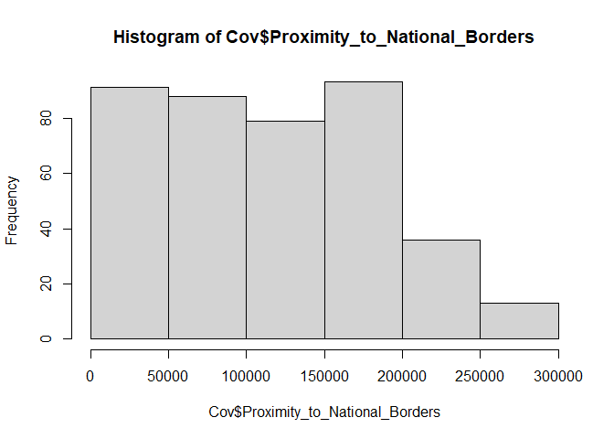
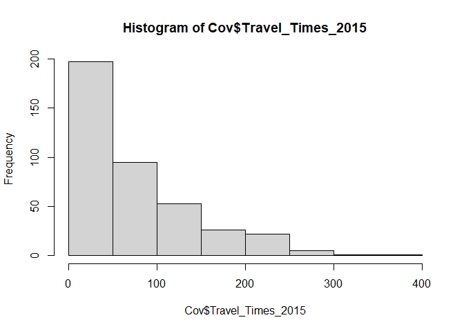

Unit 1: Load and transform ZWE dataset
================
Esteban Correa
November, 2019

# Summary

Our ETL pipeline can be summarized as follows:

-   Load datasets and extract variables of interest for the analysis
-   Filter some unwanted individuals
-   Perform some value recodes
-   Create final files and export them

# Load datasets

For this case, dhs datasets are on SPSS format (\*.SAV), but they might
come as .DAT or other source type.

``` r
rm(list = ls())
library(foreign)
library(plyr)
library(dplyr)
library(survey)
library(jtools)
library(kableExtra)
library(broom)
library(ggstance)
# load female, male and hiv records of Zimbabwe 2015 dataset
maleDataFrame <- read.spss("../../ZWMR71SV/ZWMR71FL.SAV")
hivDataFrame <- read.spss("../../ZWAR71SV/ZWAR71FL.SAV")
femaleDataFrame <- read.spss("../../ZWIR71SV/ZWIR71FL.SAV")
```

## Extract HIV variables

Load the HIV dataset that we will join to male and female datasets

``` r
hivdataset <- as.data.frame(hivDataFrame$HIVCLUST) #clnumber
hivdataset$HIVNUMB <- hivDataFrame$HIVNUMB # hhnumber
hivdataset$HIVLINE <- hivDataFrame$HIVLINE # linenumber
hivdataset$HIV03 <- hivDataFrame$HIV03 # hivStatus
hivdataset$HIV05 <- hivDataFrame$HIV05 # sample weight
names(hivdataset) <- c(
  "clnumber",
  "hhnumber",
  "linenumber",
  "hivStatus",
  "sampleweight"
)
# key for join creation
hivdataset$id<-paste(hivdataset$clnumber,
                     hivdataset$hhnumber,
                     hivdataset$linenumber,sep="")
hivdataset$id<-as.numeric(hivdataset$id, 16L)
hivdataset$sampleweight<-hivdataset$sampleweight/1000000
#this left padding helps to assure uniqueness in the key
hivdataset$id<-sprintf("%010d", hivdataset$id)
hivdataset<-hivdataset[!(duplicated(hivdataset$id)),]
```

## Extract male variables

These are the variables used in the paper (demographics+sexual
covariates+design sampling information). You can use other variables but
you can not omit design sampling variables to account for the two stage
sampling.

``` r
maleDataset <- as.data.frame(maleDataFrame$MV001) #clnumber
maleDataset$MV002 <- maleDataFrame$MV002 # hhnumber
maleDataset$MV003 <- maleDataFrame$MV003 # linenumber
maleDataset$MV005 <- maleDataFrame$MV005 # indivweight
maleDataset$MV012 <- maleDataFrame$MV012 # age
maleDataset$MV013 <- maleDataFrame$MV013 # agegroup
maleDataset$MV104 <- maleDataFrame$MV104 # YLivedinResidence
maleDataset$MV105 <- maleDataFrame$MV105 # previousType
maleDataset$MV105a <- maleDataFrame$MV105A # previousRegion
maleDataset$MV106 <- maleDataFrame$MV106 # higher level of education
maleDataset$MV130 <- maleDataFrame$MV130 # religion
maleDataset$MV190 <- maleDataFrame$MV190 # Wealthindexcombined
maleDataset$MV481 <- maleDataFrame$MV481 # covered by health insurance
maleDataset$MV501 <- maleDataFrame$MV501 # marital status
maleDataset$sex <- "Male"

#sexual variables
maleDataset$MV761 <- maleDataFrame$MV761 # used a condom the last time she had sexual intercourse.
maleDataset$MV763a <- maleDataFrame$MV763A # previous STI 12 
maleDataset$MV766b <- maleDataFrame$MV766B # number of sex partners including spouse in last 12 months
maleDataset$MV781 <- maleDataFrame$MV781 # hivtested
maleDataset$MV836 <- maleDataFrame$MV836 # total lifetime number of sex partners

#geographical variables
maleDataset$region <- maleDataFrame$MV024 # region
maleDataset$placeType <- maleDataFrame$MV025 # rural or urban
maleDataset$MV026 <- maleDataFrame$MV026 # placeLocation
maleDataset$PSU <- maleDataFrame$MV021 # PSU svydesign
maleDataset$MV022 <- maleDataFrame$MV022 # Strata sampling error

# rename each column for nemonic purposes
names(maleDataset) <- c(
  "clnumber",
  "hhnumber",
  "linenumber",
  "indivweight",
  "age",
  "agegroup",
  "YLivedinResidence",
  "previousType",
  "previousRegion",
  "education",
  "religion",
  "Wealthindexcombined",
  "healthInsured",
  "maritalStatus",
  "sex",
  
  "condomLastTime",
  "previousSTI",
  "sexPartners",
  "hivtested",
  "totalSexPartners",
  
  "region",
  "placeType",
  "placeLocation",
  "PSU",
  "V022"
)

# id for females
maleDataset$id<-paste(maleDataset$clnumber,
                      maleDataset$hhnumber,
                      maleDataset$linenumber,sep="")
maleDataset$id<-as.numeric(maleDataset$id, 16L)
maleDataset$id<-sprintf("%010d", maleDataset$id)
maleDataset<-maleDataset[!(duplicated(maleDataset$id)),]
```

## Join HIV to male dataset

Having the extracted variables, it is time to join the HIV information
using individual’s ID. Then we can recode some variables for our
analysis.

``` r
### merge male and hiv
maleData <- merge(maleDataset, hivdataset, by = "id")

#hivStatus
maleData$hivStatus<-as.factor(maleData$hivStatus)
# levels(maleData$hivStatus)
# table(maleData$hivStatus)
#remove 9 results in hivStatus
maleData <-maleData[maleData$hivStatus == "HIV  positive" | maleData$hivStatus == "HIV negative", ]
maleData$hivStatus<-as.factor(revalue(as.character(maleData$hivStatus), c("HIV  positive" = "hiv+","HIV negative"="hiv-")))

# migstatus
# table(maleData$YLivedinResidence)
# summary(maleData$YLivedinResidence)
maleData<- maleData[maleData$YLivedinResidence != "Visitor", ]  # se remueven visitantes
maleData$YLivedinResidence[maleData$YLivedinResidence=="Always"]<-maleData$age[maleData$YLivedinResidence=="Always"]
```

    ## Warning in `[<-.factor`(`*tmp*`, maleData$YLivedinResidence == "Always", :
    ## invalid factor level, NA generated

``` r
maleData$YLivedinResidence <- maleData$YLivedinResidence[ , drop=TRUE]
maleData<-maleData[!is.na(maleData$YLivedinResidence),]

maleData$migstatus<-"2+"
maleData$migstatus[maleData$YLivedinResidence == 0] <-"0_1y"
table(maleData$migstatus)
```

    ## 
    ## 0_1y   2+ 
    ##  506 6679

``` r
maleData$migstatus<-as.factor(maleData$migstatus)

# normalize weight
maleData$indivweight<-maleData$indivweight/1000000
#check NAs
maleData<-maleData[!is.na(maleData$indivweight),]

male.mapped.data<-maleData

male.mapped.data<-maleData
# which(is.na(maleData$migstatus))
# sum(is.na(maleData$migstatus))
# apply(maleData, 2, function(x) any(is.na(x)))


##### revalues section 
table(maleData$agegroup)
```

    ## 
    ## 15-19 20-24 25-29 30-34 35-39 40-44 45-49 50-54 55-59 60-64 
    ##  1859  1200   983   944   786   678   438   297     0     0

``` r
maleData$agegroup<-as.factor(revalue(as.character(maleData$agegroup), 
                                        c("15-19" = "15-24",
                                          "20-24" = "15-24",
                                          "25-29" = "25-34",
                                          "30-34" = "25-34",
                                          "35-39" = "35-44",
                                          "40-44" = "35-44",
                                          "45-49" = "45+",
                                          "50-54" = "45+",
                                          "55-59"="45+")))
```

    ## The following `from` values were not present in `x`: 55-59

``` r
table(maleData$agegroup)
```

    ## 
    ## 15-24 25-34 35-44   45+ 
    ##  3059  1927  1464   735

``` r
# education
# table(maleData$education)
maleData$education<-as.factor(revalue(as.character(maleData$education), 
                                         c("No education" = "No education/Primary",
                                           "Primary"="No education/Primary")))

# Wealthindexcombined
# table(maleData$Wealthindexcombined)
maleData$Wealthindexcombined<-as.factor(revalue(as.character(maleData$Wealthindexcombined), 
                                                   c("Poorest" = "Poorer", 
                                                     "Middle"="Middle/Richer",
                                                     "Richer"="Middle/Richer",
                                                     "Richest"="Middle/Richer")))
table(maleData$Wealthindexcombined)
```

    ## 
    ## Middle/Richer        Poorer 
    ##          4960          2225

``` r
# health insured
table(maleData$healthInsured)
```

    ## 
    ##   No  Yes 
    ## 6290  895

``` r
# marital status
# table(maleData$maritalStatus)
maleData$maritalStatus<-as.factor(revalue(as.character(maleData$maritalStatus), 
                                             c("Married" = "Married/Living with partner",
                                               "Living with partner"="Married/Living with partner",
                                               "Widowed" = "Divorced/separated",
                                               "Divorced"="Divorced/separated",
                                               "No longer living together/separated"="Divorced/separated")))

#######################
# sexual information recode
#######################

#condon last time
summary(maleData$condomLastTime)
```

    ##         No        Yes Don't know       NA's 
    ##       3432       1621          0       2132

``` r
maleData<-maleData[!is.na(maleData$condomLastTime),] #*too much NAs
maleData$condomLastTime <- maleData$condomLastTime[ , drop=TRUE]

# previousSTI
table(maleData$previousSTI)
```

    ## 
    ##         No        Yes Don't know 
    ##       4895        152          6

``` r
maleData <-maleData[maleData$previousSTI == "No" | maleData$previousSTI == "Yes", ]
maleData$previousSTI <- maleData$previousSTI[ , drop=TRUE]

## sexPartners
 summary(maleData$sexPartners)
```

    ##          0          1         10         11         12         13         15 
    ##          0       4036          4          3          1          1          3 
    ##         18          2         20         28          3         30          4 
    ##          1        861          2          1         70          1         29 
    ##          5          6          7          8          9         95 Don't know 
    ##         14          7          1          6          3          1          2 
    ##         99 
    ##          0

``` r
maleData<-maleData[!is.na(maleData$sexPartners),]
maleData <-maleData[maleData$sexPartners != "Don't know" ,]
maleData <-maleData[maleData$sexPartners != "99", ]
maleData$sexPartners<-maleData$sexPartners[,drop=TRUE]
maleData$sexPartners<-as.character(maleData$sexPartners)
maleData$sexPartners<-as.numeric(maleData$sexPartners)
maleData$sexPartnersLast12<-"0_1"
maleData$sexPartnersLast12[maleData$sexPartners > 1]<-"2+"
maleData$sexPartnersLast12<-as.factor(maleData$sexPartnersLast12)
table(maleData$sexPartnersLast12)
```

    ## 
    ##  0_1   2+ 
    ## 4036 1009

``` r
#hivtested
table(maleData$hivtested)
```

    ## 
    ##   No  Yes 
    ## 1220 3825

``` r
# totalSexPartners
table(maleData$totalSexPartners)
```

    ## 
    ##          1         10         11         12         13         14         15 
    ##        782        216         29         62         19         14        101 
    ##         16         17         18         19          2         20         21 
    ##         17          9         14          1        786         93          7 
    ##         22         23         24         25         26         27         28 
    ##          4          2          8         31          6          3          4 
    ##         29          3         30         31         32         33         35 
    ##          4        876         50          2          4          2          4 
    ##         36         38          4         40         42         44         45 
    ##          2          1        515         21          1          3          5 
    ##         46         48          5         50         52         54         55 
    ##          5          1        495         14          1          1          6 
    ##         56         58         59          6         60         61         62 
    ##          2          1          1        265          9          0          1 
    ##         64         66         67          7         70         76          8 
    ##          1          1          1        191          4          1        141 
    ##         80         88         89          9         90        95+ Don't know 
    ##          6          1          2         39          1         29        127

``` r
summary(maleData$totalSexPartners)
```

    ##          1         10         11         12         13         14         15 
    ##        782        216         29         62         19         14        101 
    ##         16         17         18         19          2         20         21 
    ##         17          9         14          1        786         93          7 
    ##         22         23         24         25         26         27         28 
    ##          4          2          8         31          6          3          4 
    ##         29          3         30         31         32         33         35 
    ##          4        876         50          2          4          2          4 
    ##         36         38          4         40         42         44         45 
    ##          2          1        515         21          1          3          5 
    ##         46         48          5         50         52         54         55 
    ##          5          1        495         14          1          1          6 
    ##         56         58         59          6         60         61         62 
    ##          2          1          1        265          9          0          1 
    ##         64         66         67          7         70         76          8 
    ##          1          1          1        191          4          1        141 
    ##         80         88         89          9         90        95+ Don't know 
    ##          6          1          2         39          1         29        127

``` r
maleData <-maleData[maleData$totalSexPartners != "Don't know" ,]
maleData$totalSexPartners<-maleData$totalSexPartners[,drop=TRUE]
maleData$totalSexPartners<-as.factor(revalue(as.character(maleData$totalSexPartners), c("95+" = "95")))

maleData<-maleData[!is.na(maleData$totalSexPartners),]

maleData$totalSexPartners<-as.character(maleData$totalSexPartners)
maleData$totalSexPartners<-as.numeric(maleData$totalSexPartners)
maleData$lifetimePartners<-"0_1"
maleData$lifetimePartners[maleData$totalSexPartners > 1 & maleData$totalSexPartners < 98 ]<-"2+"
maleData$lifetimePartners<-as.factor(maleData$lifetimePartners)
table(maleData$lifetimePartners)
```

    ## 
    ##  0_1   2+ 
    ##  782 4136

## Extract female variables

``` r
# Extract variables of interest
femaleDataset <- as.data.frame(femaleDataFrame$V001) #clnumber
femaleDataset$V002 <- femaleDataFrame$V002 # hhnumber
femaleDataset$V003 <- femaleDataFrame$V003 # linenumber
femaleDataset$V005 <- femaleDataFrame$V005 # indivweight
femaleDataset$V012 <- femaleDataFrame$V012 # age
femaleDataset$V013 <- femaleDataFrame$V013 # agegroup
femaleDataset$V104 <- femaleDataFrame$V104 # YLivedinResidence
femaleDataset$V105 <- femaleDataFrame$V105 # previousType
femaleDataset$V105a <- femaleDataFrame$V105A # previousRegion
femaleDataset$V106 <- femaleDataFrame$V106 # higher level of education
femaleDataset$V130 <- femaleDataFrame$V130 # religion
femaleDataset$V190 <- femaleDataFrame$V190 # Wealthindexcombined
femaleDataset$V481 <- femaleDataFrame$V481 # covered by health insurance
femaleDataset$V501 <- femaleDataFrame$V501 # marital status
femaleDataset$sex <- "Female"

#sexual variables
femaleDataset$V761 <- femaleDataFrame$V761 # used a condom the last time she had sexual intercourse.
femaleDataset$V763a <- femaleDataFrame$V763A # previous STI 12 
femaleDataset$v766b <- femaleDataFrame$V766B # number of sex partners in last 12 months
femaleDataset$V781 <- femaleDataFrame$V781 # hivtested
femaleDataset$V836 <- femaleDataFrame$V836 # total lifetime number of sex partners

#geographical variables
femaleDataset$region <- femaleDataFrame$V024 # region
femaleDataset$placeType <- femaleDataFrame$V025 # rural or urban
femaleDataset$V026 <- femaleDataFrame$V026 # placeLocation
femaleDataset$PSU <- femaleDataFrame$V021 # PSU svydesign
femaleDataset$V022 <- femaleDataFrame$V022 # Strata sampling error

# rename each column for nemonic purposes
names(femaleDataset) <- c(
  "clnumber",
  "hhnumber",
  "linenumber",
  "indivweight",
  "age",
  "agegroup",
  "YLivedinResidence",
  "previousType",
  "previousRegion",
  "education",
  "religion",
  "Wealthindexcombined",
  "healthInsured",
  "maritalStatus",
  "sex",
  
  "condomLastTime",
  "previousSTI",
  "sexPartners",
  "hivtested",
  "totalSexPartners",
  
  "region",
  "placeType",
  "placeLocation",
  "PSU",
  "V022"
)

# id for females
femaleDataset$id<-paste(femaleDataset$clnumber,
                        femaleDataset$hhnumber,
                        femaleDataset$linenumber,sep="")
femaleDataset$id<-as.numeric(femaleDataset$id, 16L)
femaleDataset$id<-sprintf("%010d", femaleDataset$id)
femaleDataset<-femaleDataset[!(duplicated(femaleDataset$id)),]
```

## Join HIV to male dataset

``` r
### merge female and hiv
femaleData <- merge(femaleDataset, hivdataset, by = "id")

## hivStatus
# which(is.na(femaleData$migstatus))
# sum(is.na(femaleData$migstatus))
# apply(femaleData, 2, function(x) any(is.na(x)))
# table(femaleData$hivStatus)
# levels(femaleData$hivStatus)
# levels(femaleData$hivStatus)
# table(femaleData$hivStatus)
#remove 9 results in hivStatus
femaleData <-femaleData[femaleData$hivStatus == "HIV  positive" | femaleData$hivStatus == "HIV negative", ]
femaleData$hivStatus<-as.factor(revalue(as.character(femaleData$hivStatus), c("HIV  positive" = "hiv+","HIV negative"="hiv-")))
femaleData$hivStatus<-as.factor(femaleData$hivStatus)

#migStatus
table(femaleData$YLivedinResidence)
```

    ## 
    ##            0            1           10           11           12           13 
    ##          806          548          300          154          172          174 
    ##           14           15           16           17           18           19 
    ##          141          271          107          109           88           68 
    ##            2           20           21           22           23           24 
    ##          449           99           62           54           47           47 
    ##           25           26           27           28           29            3 
    ##           41           33           23           33           11          500 
    ##           30           31           32           33           34           35 
    ##           27            6           13           16            6           12 
    ##           36           37           38           39            4           40 
    ##            6            0            2            1          385            7 
    ##           45           46           47           49            5            6 
    ##            1            2            1            0          449          286 
    ##            7            8            9       Always      Visitor Inconsistent 
    ##          302          245          186         2480          199            0 
    ##   Don't know 
    ##            0

``` r
summary(femaleData$YLivedinResidence)
```

    ##            0            1           10           11           12           13 
    ##          806          548          300          154          172          174 
    ##           14           15           16           17           18           19 
    ##          141          271          107          109           88           68 
    ##            2           20           21           22           23           24 
    ##          449           99           62           54           47           47 
    ##           25           26           27           28           29            3 
    ##           41           33           23           33           11          500 
    ##           30           31           32           33           34           35 
    ##           27            6           13           16            6           12 
    ##           36           37           38           39            4           40 
    ##            6            0            2            1          385            7 
    ##           45           46           47           49            5            6 
    ##            1            2            1            0          449          286 
    ##            7            8            9       Always      Visitor Inconsistent 
    ##          302          245          186         2480          199            0 
    ##   Don't know 
    ##            0

``` r
femaleData<- femaleData[femaleData$YLivedinResidence != "Visitor", ]  # we remove visitors
femaleData$YLivedinResidence[femaleData$YLivedinResidence=="Always"]<-femaleData$age[femaleData$YLivedinResidence=="Always"]
```

    ## Warning in `[<-.factor`(`*tmp*`, femaleData$YLivedinResidence == "Always", :
    ## invalid factor level, NA generated

``` r
femaleData$YLivedinResidence <- femaleData$YLivedinResidence[ , drop=TRUE]
femaleData<-femaleData[!is.na(femaleData$YLivedinResidence),]

femaleData$migstatus<-"2+"
femaleData$migstatus[femaleData$YLivedinResidence == 0] <-"0_1y"
table(femaleData$migstatus)
```

    ## 
    ## 0_1y   2+ 
    ##  806 7796

``` r
#factorize variables
femaleData$migstatus<-as.factor(femaleData$migstatus)


# normalize weight
femaleData$indivweight<-femaleData$indivweight/1000000
#check NAs
femaleData<-femaleData[!is.na(femaleData$indivweight),]

female.mapped.data<-femaleData

##### revalues section 
table(femaleData$agegroup)
```

    ## 
    ## 15-19 20-24 25-29 30-34 35-39 40-44 45-49 
    ##  1932  1569  1460  1385  1050   712   494

``` r
femaleData$agegroup<-as.factor(revalue(as.character(femaleData$agegroup), 
                                        c("15-19" = "15-24",
                                          "20-24" = "15-24",
                                          "25-29" = "25-34",
                                          "30-34" = "25-34",
                                          "35-39" = "35-44",
                                          "40-44" = "35-44",
                                          "45-49" = "45+",
                                          "50-54" = "45+",
                                          "55-59"="45+")))
```

    ## The following `from` values were not present in `x`: 50-54, 55-59

``` r
table(femaleData$agegroup)
```

    ## 
    ## 15-24 25-34 35-44   45+ 
    ##  3501  2845  1762   494

``` r
# education
# table(femaleData$education)
femaleData$education<-as.factor(revalue(as.character(femaleData$education), 
                                         c("No education" = "No education/Primary",
                                           "Primary"="No education/Primary")))

#wealthindexCombined
 # table(femaleData$Wealthindexcombined)
femaleData$Wealthindexcombined<-as.factor(revalue(as.character(femaleData$Wealthindexcombined), 
                                        c("Poorest" = "Poorer", 
                                          "Middle"="Middle/Richer",
                                          "Richer"="Middle/Richer",
                                          "Richest"="Middle/Richer")))
table(femaleData$Wealthindexcombined)
```

    ## 
    ## Middle/Richer        Poorer 
    ##          5998          2604

``` r
# health insured
table(femaleData$healthInsured)
```

    ## 
    ##   No  Yes 
    ## 7596 1006

``` r
# marital status
 # table(femaleData$maritalStatus)
femaleData$maritalStatus<-as.factor(revalue(as.character(femaleData$maritalStatus), 
                                             c("Married" = "Married/Living with partner",
                                               "Living with partner"="Married/Living with partner",
                                               "Widowed" = "Divorced/separated",
                                               "Divorced"="Divorced/separated",
                                               "No longer living together/separated"="Divorced/separated")))
#######################
# sexual information recode
#######################
#condom last time
summary(femaleData$condomLastTime)
```

    ##         No        Yes Don't know       NA's 
    ##       4949       1242          0       2411

``` r
femaleData<-femaleData[!is.na(femaleData$condomLastTime),] #*too much NAs
femaleData$condomLastTime <- femaleData$condomLastTime[ , drop=TRUE]
 
# previousSTI
table(femaleData$previousSTI)
```

    ## 
    ##         No        Yes Don't know 
    ##       6023        155         13

``` r
femaleData <-femaleData[femaleData$previousSTI == "No" | femaleData$previousSTI == "Yes", ]
femaleData$previousSTI <- femaleData$previousSTI[ , drop=TRUE]

## sexPartners
summary(femaleData$sexPartners)
```

    ##          0          1          2          3          4          5         50 
    ##          0       6062         93          8          1          3          3 
    ##          6          8         95 Don't know         99 
    ##          1          1          2          4          0

``` r
femaleData <-femaleData[femaleData$sexPartners != "Don't know" ,]
femaleData <-femaleData[femaleData$sexPartners != "99", ]
femaleData<-femaleData[!is.na(femaleData$sexPartners),]
femaleData$sexPartners<-femaleData$sexPartners[,drop=TRUE]
femaleData$sexPartners<-as.character(femaleData$sexPartners)
femaleData$sexPartners<-as.numeric(femaleData$sexPartners)
femaleData$sexPartnersLast12<-"0_1"
femaleData$sexPartnersLast12[femaleData$sexPartners > 1]<-"2+"
femaleData$sexPartnersLast12<-as.factor(femaleData$sexPartnersLast12)
table(femaleData$sexPartnersLast12)
```

    ## 
    ##  0_1   2+ 
    ## 6062  112

``` r
#hivtested
summary(femaleData$hivtested)
```

    ##   No  Yes 
    ##  427 5747

``` r
# totalSexPartners
table(femaleData$totalSexPartners)
```

    ## 
    ##          1         10         11         12         15         16         19 
    ##       3684         19          3          3          9          2          1 
    ##          2         20         25          3         30         36          4 
    ##       1392         11          0        610          1          0        222 
    ##          5         50          6         65          7          8          9 
    ##        121          3         41          0         18         10          2 
    ##        95+ Don't know 
    ##          6         16

``` r
summary(femaleData$totalSexPartners)
```

    ##          1         10         11         12         15         16         19 
    ##       3684         19          3          3          9          2          1 
    ##          2         20         25          3         30         36          4 
    ##       1392         11          0        610          1          0        222 
    ##          5         50          6         65          7          8          9 
    ##        121          3         41          0         18         10          2 
    ##        95+ Don't know 
    ##          6         16

``` r
femaleData<-femaleData[!is.na(femaleData$totalSexPartners),]
femaleData <-femaleData[femaleData$totalSexPartners != "Don't know" ,]
femaleData$totalSexPartners<-as.factor(revalue(as.character(femaleData$totalSexPartners), c("95+" = "95")))
femaleData$totalSexPartners<-as.factor(femaleData$totalSexPartners[,drop=TRUE])
femaleData<-femaleData[!is.na(femaleData$totalSexPartners),]
femaleData$totalSexPartners<-as.character(femaleData$totalSexPartners)
femaleData$totalSexPartners<-as.numeric(femaleData$totalSexPartners)
femaleData$lifetimePartners<-"0_1"
femaleData$lifetimePartners[femaleData$totalSexPartners > 1 & femaleData$totalSexPartners < 98 ]<-"2+"
femaleData$lifetimePartners<-as.factor(femaleData$lifetimePartners)
table(femaleData$lifetimePartners)
```

    ## 
    ##  0_1   2+ 
    ## 3684 2474

## Load psu-level variables

We are interested in geodesic distance to national borders and travel
time to nearest city.

``` r
Cov<-read.csv("../../ZWGC72FL/ZWGC72FL.csv")

hist(Cov$Proximity_to_National_Borders)
```

<!-- -->

``` r
Cov$Distance2Borders[Cov$Proximity_to_National_Borders <= 50000 ]<-"50kms"
Cov$Distance2Borders[Cov$Proximity_to_National_Borders > 50000 & Cov$Proximity_to_National_Borders <= 100000 ]<-"100kms"
Cov$Distance2Borders[Cov$Proximity_to_National_Borders > 100000 ]<-"100kms+"
Cov$Distance2Borders<-as.factor(Cov$Distance2Borders)
table(Cov$Distance2Borders)
```

    ## 
    ##  100kms 100kms+   50kms 
    ##      88     221      91

``` r
hist(Cov$Travel_Times_2015)
```

<!-- -->

``` r
Cov$TravelTime[Cov$Travel_Times_2015 <= 60 ]<-"1hr"
Cov$TravelTime[Cov$Travel_Times_2015 > 60 & Cov$Travel_Times_2015 <= 120 ]<-"2hrs"
Cov$TravelTime[Cov$Travel_Times_2015 > 120 ]<-"2hrs+"
Cov$TravelTime<-as.factor(Cov$TravelTime)
table(Cov$TravelTime)
```

    ## 
    ##   1hr  2hrs 2hrs+ 
    ##   214    96    90

``` r
# summary(Cov)

Cov<-Cov%>%
    dplyr::select(DHSCLUST,
                  Proximity_to_National_Borders,
                  Travel_Times_2015,
                  Distance2Borders,
                  TravelTime)
colnames(Cov)<-c("PSU",
                 "Proximity_to_National_Borders",
                 "Travel_Times_2015",
                 "Distance2Borders",
                 "TravelTimes")

Cov$Travel_Times_2015<-Cov$Travel_Times_2015/60
Cov$Proximity_to_National_Borders<-Cov$Proximity_to_National_Borders/1000
```

## Join males, females and psu variables

``` r
allZWE<-rbind(femaleData,maleData)
allZWE <- merge(allZWE, Cov, by = "PSU")

allZWE$sex<-as.factor(allZWE$sex)
allZWE$sex<-relevel(allZWE$sex, ref = "Male")

allZWE$sexPartnersLast12<-relevel(allZWE$sexPartnersLast12, ref = "0_1")
allZWE$condomLastTime<-relevel(allZWE$condomLastTime, ref = "No")
allZWE$lifetimePartners<-relevel(allZWE$lifetimePartners, ref = "0_1")
allZWE$maritalStatus<-relevel(allZWE$maritalStatus, ref = "Never in union")
allZWE$hivStatus<-relevel(allZWE$hivStatus, ref = "hiv-")

#sortering
allZWE$migstatus<-factor(allZWE$migstatus,levels=c("0_1y", "2+"))
allZWE$migstatus<-relevel(allZWE$migstatus, ref = "2+")
allZWE$maritalStatus<-factor(allZWE$maritalStatus, levels=c("Never in union",
                                                          "Married/Living with partner",
                                                          "Divorced/separated"))
allZWE$Distance2Borders<-factor(allZWE$Distance2Borders,c("100kms+","100kms","50kms"))
levels(allZWE$Distance2Borders)
```

    ## [1] "100kms+" "100kms"  "50kms"

``` r
allZWE$TravelTimes<-factor(allZWE$TravelTimes,levels=c("2hrs+", "2hrs","1hr"))

allZWE <- allZWE %>%
    dplyr::select(PSU,
            V022,
            sex,
            age,
            YLivedinResidence,
            indivweight,
            sampleweight,
            hivStatus,
            migstatus,
            agegroup,
            education,
            Wealthindexcombined,
            placeType,
            maritalStatus,
            sexPartnersLast12,
            lifetimePartners,
            condomLastTime,
            previousSTI,
            hivtested,
            healthInsured,
            Distance2Borders,
            TravelTimes,
            Proximity_to_National_Borders,
            Travel_Times_2015
            )
```

## Prepare final files

We have created several intermediate files, so we proceed to delete all
unnecesary variables for the final dataset.

``` r
rm(Cov, femaleData,femaleDataFrame,femaleDataset,hivDataFrame,hivdataset,maleData,maleDataFrame,maleDataset,mapped.data,country)
```

    ## Warning in rm(Cov, femaleData, femaleDataFrame, femaleDataset, hivDataFrame, :
    ## object 'mapped.data' not found

    ## Warning in rm(Cov, femaleData, femaleDataFrame, femaleDataset, hivDataFrame, :
    ## object 'country' not found

``` r
save.image("zwe_dataset.RData")
```

This is the end of the pre-processing stage. We have extracted and
processed our data files, including their design sampling information.
They are now ready to be used in the statistical analysis.
