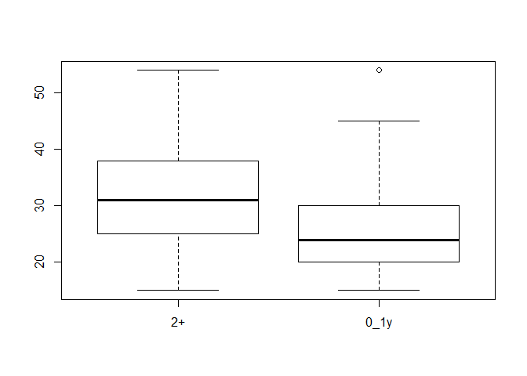

Unit 2: Statistical analysis for ZWE dataset
================
Esteban Correa
November, 2019

``` r
rm(list = ls())
library(foreign)
library(plyr)
library(dplyr)
library(survey)
library(jtools)
library(kableExtra)
library(broom)
library(ggstance)
# load female, male and hiv records of Zimbabwe
load("../data/zwe_dataset.RData")
summary(allZWE)
```

    FALSE       PSU                                 V022          sex      
    FALSE  Min.   :  1.0   Urban : Bulawayo           :1042   Male  :4918  
    FALSE  1st Qu.: 99.0   Rural : Mashonaland Central: 982   Female:6158  
    FALSE  Median :201.0   Urban : Harare             : 867                
    FALSE  Mean   :201.2   Rural : Mashonaland West   : 790                
    FALSE  3rd Qu.:303.0   Rural : Matabeleland North : 741                
    FALSE  Max.   :400.0   Rural : Midlands           : 729                
    FALSE                  (Other)                    :5925                
    FALSE       age        YLivedinResidence  indivweight       sampleweight    
    FALSE  Min.   :15.00   0      : 844      Min.   :0.09884   Min.   :0.09571  
    FALSE  1st Qu.:24.00   1      : 635      1st Qu.:0.58822   1st Qu.:0.57522  
    FALSE  Median :31.00   3      : 619      Median :0.89042   Median :0.90067  
    FALSE  Mean   :31.23   2      : 550      Mean   :0.98403   Mean   :0.98648  
    FALSE  3rd Qu.:38.00   5      : 548      3rd Qu.:1.30069   3rd Qu.:1.26695  
    FALSE  Max.   :54.00   4      : 472      Max.   :3.67468   Max.   :4.09752  
    FALSE                  (Other):7408                        NA's   :82       
    FALSE  hivStatus   migstatus     agegroup                   education   
    FALSE  hiv-:9236   2+  :10232   15-24:2961   Higher              :1148  
    FALSE  hiv+:1840   0_1y:  844   25-34:4268   No education/Primary:2840  
    FALSE                           35-44:2835   Secondary           :7088  
    FALSE                           45+  :1012                              
    FALSE                                                                   
    FALSE                                                                   
    FALSE                                                                   
    FALSE     Wealthindexcombined placeType                        maritalStatus 
    FALSE  Middle/Richer:7602     Urban:4711   Never in union             :1724  
    FALSE  Poorer       :3474     Rural:6365   Married/Living with partner:8510  
    FALSE                                      Divorced/separated         : 842  
    FALSE                                                                        
    FALSE                                                                        
    FALSE                                                                        
    FALSE                                                                        
    FALSE  sexPartnersLast12 lifetimePartners condomLastTime previousSTI hivtested 
    FALSE  0_1:9993          0_1:4466         No :8264       No :10778   No :1613  
    FALSE  2+ :1083          2+ :6610         Yes:2812       Yes:  298   Yes:9463  
    FALSE                                                                          
    FALSE                                                                          
    FALSE                                                                          
    FALSE                                                                          
    FALSE                                                                          
    FALSE  healthInsured Distance2Borders TravelTimes  Proximity_to_National_Borders
    FALSE  No :9598      100kms+:6027     2hrs+:2568   Min.   :  0.1027             
    FALSE  Yes:1478      100kms :2560     2hrs :2511   1st Qu.: 62.3758             
    FALSE                50kms  :2489     1hr  :5997   Median :113.1934             
    FALSE                                              Mean   :117.6234             
    FALSE                                              3rd Qu.:182.2713             
    FALSE                                              Max.   :285.3468             
    FALSE                                                                           
    FALSE  Travel_Times_2015
    FALSE  Min.   :0.00000  
    FALSE  1st Qu.:0.02083  
    FALSE  Median :0.82728  
    FALSE  Mean   :1.13685  
    FALSE  3rd Qu.:1.88750  
    FALSE  Max.   :6.35142  
    FALSE 

# Summary

Our analysis pipeline can be summarized as follows:

-   Create the survey design object
-   Perform population characteristics for table 1
-   Perform unadjusted analysis
-   Perform adjusted analysis

## Create survey design

We create the survey object using survey package from Lumley et al. It
requires the ID to identify the PSU, the strata and the individual
weights.

``` r
# We need to set this flag, because we do not have variance within psu
options (survey.lonely.psu = "remove")
dhs1<- svydesign(id = ~PSU, 
                 strata = ~V022,
                 weights = ~indivweight,
                 nest=TRUE,
                 data = allZWE)
```

## Descriptive statistics

This is one way to create your table 1 manually, however there is
another using table1 package. The idea is to create contigency tables
per each variable

``` r
mymr<-2
round(svytable(~migstatus, dhs1),1)
```

    ## migstatus
    ##      2+    0_1y 
    ## 10121.5   777.6

``` r
svyttest(migstatus~0, dhs1)
```

    ## 
    ##  Design-based one-sample t-test
    ## 
    ## data:  migstatus ~ 0
    ## t = 238.38, df = 380, p-value < 2.2e-16
    ## alternative hypothesis: true mean is not equal to 0
    ## 95 percent confidence interval:
    ##  0.92099451 0.06368564
    ## sample estimates:
    ##      mean 
    ## 0.9286544

``` r
round(prop.table(svytable(~hivStatus+migstatus, dhs1),margin = mymr)*100,0)
```

    ##          migstatus
    ## hivStatus 2+ 0_1y
    ##      hiv- 84   84
    ##      hiv+ 16   16

``` r
summary(svytable(~hivStatus+migstatus, dhs1), statistic="Chisq")
```

    ##          migstatus
    ## hivStatus   2+ 0_1y
    ##      hiv- 8538  651
    ##      hiv+ 1583  127
    ## 
    ##  Pearson's X^2: Rao & Scott adjustment
    ## 
    ## data:  svychisq(~hivStatus + migstatus, design = dhs1, statistic = "Chisq")
    ## X-squared = 0.23833, df = 1, p-value = 0.6666

``` r
round(prop.table(svytable(~sex+migstatus, dhs1),margin = mymr)*100,0)
```

    ##         migstatus
    ## sex      2+ 0_1y
    ##   Male   45   39
    ##   Female 55   61

``` r
summary(svytable(~sex+migstatus, dhs1), statistic="Chisq")
```

    ##         migstatus
    ## sex        2+ 0_1y
    ##   Male   4514  300
    ##   Female 5607  477
    ## 
    ##  Pearson's X^2: Rao & Scott adjustment
    ## 
    ## data:  svychisq(~sex + migstatus, design = dhs1, statistic = "Chisq")
    ## X-squared = 10.66, df = 1, p-value = 0.002909

``` r
svyby(~age, ~migstatus, dhs1, svymean, se=T,ci=TRUE,vartype =c("se","ci","cv","cvpct","var"))
```

    ##      migstatus      age        se     ci_l     ci_u          cv       cv%
    ## 2+          2+ 31.72433 0.1260216 31.47733 31.97133 0.003972395 0.3972395
    ## 0_1y      0_1y 26.14723 0.3247604 25.51071 26.78375 0.012420454 1.2420454
    ##             var
    ## 2+   0.01588144
    ## 0_1y 0.10546933

``` r
svyboxplot(age~migstatus,dhs1)
```

<!-- -->

``` r
svyttest(age~migstatus,dhs1)
```

    ## 
    ##  Design-based t-test
    ## 
    ## data:  age ~ migstatus
    ## t = -16.467, df = 380, p-value < 2.2e-16
    ## alternative hypothesis: true difference in mean is not equal to 0
    ## 95 percent confidence interval:
    ##  -6.240903 -4.913302
    ## sample estimates:
    ## difference in mean 
    ##          -5.577103

``` r
round(prop.table(svytable(~agegroup+migstatus, dhs1),margin = mymr)*100,0)
```

    ##         migstatus
    ## agegroup 2+ 0_1y
    ##    15-24 24   51
    ##    25-34 39   34
    ##    35-44 27   12
    ##    45+    9    3

``` r
summary(svytable(~agegroup+migstatus, dhs1), statistic="Chisq")
```

    ##         migstatus
    ## agegroup   2+ 0_1y
    ##    15-24 2418  394
    ##    25-34 3996  266
    ##    35-44 2749   91
    ##    45+    958   27
    ## 
    ##  Pearson's X^2: Rao & Scott adjustment
    ## 
    ## data:  svychisq(~agegroup + migstatus, design = dhs1, statistic = "Chisq")
    ## X-squared = 304.57, df = 3, p-value < 2.2e-16

``` r
round(prop.table(svytable(~education+migstatus, dhs1),margin = mymr)*100,0)
```

    ##                       migstatus
    ## education              2+ 0_1y
    ##   Higher               10    6
    ##   No education/Primary 28   24
    ##   Secondary            63   70

``` r
summary(svytable(~education+migstatus, dhs1), statistic="Chisq")
```

    ##                       migstatus
    ## education                2+ 0_1y
    ##   Higher                993   48
    ##   No education/Primary 2791  185
    ##   Secondary            6337  545
    ## 
    ##  Pearson's X^2: Rao & Scott adjustment
    ## 
    ## data:  svychisq(~education + migstatus, design = dhs1, statistic = "Chisq")
    ## X-squared = 20.443, df = 2, p-value = 0.0002066

``` r
round(prop.table(svytable(~Wealthindexcombined+migstatus, dhs1),margin = mymr)*100,0)
```

    ##                    migstatus
    ## Wealthindexcombined 2+ 0_1y
    ##       Middle/Richer 64   72
    ##       Poorer        36   28

``` r
summary(svytable(~Wealthindexcombined+migstatus, dhs1), statistic="Chisq")
```

    ##                    migstatus
    ## Wealthindexcombined   2+ 0_1y
    ##       Middle/Richer 6455  557
    ##       Poorer        3666  220
    ## 
    ##  Pearson's X^2: Rao & Scott adjustment
    ## 
    ## data:  svychisq(~Wealthindexcombined + migstatus, design = dhs1, statistic = "Chisq")
    ## X-squared = 19.815, df = 1, p-value = 0.001876

``` r
round(prop.table(svytable(~healthInsured+migstatus, dhs1),margin = mymr)*100,0)
```

    ##              migstatus
    ## healthInsured 2+ 0_1y
    ##           No  87   93
    ##           Yes 13    7

``` r
summary(svytable(~healthInsured+migstatus, dhs1), statistic="Chisq")
```

    ##              migstatus
    ## healthInsured   2+ 0_1y
    ##           No  8848  723
    ##           Yes 1273   55
    ## 
    ##  Pearson's X^2: Rao & Scott adjustment
    ## 
    ## data:  svychisq(~healthInsured + migstatus, design = dhs1, statistic = "Chisq")
    ## X-squared = 20.874, df = 1, p-value = 0.0001801

``` r
round(prop.table(svytable(~maritalStatus+migstatus, dhs1),margin = mymr)*100,0)
```

    ##                              migstatus
    ## maritalStatus                 2+ 0_1y
    ##   Never in union              13   23
    ##   Married/Living with partner 80   61
    ##   Divorced/separated           7   16

``` r
summary(svytable(~maritalStatus+migstatus, dhs1), statistic="Chisq")
```

    ##                              migstatus
    ## maritalStatus                   2+ 0_1y
    ##   Never in union              1316  178
    ##   Married/Living with partner 8111  478
    ##   Divorced/separated           695  122
    ## 
    ##  Pearson's X^2: Rao & Scott adjustment
    ## 
    ## data:  svychisq(~maritalStatus + migstatus, design = dhs1, statistic = "Chisq")
    ## X-squared = 159.71, df = 2, p-value < 2.2e-16

``` r
# round(svytable(~religion+migstatus, dhs1),1)
# round(prop.table(svytable(~religion+migstatus, dhs1),margin = mymr),0)*100
# summary(svytable(~religion+migstatus, dhs1), statistic="Chisq")

round(prop.table(svytable(~placeType+migstatus, dhs1),margin = mymr)*100,0)
```

    ##          migstatus
    ## placeType 2+ 0_1y
    ##     Urban 36   35
    ##     Rural 64   65

``` r
summary(svytable(~placeType+migstatus, dhs1), statistic="Chisq")
```

    ##          migstatus
    ## placeType   2+ 0_1y
    ##     Urban 3664  272
    ##     Rural 6458  505
    ## 
    ##  Pearson's X^2: Rao & Scott adjustment
    ## 
    ## data:  svychisq(~placeType + migstatus, design = dhs1, statistic = "Chisq")
    ## X-squared = 0.42497, df = 1, p-value = 0.6768

``` r
round(prop.table(svytable(~condomLastTime+migstatus, dhs1),margin = mymr)*100,0)
```

    ##               migstatus
    ## condomLastTime 2+ 0_1y
    ##            No  77   70
    ##            Yes 23   30

``` r
summary(svytable(~condomLastTime+migstatus, dhs1), statistic="Chisq")
```

    ##               migstatus
    ## condomLastTime   2+ 0_1y
    ##            No  7786  543
    ##            Yes 2336  235
    ## 
    ##  Pearson's X^2: Rao & Scott adjustment
    ## 
    ## data:  svychisq(~condomLastTime + migstatus, design = dhs1, statistic = "Chisq")
    ## X-squared = 20.644, df = 1, p-value = 6.878e-05

``` r
round(prop.table(svytable(~previousSTI+migstatus, dhs1),margin = mymr)*100,0)
```

    ##            migstatus
    ## previousSTI 2+ 0_1y
    ##         No  98   97
    ##         Yes  2    3

``` r
summary(svytable(~previousSTI+migstatus, dhs1), statistic="Chisq")
```

    ##            migstatus
    ## previousSTI   2+ 0_1y
    ##         No  9880  755
    ##         Yes  242   22
    ## 
    ##  Pearson's X^2: Rao & Scott adjustment
    ## 
    ## data:  svychisq(~previousSTI + migstatus, design = dhs1, statistic = "Chisq")
    ## X-squared = 0.69944, df = 1, p-value = 0.4477

``` r
round(prop.table(svytable(~hivtested+migstatus, dhs1),margin = mymr)*100,0)
```

    ##          migstatus
    ## hivtested 2+ 0_1y
    ##       No  14   18
    ##       Yes 86   82

``` r
summary(svytable(~hivtested+migstatus, dhs1), statistic="Chisq")
```

    ##          migstatus
    ## hivtested   2+ 0_1y
    ##       No  1460  136
    ##       Yes 8662  641
    ## 
    ##  Pearson's X^2: Rao & Scott adjustment
    ## 
    ## data:  svychisq(~hivtested + migstatus, design = dhs1, statistic = "Chisq")
    ## X-squared = 5.5806, df = 1, p-value = 0.0881

``` r
round(prop.table(svytable(~sexPartnersLast12+migstatus, dhs1),margin = mymr)*100,0)
```

    ##                  migstatus
    ## sexPartnersLast12 2+ 0_1y
    ##               0_1 91   88
    ##               2+   9   12

``` r
summary(svytable(~sexPartnersLast12+migstatus, dhs1), statistic="Chisq")
```

    ##                  migstatus
    ## sexPartnersLast12   2+ 0_1y
    ##               0_1 9175  684
    ##               2+   946   94
    ## 
    ##  Pearson's X^2: Rao & Scott adjustment
    ## 
    ## data:  svychisq(~sexPartnersLast12 + migstatus, design = dhs1, statistic = "Chisq")
    ## X-squared = 6.3531, df = 1, p-value = 0.01736

``` r
round(prop.table(svytable(~lifetimePartners+migstatus, dhs1),margin = mymr)*100,0)
```

    ##                 migstatus
    ## lifetimePartners 2+ 0_1y
    ##              0_1 42   40
    ##              2+  58   60

``` r
summary(svytable(~lifetimePartners+migstatus, dhs1), statistic="Chisq")
```

    ##                 migstatus
    ## lifetimePartners   2+ 0_1y
    ##              0_1 4240  311
    ##              2+  5881  466
    ## 
    ##  Pearson's X^2: Rao & Scott adjustment
    ## 
    ## data:  svychisq(~lifetimePartners + migstatus, design = dhs1, statistic = "Chisq")
    ## X-squared = 1.0423, df = 1, p-value = 0.3838

``` r
round(prop.table(svytable(~Distance2Borders+migstatus, dhs1),margin = mymr)*100,0)
```

    ##                 migstatus
    ## Distance2Borders 2+ 0_1y
    ##          100kms+ 58   65
    ##          100kms  22   16
    ##          50kms   19   19

``` r
summary(svytable(~Distance2Borders+migstatus, dhs1), statistic="Chisq")
```

    ##                 migstatus
    ## Distance2Borders   2+ 0_1y
    ##          100kms+ 5912  507
    ##          100kms  2241  121
    ##          50kms   1969  149
    ## 
    ##  Pearson's X^2: Rao & Scott adjustment
    ## 
    ## data:  svychisq(~Distance2Borders + migstatus, design = dhs1, statistic = "Chisq")
    ## X-squared = 20.575, df = 2, p-value = 0.003867

``` r
round(prop.table(svytable(~TravelTimes+migstatus, dhs1),margin = mymr)*100,0)
```

    ##            migstatus
    ## TravelTimes 2+ 0_1y
    ##       2hrs+ 22   17
    ##       2hrs  25   23
    ##       1hr   52   59

``` r
summary(svytable(~TravelTimes+migstatus, dhs1), statistic="Chisq")
```

    ##            migstatus
    ## TravelTimes   2+ 0_1y
    ##       2hrs+ 2245  136
    ##       2hrs  2564  180
    ##       1hr   5313  462
    ## 
    ##  Pearson's X^2: Rao & Scott adjustment
    ## 
    ## data:  svychisq(~TravelTimes + migstatus, design = dhs1, statistic = "Chisq")
    ## X-squared = 15.486, df = 2, p-value = 0.02013

## Unadjusted analysis

``` r
fitall<-svyglm(migstatus~hivStatus,
            data=allZWE,
            family=quasibinomial(),
            design=dhs1)
summ(fitall, exp = T,confint = TRUE,digits = 2)        
```

<table class="table table-striped table-hover table-condensed table-responsive" style="width: auto !important; margin-left: auto; margin-right: auto;">
<tbody>
<tr>
<td style="text-align:left;font-weight: bold;">
Observations
</td>
<td style="text-align:right;">
11076
</td>
</tr>
<tr>
<td style="text-align:left;font-weight: bold;">
Dependent variable
</td>
<td style="text-align:right;">
migstatus
</td>
</tr>
<tr>
<td style="text-align:left;font-weight: bold;">
Type
</td>
<td style="text-align:right;">
Survey-weighted generalized linear model
</td>
</tr>
<tr>
<td style="text-align:left;font-weight: bold;">
Family
</td>
<td style="text-align:right;">
quasibinomial
</td>
</tr>
<tr>
<td style="text-align:left;font-weight: bold;">
Link
</td>
<td style="text-align:right;">
logit
</td>
</tr>
</tbody>
</table>
<table class="table table-striped table-hover table-condensed table-responsive" style="width: auto !important; margin-left: auto; margin-right: auto;">
<tbody>
<tr>
<td style="text-align:left;font-weight: bold;">
Pseudo-R² (Cragg-Uhler)
</td>
<td style="text-align:right;">
0.00
</td>
</tr>
<tr>
<td style="text-align:left;font-weight: bold;">
Pseudo-R² (McFadden)
</td>
<td style="text-align:right;">
0.00
</td>
</tr>
<tr>
<td style="text-align:left;font-weight: bold;">
AIC
</td>
<td style="text-align:right;">
NA
</td>
</tr>
</tbody>
</table>
<table class="table table-striped table-hover table-condensed table-responsive" style="width: auto !important; margin-left: auto; margin-right: auto;border-bottom: 0;">
<thead>
<tr>
<th style="text-align:left;">
</th>
<th style="text-align:right;">
exp(Est.)
</th>
<th style="text-align:right;">
2.5%
</th>
<th style="text-align:right;">
97.5%
</th>
<th style="text-align:right;">
t val.
</th>
<th style="text-align:right;">
p
</th>
</tr>
</thead>
<tbody>
<tr>
<td style="text-align:left;font-weight: bold;">
(Intercept)
</td>
<td style="text-align:right;">
0.08
</td>
<td style="text-align:right;">
0.07
</td>
<td style="text-align:right;">
0.09
</td>
<td style="text-align:right;">
-40.32
</td>
<td style="text-align:right;">
0.00
</td>
</tr>
<tr>
<td style="text-align:left;font-weight: bold;">
hivStatushiv+
</td>
<td style="text-align:right;">
1.05
</td>
<td style="text-align:right;">
0.84
</td>
<td style="text-align:right;">
1.31
</td>
<td style="text-align:right;">
0.43
</td>
<td style="text-align:right;">
0.67
</td>
</tr>
</tbody>
<tfoot>
<tr>
<td style="padding: 0; " colspan="100%">
<sup></sup> Standard errors: Robust
</td>
</tr>
</tfoot>
</table>

``` r
fitall<-svyglm(migstatus~sex,
            data=allZWE,
            family=quasibinomial(),
            design=dhs1)
summ(fitall, exp = T,confint = TRUE,digits = 2)  
```

<table class="table table-striped table-hover table-condensed table-responsive" style="width: auto !important; margin-left: auto; margin-right: auto;">
<tbody>
<tr>
<td style="text-align:left;font-weight: bold;">
Observations
</td>
<td style="text-align:right;">
11076
</td>
</tr>
<tr>
<td style="text-align:left;font-weight: bold;">
Dependent variable
</td>
<td style="text-align:right;">
migstatus
</td>
</tr>
<tr>
<td style="text-align:left;font-weight: bold;">
Type
</td>
<td style="text-align:right;">
Survey-weighted generalized linear model
</td>
</tr>
<tr>
<td style="text-align:left;font-weight: bold;">
Family
</td>
<td style="text-align:right;">
quasibinomial
</td>
</tr>
<tr>
<td style="text-align:left;font-weight: bold;">
Link
</td>
<td style="text-align:right;">
logit
</td>
</tr>
</tbody>
</table>
<table class="table table-striped table-hover table-condensed table-responsive" style="width: auto !important; margin-left: auto; margin-right: auto;">
<tbody>
<tr>
<td style="text-align:left;font-weight: bold;">
Pseudo-R² (Cragg-Uhler)
</td>
<td style="text-align:right;">
0.00
</td>
</tr>
<tr>
<td style="text-align:left;font-weight: bold;">
Pseudo-R² (McFadden)
</td>
<td style="text-align:right;">
0.00
</td>
</tr>
<tr>
<td style="text-align:left;font-weight: bold;">
AIC
</td>
<td style="text-align:right;">
NA
</td>
</tr>
</tbody>
</table>
<table class="table table-striped table-hover table-condensed table-responsive" style="width: auto !important; margin-left: auto; margin-right: auto;border-bottom: 0;">
<thead>
<tr>
<th style="text-align:left;">
</th>
<th style="text-align:right;">
exp(Est.)
</th>
<th style="text-align:right;">
2.5%
</th>
<th style="text-align:right;">
97.5%
</th>
<th style="text-align:right;">
t val.
</th>
<th style="text-align:right;">
p
</th>
</tr>
</thead>
<tbody>
<tr>
<td style="text-align:left;font-weight: bold;">
(Intercept)
</td>
<td style="text-align:right;">
0.07
</td>
<td style="text-align:right;">
0.06
</td>
<td style="text-align:right;">
0.08
</td>
<td style="text-align:right;">
-34.45
</td>
<td style="text-align:right;">
0.00
</td>
</tr>
<tr>
<td style="text-align:left;font-weight: bold;">
sexFemale
</td>
<td style="text-align:right;">
1.28
</td>
<td style="text-align:right;">
1.09
</td>
<td style="text-align:right;">
1.51
</td>
<td style="text-align:right;">
2.97
</td>
<td style="text-align:right;">
0.00
</td>
</tr>
</tbody>
<tfoot>
<tr>
<td style="padding: 0; " colspan="100%">
<sup></sup> Standard errors: Robust
</td>
</tr>
</tfoot>
</table>

``` r
fitall<-svyglm(migstatus~
              agegroup,
            data=allZWE,
            family=quasibinomial(),
            design=dhs1)
summ(fitall, exp = T,confint = TRUE,digits = 2)
```

<table class="table table-striped table-hover table-condensed table-responsive" style="width: auto !important; margin-left: auto; margin-right: auto;">
<tbody>
<tr>
<td style="text-align:left;font-weight: bold;">
Observations
</td>
<td style="text-align:right;">
11076
</td>
</tr>
<tr>
<td style="text-align:left;font-weight: bold;">
Dependent variable
</td>
<td style="text-align:right;">
migstatus
</td>
</tr>
<tr>
<td style="text-align:left;font-weight: bold;">
Type
</td>
<td style="text-align:right;">
Survey-weighted generalized linear model
</td>
</tr>
<tr>
<td style="text-align:left;font-weight: bold;">
Family
</td>
<td style="text-align:right;">
quasibinomial
</td>
</tr>
<tr>
<td style="text-align:left;font-weight: bold;">
Link
</td>
<td style="text-align:right;">
logit
</td>
</tr>
</tbody>
</table>
<table class="table table-striped table-hover table-condensed table-responsive" style="width: auto !important; margin-left: auto; margin-right: auto;">
<tbody>
<tr>
<td style="text-align:left;font-weight: bold;">
Pseudo-R² (Cragg-Uhler)
</td>
<td style="text-align:right;">
0.03
</td>
</tr>
<tr>
<td style="text-align:left;font-weight: bold;">
Pseudo-R² (McFadden)
</td>
<td style="text-align:right;">
0.05
</td>
</tr>
<tr>
<td style="text-align:left;font-weight: bold;">
AIC
</td>
<td style="text-align:right;">
NA
</td>
</tr>
</tbody>
</table>
<table class="table table-striped table-hover table-condensed table-responsive" style="width: auto !important; margin-left: auto; margin-right: auto;border-bottom: 0;">
<thead>
<tr>
<th style="text-align:left;">
</th>
<th style="text-align:right;">
exp(Est.)
</th>
<th style="text-align:right;">
2.5%
</th>
<th style="text-align:right;">
97.5%
</th>
<th style="text-align:right;">
t val.
</th>
<th style="text-align:right;">
p
</th>
</tr>
</thead>
<tbody>
<tr>
<td style="text-align:left;font-weight: bold;">
(Intercept)
</td>
<td style="text-align:right;">
0.16
</td>
<td style="text-align:right;">
0.14
</td>
<td style="text-align:right;">
0.19
</td>
<td style="text-align:right;">
-26.56
</td>
<td style="text-align:right;">
0.00
</td>
</tr>
<tr>
<td style="text-align:left;font-weight: bold;">
agegroup25-34
</td>
<td style="text-align:right;">
0.41
</td>
<td style="text-align:right;">
0.34
</td>
<td style="text-align:right;">
0.49
</td>
<td style="text-align:right;">
-9.67
</td>
<td style="text-align:right;">
0.00
</td>
</tr>
<tr>
<td style="text-align:left;font-weight: bold;">
agegroup35-44
</td>
<td style="text-align:right;">
0.20
</td>
<td style="text-align:right;">
0.16
</td>
<td style="text-align:right;">
0.26
</td>
<td style="text-align:right;">
-12.40
</td>
<td style="text-align:right;">
0.00
</td>
</tr>
<tr>
<td style="text-align:left;font-weight: bold;">
agegroup45+
</td>
<td style="text-align:right;">
0.17
</td>
<td style="text-align:right;">
0.11
</td>
<td style="text-align:right;">
0.26
</td>
<td style="text-align:right;">
-8.32
</td>
<td style="text-align:right;">
0.00
</td>
</tr>
</tbody>
<tfoot>
<tr>
<td style="padding: 0; " colspan="100%">
<sup></sup> Standard errors: Robust
</td>
</tr>
</tfoot>
</table>

``` r
fitall<-svyglm(migstatus~
              education,
            data=allZWE,
            family=quasibinomial(),
            design=dhs1)
summ(fitall, exp = T,confint = TRUE,digits = 2)
```

<table class="table table-striped table-hover table-condensed table-responsive" style="width: auto !important; margin-left: auto; margin-right: auto;">
<tbody>
<tr>
<td style="text-align:left;font-weight: bold;">
Observations
</td>
<td style="text-align:right;">
11076
</td>
</tr>
<tr>
<td style="text-align:left;font-weight: bold;">
Dependent variable
</td>
<td style="text-align:right;">
migstatus
</td>
</tr>
<tr>
<td style="text-align:left;font-weight: bold;">
Type
</td>
<td style="text-align:right;">
Survey-weighted generalized linear model
</td>
</tr>
<tr>
<td style="text-align:left;font-weight: bold;">
Family
</td>
<td style="text-align:right;">
quasibinomial
</td>
</tr>
<tr>
<td style="text-align:left;font-weight: bold;">
Link
</td>
<td style="text-align:right;">
logit
</td>
</tr>
</tbody>
</table>
<table class="table table-striped table-hover table-condensed table-responsive" style="width: auto !important; margin-left: auto; margin-right: auto;">
<tbody>
<tr>
<td style="text-align:left;font-weight: bold;">
Pseudo-R² (Cragg-Uhler)
</td>
<td style="text-align:right;">
0.00
</td>
</tr>
<tr>
<td style="text-align:left;font-weight: bold;">
Pseudo-R² (McFadden)
</td>
<td style="text-align:right;">
0.00
</td>
</tr>
<tr>
<td style="text-align:left;font-weight: bold;">
AIC
</td>
<td style="text-align:right;">
NA
</td>
</tr>
</tbody>
</table>
<table class="table table-striped table-hover table-condensed table-responsive" style="width: auto !important; margin-left: auto; margin-right: auto;border-bottom: 0;">
<thead>
<tr>
<th style="text-align:left;">
</th>
<th style="text-align:right;">
exp(Est.)
</th>
<th style="text-align:right;">
2.5%
</th>
<th style="text-align:right;">
97.5%
</th>
<th style="text-align:right;">
t val.
</th>
<th style="text-align:right;">
p
</th>
</tr>
</thead>
<tbody>
<tr>
<td style="text-align:left;font-weight: bold;">
(Intercept)
</td>
<td style="text-align:right;">
0.05
</td>
<td style="text-align:right;">
0.04
</td>
<td style="text-align:right;">
0.07
</td>
<td style="text-align:right;">
-18.97
</td>
<td style="text-align:right;">
0.00
</td>
</tr>
<tr>
<td style="text-align:left;font-weight: bold;">
educationNo education/Primary
</td>
<td style="text-align:right;">
1.37
</td>
<td style="text-align:right;">
0.96
</td>
<td style="text-align:right;">
1.97
</td>
<td style="text-align:right;">
1.72
</td>
<td style="text-align:right;">
0.09
</td>
</tr>
<tr>
<td style="text-align:left;font-weight: bold;">
educationSecondary
</td>
<td style="text-align:right;">
1.78
</td>
<td style="text-align:right;">
1.31
</td>
<td style="text-align:right;">
2.42
</td>
<td style="text-align:right;">
3.70
</td>
<td style="text-align:right;">
0.00
</td>
</tr>
</tbody>
<tfoot>
<tr>
<td style="padding: 0; " colspan="100%">
<sup></sup> Standard errors: Robust
</td>
</tr>
</tfoot>
</table>

``` r
fitall<-svyglm(migstatus~Wealthindexcombined,
            data=allZWE,
            family=quasibinomial(),
            design=dhs1)
summ(fitall, exp = T,confint = TRUE,digits = 2)
```

<table class="table table-striped table-hover table-condensed table-responsive" style="width: auto !important; margin-left: auto; margin-right: auto;">
<tbody>
<tr>
<td style="text-align:left;font-weight: bold;">
Observations
</td>
<td style="text-align:right;">
11076
</td>
</tr>
<tr>
<td style="text-align:left;font-weight: bold;">
Dependent variable
</td>
<td style="text-align:right;">
migstatus
</td>
</tr>
<tr>
<td style="text-align:left;font-weight: bold;">
Type
</td>
<td style="text-align:right;">
Survey-weighted generalized linear model
</td>
</tr>
<tr>
<td style="text-align:left;font-weight: bold;">
Family
</td>
<td style="text-align:right;">
quasibinomial
</td>
</tr>
<tr>
<td style="text-align:left;font-weight: bold;">
Link
</td>
<td style="text-align:right;">
logit
</td>
</tr>
</tbody>
</table>
<table class="table table-striped table-hover table-condensed table-responsive" style="width: auto !important; margin-left: auto; margin-right: auto;">
<tbody>
<tr>
<td style="text-align:left;font-weight: bold;">
Pseudo-R² (Cragg-Uhler)
</td>
<td style="text-align:right;">
0.00
</td>
</tr>
<tr>
<td style="text-align:left;font-weight: bold;">
Pseudo-R² (McFadden)
</td>
<td style="text-align:right;">
0.00
</td>
</tr>
<tr>
<td style="text-align:left;font-weight: bold;">
AIC
</td>
<td style="text-align:right;">
NA
</td>
</tr>
</tbody>
</table>
<table class="table table-striped table-hover table-condensed table-responsive" style="width: auto !important; margin-left: auto; margin-right: auto;border-bottom: 0;">
<thead>
<tr>
<th style="text-align:left;">
</th>
<th style="text-align:right;">
exp(Est.)
</th>
<th style="text-align:right;">
2.5%
</th>
<th style="text-align:right;">
97.5%
</th>
<th style="text-align:right;">
t val.
</th>
<th style="text-align:right;">
p
</th>
</tr>
</thead>
<tbody>
<tr>
<td style="text-align:left;font-weight: bold;">
(Intercept)
</td>
<td style="text-align:right;">
0.09
</td>
<td style="text-align:right;">
0.08
</td>
<td style="text-align:right;">
0.10
</td>
<td style="text-align:right;">
-34.27
</td>
<td style="text-align:right;">
0.00
</td>
</tr>
<tr>
<td style="text-align:left;font-weight: bold;">
WealthindexcombinedPoorer
</td>
<td style="text-align:right;">
0.70
</td>
<td style="text-align:right;">
0.55
</td>
<td style="text-align:right;">
0.88
</td>
<td style="text-align:right;">
-3.10
</td>
<td style="text-align:right;">
0.00
</td>
</tr>
</tbody>
<tfoot>
<tr>
<td style="padding: 0; " colspan="100%">
<sup></sup> Standard errors: Robust
</td>
</tr>
</tfoot>
</table>

``` r
fitall<-svyglm(migstatus~healthInsured,
            data=allZWE,
            family=quasibinomial(),
            design=dhs1)
summ(fitall, exp = T,confint = TRUE,digits = 2)
```

<table class="table table-striped table-hover table-condensed table-responsive" style="width: auto !important; margin-left: auto; margin-right: auto;">
<tbody>
<tr>
<td style="text-align:left;font-weight: bold;">
Observations
</td>
<td style="text-align:right;">
11076
</td>
</tr>
<tr>
<td style="text-align:left;font-weight: bold;">
Dependent variable
</td>
<td style="text-align:right;">
migstatus
</td>
</tr>
<tr>
<td style="text-align:left;font-weight: bold;">
Type
</td>
<td style="text-align:right;">
Survey-weighted generalized linear model
</td>
</tr>
<tr>
<td style="text-align:left;font-weight: bold;">
Family
</td>
<td style="text-align:right;">
quasibinomial
</td>
</tr>
<tr>
<td style="text-align:left;font-weight: bold;">
Link
</td>
<td style="text-align:right;">
logit
</td>
</tr>
</tbody>
</table>
<table class="table table-striped table-hover table-condensed table-responsive" style="width: auto !important; margin-left: auto; margin-right: auto;">
<tbody>
<tr>
<td style="text-align:left;font-weight: bold;">
Pseudo-R² (Cragg-Uhler)
</td>
<td style="text-align:right;">
0.00
</td>
</tr>
<tr>
<td style="text-align:left;font-weight: bold;">
Pseudo-R² (McFadden)
</td>
<td style="text-align:right;">
0.00
</td>
</tr>
<tr>
<td style="text-align:left;font-weight: bold;">
AIC
</td>
<td style="text-align:right;">
NA
</td>
</tr>
</tbody>
</table>
<table class="table table-striped table-hover table-condensed table-responsive" style="width: auto !important; margin-left: auto; margin-right: auto;border-bottom: 0;">
<thead>
<tr>
<th style="text-align:left;">
</th>
<th style="text-align:right;">
exp(Est.)
</th>
<th style="text-align:right;">
2.5%
</th>
<th style="text-align:right;">
97.5%
</th>
<th style="text-align:right;">
t val.
</th>
<th style="text-align:right;">
p
</th>
</tr>
</thead>
<tbody>
<tr>
<td style="text-align:left;font-weight: bold;">
(Intercept)
</td>
<td style="text-align:right;">
0.08
</td>
<td style="text-align:right;">
0.07
</td>
<td style="text-align:right;">
0.09
</td>
<td style="text-align:right;">
-41.51
</td>
<td style="text-align:right;">
0.00
</td>
</tr>
<tr>
<td style="text-align:left;font-weight: bold;">
healthInsuredYes
</td>
<td style="text-align:right;">
0.53
</td>
<td style="text-align:right;">
0.38
</td>
<td style="text-align:right;">
0.74
</td>
<td style="text-align:right;">
-3.69
</td>
<td style="text-align:right;">
0.00
</td>
</tr>
</tbody>
<tfoot>
<tr>
<td style="padding: 0; " colspan="100%">
<sup></sup> Standard errors: Robust
</td>
</tr>
</tfoot>
</table>

``` r
fitall<-svyglm(migstatus~maritalStatus,
            data=allZWE,
            family=quasibinomial(),
            design=dhs1)
summ(fitall, exp = T,confint = TRUE,digits = 2)
```

<table class="table table-striped table-hover table-condensed table-responsive" style="width: auto !important; margin-left: auto; margin-right: auto;">
<tbody>
<tr>
<td style="text-align:left;font-weight: bold;">
Observations
</td>
<td style="text-align:right;">
11076
</td>
</tr>
<tr>
<td style="text-align:left;font-weight: bold;">
Dependent variable
</td>
<td style="text-align:right;">
migstatus
</td>
</tr>
<tr>
<td style="text-align:left;font-weight: bold;">
Type
</td>
<td style="text-align:right;">
Survey-weighted generalized linear model
</td>
</tr>
<tr>
<td style="text-align:left;font-weight: bold;">
Family
</td>
<td style="text-align:right;">
quasibinomial
</td>
</tr>
<tr>
<td style="text-align:left;font-weight: bold;">
Link
</td>
<td style="text-align:right;">
logit
</td>
</tr>
</tbody>
</table>
<table class="table table-striped table-hover table-condensed table-responsive" style="width: auto !important; margin-left: auto; margin-right: auto;">
<tbody>
<tr>
<td style="text-align:left;font-weight: bold;">
Pseudo-R² (Cragg-Uhler)
</td>
<td style="text-align:right;">
0.01
</td>
</tr>
<tr>
<td style="text-align:left;font-weight: bold;">
Pseudo-R² (McFadden)
</td>
<td style="text-align:right;">
0.02
</td>
</tr>
<tr>
<td style="text-align:left;font-weight: bold;">
AIC
</td>
<td style="text-align:right;">
NA
</td>
</tr>
</tbody>
</table>
<table class="table table-striped table-hover table-condensed table-responsive" style="width: auto !important; margin-left: auto; margin-right: auto;border-bottom: 0;">
<thead>
<tr>
<th style="text-align:left;">
</th>
<th style="text-align:right;">
exp(Est.)
</th>
<th style="text-align:right;">
2.5%
</th>
<th style="text-align:right;">
97.5%
</th>
<th style="text-align:right;">
t val.
</th>
<th style="text-align:right;">
p
</th>
</tr>
</thead>
<tbody>
<tr>
<td style="text-align:left;font-weight: bold;">
(Intercept)
</td>
<td style="text-align:right;">
0.14
</td>
<td style="text-align:right;">
0.11
</td>
<td style="text-align:right;">
0.17
</td>
<td style="text-align:right;">
-18.22
</td>
<td style="text-align:right;">
0.00
</td>
</tr>
<tr>
<td style="text-align:left;font-weight: bold;">
maritalStatusMarried/Living with partner
</td>
<td style="text-align:right;">
0.44
</td>
<td style="text-align:right;">
0.34
</td>
<td style="text-align:right;">
0.56
</td>
<td style="text-align:right;">
-6.65
</td>
<td style="text-align:right;">
0.00
</td>
</tr>
<tr>
<td style="text-align:left;font-weight: bold;">
maritalStatusDivorced/separated
</td>
<td style="text-align:right;">
1.29
</td>
<td style="text-align:right;">
0.99
</td>
<td style="text-align:right;">
1.68
</td>
<td style="text-align:right;">
1.92
</td>
<td style="text-align:right;">
0.06
</td>
</tr>
</tbody>
<tfoot>
<tr>
<td style="padding: 0; " colspan="100%">
<sup></sup> Standard errors: Robust
</td>
</tr>
</tfoot>
</table>

``` r
fitall<-svyglm(migstatus~placeType,
            data=allZWE,
            family=quasibinomial(),
            design=dhs1)
summ(fitall, exp = T,confint = TRUE,digits = 2)
```

<table class="table table-striped table-hover table-condensed table-responsive" style="width: auto !important; margin-left: auto; margin-right: auto;">
<tbody>
<tr>
<td style="text-align:left;font-weight: bold;">
Observations
</td>
<td style="text-align:right;">
11076
</td>
</tr>
<tr>
<td style="text-align:left;font-weight: bold;">
Dependent variable
</td>
<td style="text-align:right;">
migstatus
</td>
</tr>
<tr>
<td style="text-align:left;font-weight: bold;">
Type
</td>
<td style="text-align:right;">
Survey-weighted generalized linear model
</td>
</tr>
<tr>
<td style="text-align:left;font-weight: bold;">
Family
</td>
<td style="text-align:right;">
quasibinomial
</td>
</tr>
<tr>
<td style="text-align:left;font-weight: bold;">
Link
</td>
<td style="text-align:right;">
logit
</td>
</tr>
</tbody>
</table>
<table class="table table-striped table-hover table-condensed table-responsive" style="width: auto !important; margin-left: auto; margin-right: auto;">
<tbody>
<tr>
<td style="text-align:left;font-weight: bold;">
Pseudo-R² (Cragg-Uhler)
</td>
<td style="text-align:right;">
0.00
</td>
</tr>
<tr>
<td style="text-align:left;font-weight: bold;">
Pseudo-R² (McFadden)
</td>
<td style="text-align:right;">
0.00
</td>
</tr>
<tr>
<td style="text-align:left;font-weight: bold;">
AIC
</td>
<td style="text-align:right;">
NA
</td>
</tr>
</tbody>
</table>
<table class="table table-striped table-hover table-condensed table-responsive" style="width: auto !important; margin-left: auto; margin-right: auto;border-bottom: 0;">
<thead>
<tr>
<th style="text-align:left;">
</th>
<th style="text-align:right;">
exp(Est.)
</th>
<th style="text-align:right;">
2.5%
</th>
<th style="text-align:right;">
97.5%
</th>
<th style="text-align:right;">
t val.
</th>
<th style="text-align:right;">
p
</th>
</tr>
</thead>
<tbody>
<tr>
<td style="text-align:left;font-weight: bold;">
(Intercept)
</td>
<td style="text-align:right;">
0.07
</td>
<td style="text-align:right;">
0.06
</td>
<td style="text-align:right;">
0.09
</td>
<td style="text-align:right;">
-27.26
</td>
<td style="text-align:right;">
0.00
</td>
</tr>
<tr>
<td style="text-align:left;font-weight: bold;">
placeTypeRural
</td>
<td style="text-align:right;">
1.05
</td>
<td style="text-align:right;">
0.83
</td>
<td style="text-align:right;">
1.33
</td>
<td style="text-align:right;">
0.42
</td>
<td style="text-align:right;">
0.68
</td>
</tr>
</tbody>
<tfoot>
<tr>
<td style="padding: 0; " colspan="100%">
<sup></sup> Standard errors: Robust
</td>
</tr>
</tfoot>
</table>

``` r
fitall<-svyglm(migstatus~condomLastTime,
            data=allZWE,
            family=quasibinomial(),
            design=dhs1)
summ(fitall, exp = T,confint = TRUE,digits = 2)
```

<table class="table table-striped table-hover table-condensed table-responsive" style="width: auto !important; margin-left: auto; margin-right: auto;">
<tbody>
<tr>
<td style="text-align:left;font-weight: bold;">
Observations
</td>
<td style="text-align:right;">
11076
</td>
</tr>
<tr>
<td style="text-align:left;font-weight: bold;">
Dependent variable
</td>
<td style="text-align:right;">
migstatus
</td>
</tr>
<tr>
<td style="text-align:left;font-weight: bold;">
Type
</td>
<td style="text-align:right;">
Survey-weighted generalized linear model
</td>
</tr>
<tr>
<td style="text-align:left;font-weight: bold;">
Family
</td>
<td style="text-align:right;">
quasibinomial
</td>
</tr>
<tr>
<td style="text-align:left;font-weight: bold;">
Link
</td>
<td style="text-align:right;">
logit
</td>
</tr>
</tbody>
</table>
<table class="table table-striped table-hover table-condensed table-responsive" style="width: auto !important; margin-left: auto; margin-right: auto;">
<tbody>
<tr>
<td style="text-align:left;font-weight: bold;">
Pseudo-R² (Cragg-Uhler)
</td>
<td style="text-align:right;">
0.00
</td>
</tr>
<tr>
<td style="text-align:left;font-weight: bold;">
Pseudo-R² (McFadden)
</td>
<td style="text-align:right;">
0.00
</td>
</tr>
<tr>
<td style="text-align:left;font-weight: bold;">
AIC
</td>
<td style="text-align:right;">
NA
</td>
</tr>
</tbody>
</table>
<table class="table table-striped table-hover table-condensed table-responsive" style="width: auto !important; margin-left: auto; margin-right: auto;border-bottom: 0;">
<thead>
<tr>
<th style="text-align:left;">
</th>
<th style="text-align:right;">
exp(Est.)
</th>
<th style="text-align:right;">
2.5%
</th>
<th style="text-align:right;">
97.5%
</th>
<th style="text-align:right;">
t val.
</th>
<th style="text-align:right;">
p
</th>
</tr>
</thead>
<tbody>
<tr>
<td style="text-align:left;font-weight: bold;">
(Intercept)
</td>
<td style="text-align:right;">
0.07
</td>
<td style="text-align:right;">
0.06
</td>
<td style="text-align:right;">
0.08
</td>
<td style="text-align:right;">
-41.19
</td>
<td style="text-align:right;">
0.00
</td>
</tr>
<tr>
<td style="text-align:left;font-weight: bold;">
condomLastTimeYes
</td>
<td style="text-align:right;">
1.44
</td>
<td style="text-align:right;">
1.20
</td>
<td style="text-align:right;">
1.73
</td>
<td style="text-align:right;">
3.96
</td>
<td style="text-align:right;">
0.00
</td>
</tr>
</tbody>
<tfoot>
<tr>
<td style="padding: 0; " colspan="100%">
<sup></sup> Standard errors: Robust
</td>
</tr>
</tfoot>
</table>

``` r
fitall<-svyglm(migstatus~
              previousSTI,
            data=allZWE,
            family=quasibinomial(),
            design=dhs1)
summ(fitall, exp = T,confint = TRUE,digits = 2)
```

<table class="table table-striped table-hover table-condensed table-responsive" style="width: auto !important; margin-left: auto; margin-right: auto;">
<tbody>
<tr>
<td style="text-align:left;font-weight: bold;">
Observations
</td>
<td style="text-align:right;">
11076
</td>
</tr>
<tr>
<td style="text-align:left;font-weight: bold;">
Dependent variable
</td>
<td style="text-align:right;">
migstatus
</td>
</tr>
<tr>
<td style="text-align:left;font-weight: bold;">
Type
</td>
<td style="text-align:right;">
Survey-weighted generalized linear model
</td>
</tr>
<tr>
<td style="text-align:left;font-weight: bold;">
Family
</td>
<td style="text-align:right;">
quasibinomial
</td>
</tr>
<tr>
<td style="text-align:left;font-weight: bold;">
Link
</td>
<td style="text-align:right;">
logit
</td>
</tr>
</tbody>
</table>
<table class="table table-striped table-hover table-condensed table-responsive" style="width: auto !important; margin-left: auto; margin-right: auto;">
<tbody>
<tr>
<td style="text-align:left;font-weight: bold;">
Pseudo-R² (Cragg-Uhler)
</td>
<td style="text-align:right;">
0.00
</td>
</tr>
<tr>
<td style="text-align:left;font-weight: bold;">
Pseudo-R² (McFadden)
</td>
<td style="text-align:right;">
0.00
</td>
</tr>
<tr>
<td style="text-align:left;font-weight: bold;">
AIC
</td>
<td style="text-align:right;">
NA
</td>
</tr>
</tbody>
</table>
<table class="table table-striped table-hover table-condensed table-responsive" style="width: auto !important; margin-left: auto; margin-right: auto;border-bottom: 0;">
<thead>
<tr>
<th style="text-align:left;">
</th>
<th style="text-align:right;">
exp(Est.)
</th>
<th style="text-align:right;">
2.5%
</th>
<th style="text-align:right;">
97.5%
</th>
<th style="text-align:right;">
t val.
</th>
<th style="text-align:right;">
p
</th>
</tr>
</thead>
<tbody>
<tr>
<td style="text-align:left;font-weight: bold;">
(Intercept)
</td>
<td style="text-align:right;">
0.08
</td>
<td style="text-align:right;">
0.07
</td>
<td style="text-align:right;">
0.09
</td>
<td style="text-align:right;">
-44.21
</td>
<td style="text-align:right;">
0.00
</td>
</tr>
<tr>
<td style="text-align:left;font-weight: bold;">
previousSTIYes
</td>
<td style="text-align:right;">
1.20
</td>
<td style="text-align:right;">
0.74
</td>
<td style="text-align:right;">
1.95
</td>
<td style="text-align:right;">
0.76
</td>
<td style="text-align:right;">
0.45
</td>
</tr>
</tbody>
<tfoot>
<tr>
<td style="padding: 0; " colspan="100%">
<sup></sup> Standard errors: Robust
</td>
</tr>
</tfoot>
</table>

``` r
fitall<-svyglm(migstatus~
              hivtested,
            data=allZWE,
            family=quasibinomial(),
            design=dhs1)
summ(fitall, exp = T,confint = TRUE,digits = 2)
```

<table class="table table-striped table-hover table-condensed table-responsive" style="width: auto !important; margin-left: auto; margin-right: auto;">
<tbody>
<tr>
<td style="text-align:left;font-weight: bold;">
Observations
</td>
<td style="text-align:right;">
11076
</td>
</tr>
<tr>
<td style="text-align:left;font-weight: bold;">
Dependent variable
</td>
<td style="text-align:right;">
migstatus
</td>
</tr>
<tr>
<td style="text-align:left;font-weight: bold;">
Type
</td>
<td style="text-align:right;">
Survey-weighted generalized linear model
</td>
</tr>
<tr>
<td style="text-align:left;font-weight: bold;">
Family
</td>
<td style="text-align:right;">
quasibinomial
</td>
</tr>
<tr>
<td style="text-align:left;font-weight: bold;">
Link
</td>
<td style="text-align:right;">
logit
</td>
</tr>
</tbody>
</table>
<table class="table table-striped table-hover table-condensed table-responsive" style="width: auto !important; margin-left: auto; margin-right: auto;">
<tbody>
<tr>
<td style="text-align:left;font-weight: bold;">
Pseudo-R² (Cragg-Uhler)
</td>
<td style="text-align:right;">
0.00
</td>
</tr>
<tr>
<td style="text-align:left;font-weight: bold;">
Pseudo-R² (McFadden)
</td>
<td style="text-align:right;">
0.00
</td>
</tr>
<tr>
<td style="text-align:left;font-weight: bold;">
AIC
</td>
<td style="text-align:right;">
NA
</td>
</tr>
</tbody>
</table>
<table class="table table-striped table-hover table-condensed table-responsive" style="width: auto !important; margin-left: auto; margin-right: auto;border-bottom: 0;">
<thead>
<tr>
<th style="text-align:left;">
</th>
<th style="text-align:right;">
exp(Est.)
</th>
<th style="text-align:right;">
2.5%
</th>
<th style="text-align:right;">
97.5%
</th>
<th style="text-align:right;">
t val.
</th>
<th style="text-align:right;">
p
</th>
</tr>
</thead>
<tbody>
<tr>
<td style="text-align:left;font-weight: bold;">
(Intercept)
</td>
<td style="text-align:right;">
0.09
</td>
<td style="text-align:right;">
0.07
</td>
<td style="text-align:right;">
0.12
</td>
<td style="text-align:right;">
-19.93
</td>
<td style="text-align:right;">
0.00
</td>
</tr>
<tr>
<td style="text-align:left;font-weight: bold;">
hivtestedYes
</td>
<td style="text-align:right;">
0.79
</td>
<td style="text-align:right;">
0.61
</td>
<td style="text-align:right;">
1.04
</td>
<td style="text-align:right;">
-1.70
</td>
<td style="text-align:right;">
0.09
</td>
</tr>
</tbody>
<tfoot>
<tr>
<td style="padding: 0; " colspan="100%">
<sup></sup> Standard errors: Robust
</td>
</tr>
</tfoot>
</table>

``` r
fitall<-svyglm(migstatus~
              sexPartnersLast12,
            data=allZWE,
            family=quasibinomial(),
            design=dhs1)
summ(fitall, exp = T,confint = TRUE,digits = 2)
```

<table class="table table-striped table-hover table-condensed table-responsive" style="width: auto !important; margin-left: auto; margin-right: auto;">
<tbody>
<tr>
<td style="text-align:left;font-weight: bold;">
Observations
</td>
<td style="text-align:right;">
11076
</td>
</tr>
<tr>
<td style="text-align:left;font-weight: bold;">
Dependent variable
</td>
<td style="text-align:right;">
migstatus
</td>
</tr>
<tr>
<td style="text-align:left;font-weight: bold;">
Type
</td>
<td style="text-align:right;">
Survey-weighted generalized linear model
</td>
</tr>
<tr>
<td style="text-align:left;font-weight: bold;">
Family
</td>
<td style="text-align:right;">
quasibinomial
</td>
</tr>
<tr>
<td style="text-align:left;font-weight: bold;">
Link
</td>
<td style="text-align:right;">
logit
</td>
</tr>
</tbody>
</table>
<table class="table table-striped table-hover table-condensed table-responsive" style="width: auto !important; margin-left: auto; margin-right: auto;">
<tbody>
<tr>
<td style="text-align:left;font-weight: bold;">
Pseudo-R² (Cragg-Uhler)
</td>
<td style="text-align:right;">
0.00
</td>
</tr>
<tr>
<td style="text-align:left;font-weight: bold;">
Pseudo-R² (McFadden)
</td>
<td style="text-align:right;">
0.00
</td>
</tr>
<tr>
<td style="text-align:left;font-weight: bold;">
AIC
</td>
<td style="text-align:right;">
NA
</td>
</tr>
</tbody>
</table>
<table class="table table-striped table-hover table-condensed table-responsive" style="width: auto !important; margin-left: auto; margin-right: auto;border-bottom: 0;">
<thead>
<tr>
<th style="text-align:left;">
</th>
<th style="text-align:right;">
exp(Est.)
</th>
<th style="text-align:right;">
2.5%
</th>
<th style="text-align:right;">
97.5%
</th>
<th style="text-align:right;">
t val.
</th>
<th style="text-align:right;">
p
</th>
</tr>
</thead>
<tbody>
<tr>
<td style="text-align:left;font-weight: bold;">
(Intercept)
</td>
<td style="text-align:right;">
0.07
</td>
<td style="text-align:right;">
0.07
</td>
<td style="text-align:right;">
0.08
</td>
<td style="text-align:right;">
-42.70
</td>
<td style="text-align:right;">
0.00
</td>
</tr>
<tr>
<td style="text-align:left;font-weight: bold;">
sexPartnersLast122+
</td>
<td style="text-align:right;">
1.33
</td>
<td style="text-align:right;">
1.05
</td>
<td style="text-align:right;">
1.69
</td>
<td style="text-align:right;">
2.37
</td>
<td style="text-align:right;">
0.02
</td>
</tr>
</tbody>
<tfoot>
<tr>
<td style="padding: 0; " colspan="100%">
<sup></sup> Standard errors: Robust
</td>
</tr>
</tfoot>
</table>

``` r
fitall<-svyglm(migstatus~
              lifetimePartners,
            data=allZWE,
            family=quasibinomial(),
            design=dhs1)
summ(fitall, exp = T,confint = TRUE,digits = 2)
```

<table class="table table-striped table-hover table-condensed table-responsive" style="width: auto !important; margin-left: auto; margin-right: auto;">
<tbody>
<tr>
<td style="text-align:left;font-weight: bold;">
Observations
</td>
<td style="text-align:right;">
11076
</td>
</tr>
<tr>
<td style="text-align:left;font-weight: bold;">
Dependent variable
</td>
<td style="text-align:right;">
migstatus
</td>
</tr>
<tr>
<td style="text-align:left;font-weight: bold;">
Type
</td>
<td style="text-align:right;">
Survey-weighted generalized linear model
</td>
</tr>
<tr>
<td style="text-align:left;font-weight: bold;">
Family
</td>
<td style="text-align:right;">
quasibinomial
</td>
</tr>
<tr>
<td style="text-align:left;font-weight: bold;">
Link
</td>
<td style="text-align:right;">
logit
</td>
</tr>
</tbody>
</table>
<table class="table table-striped table-hover table-condensed table-responsive" style="width: auto !important; margin-left: auto; margin-right: auto;">
<tbody>
<tr>
<td style="text-align:left;font-weight: bold;">
Pseudo-R² (Cragg-Uhler)
</td>
<td style="text-align:right;">
0.00
</td>
</tr>
<tr>
<td style="text-align:left;font-weight: bold;">
Pseudo-R² (McFadden)
</td>
<td style="text-align:right;">
0.00
</td>
</tr>
<tr>
<td style="text-align:left;font-weight: bold;">
AIC
</td>
<td style="text-align:right;">
NA
</td>
</tr>
</tbody>
</table>
<table class="table table-striped table-hover table-condensed table-responsive" style="width: auto !important; margin-left: auto; margin-right: auto;border-bottom: 0;">
<thead>
<tr>
<th style="text-align:left;">
</th>
<th style="text-align:right;">
exp(Est.)
</th>
<th style="text-align:right;">
2.5%
</th>
<th style="text-align:right;">
97.5%
</th>
<th style="text-align:right;">
t val.
</th>
<th style="text-align:right;">
p
</th>
</tr>
</thead>
<tbody>
<tr>
<td style="text-align:left;font-weight: bold;">
(Intercept)
</td>
<td style="text-align:right;">
0.07
</td>
<td style="text-align:right;">
0.06
</td>
<td style="text-align:right;">
0.09
</td>
<td style="text-align:right;">
-31.42
</td>
<td style="text-align:right;">
0.00
</td>
</tr>
<tr>
<td style="text-align:left;font-weight: bold;">
lifetimePartners2+
</td>
<td style="text-align:right;">
1.08
</td>
<td style="text-align:right;">
0.91
</td>
<td style="text-align:right;">
1.28
</td>
<td style="text-align:right;">
0.87
</td>
<td style="text-align:right;">
0.38
</td>
</tr>
</tbody>
<tfoot>
<tr>
<td style="padding: 0; " colspan="100%">
<sup></sup> Standard errors: Robust
</td>
</tr>
</tfoot>
</table>

``` r
fitall<-svyglm(migstatus~
              Distance2Borders,
            data=allZWE,
            family=quasibinomial(),
            design=dhs1)
summ(fitall, exp = T,confint = TRUE,digits = 2)
```

<table class="table table-striped table-hover table-condensed table-responsive" style="width: auto !important; margin-left: auto; margin-right: auto;">
<tbody>
<tr>
<td style="text-align:left;font-weight: bold;">
Observations
</td>
<td style="text-align:right;">
11076
</td>
</tr>
<tr>
<td style="text-align:left;font-weight: bold;">
Dependent variable
</td>
<td style="text-align:right;">
migstatus
</td>
</tr>
<tr>
<td style="text-align:left;font-weight: bold;">
Type
</td>
<td style="text-align:right;">
Survey-weighted generalized linear model
</td>
</tr>
<tr>
<td style="text-align:left;font-weight: bold;">
Family
</td>
<td style="text-align:right;">
quasibinomial
</td>
</tr>
<tr>
<td style="text-align:left;font-weight: bold;">
Link
</td>
<td style="text-align:right;">
logit
</td>
</tr>
</tbody>
</table>
<table class="table table-striped table-hover table-condensed table-responsive" style="width: auto !important; margin-left: auto; margin-right: auto;">
<tbody>
<tr>
<td style="text-align:left;font-weight: bold;">
Pseudo-R² (Cragg-Uhler)
</td>
<td style="text-align:right;">
0.00
</td>
</tr>
<tr>
<td style="text-align:left;font-weight: bold;">
Pseudo-R² (McFadden)
</td>
<td style="text-align:right;">
0.00
</td>
</tr>
<tr>
<td style="text-align:left;font-weight: bold;">
AIC
</td>
<td style="text-align:right;">
NA
</td>
</tr>
</tbody>
</table>
<table class="table table-striped table-hover table-condensed table-responsive" style="width: auto !important; margin-left: auto; margin-right: auto;border-bottom: 0;">
<thead>
<tr>
<th style="text-align:left;">
</th>
<th style="text-align:right;">
exp(Est.)
</th>
<th style="text-align:right;">
2.5%
</th>
<th style="text-align:right;">
97.5%
</th>
<th style="text-align:right;">
t val.
</th>
<th style="text-align:right;">
p
</th>
</tr>
</thead>
<tbody>
<tr>
<td style="text-align:left;font-weight: bold;">
(Intercept)
</td>
<td style="text-align:right;">
0.09
</td>
<td style="text-align:right;">
0.07
</td>
<td style="text-align:right;">
0.10
</td>
<td style="text-align:right;">
-31.41
</td>
<td style="text-align:right;">
0.00
</td>
</tr>
<tr>
<td style="text-align:left;font-weight: bold;">
Distance2Borders100kms
</td>
<td style="text-align:right;">
0.63
</td>
<td style="text-align:right;">
0.47
</td>
<td style="text-align:right;">
0.84
</td>
<td style="text-align:right;">
-3.15
</td>
<td style="text-align:right;">
0.00
</td>
</tr>
<tr>
<td style="text-align:left;font-weight: bold;">
Distance2Borders50kms
</td>
<td style="text-align:right;">
0.88
</td>
<td style="text-align:right;">
0.69
</td>
<td style="text-align:right;">
1.13
</td>
<td style="text-align:right;">
-0.98
</td>
<td style="text-align:right;">
0.33
</td>
</tr>
</tbody>
<tfoot>
<tr>
<td style="padding: 0; " colspan="100%">
<sup></sup> Standard errors: Robust
</td>
</tr>
</tfoot>
</table>

``` r
fitall<-svyglm(migstatus~
              TravelTimes,
            data=allZWE,
            family=quasibinomial(),
            design=dhs1)
summ(fitall, exp = T,confint = TRUE,digits = 2)
```

<table class="table table-striped table-hover table-condensed table-responsive" style="width: auto !important; margin-left: auto; margin-right: auto;">
<tbody>
<tr>
<td style="text-align:left;font-weight: bold;">
Observations
</td>
<td style="text-align:right;">
11076
</td>
</tr>
<tr>
<td style="text-align:left;font-weight: bold;">
Dependent variable
</td>
<td style="text-align:right;">
migstatus
</td>
</tr>
<tr>
<td style="text-align:left;font-weight: bold;">
Type
</td>
<td style="text-align:right;">
Survey-weighted generalized linear model
</td>
</tr>
<tr>
<td style="text-align:left;font-weight: bold;">
Family
</td>
<td style="text-align:right;">
quasibinomial
</td>
</tr>
<tr>
<td style="text-align:left;font-weight: bold;">
Link
</td>
<td style="text-align:right;">
logit
</td>
</tr>
</tbody>
</table>
<table class="table table-striped table-hover table-condensed table-responsive" style="width: auto !important; margin-left: auto; margin-right: auto;">
<tbody>
<tr>
<td style="text-align:left;font-weight: bold;">
Pseudo-R² (Cragg-Uhler)
</td>
<td style="text-align:right;">
0.00
</td>
</tr>
<tr>
<td style="text-align:left;font-weight: bold;">
Pseudo-R² (McFadden)
</td>
<td style="text-align:right;">
0.00
</td>
</tr>
<tr>
<td style="text-align:left;font-weight: bold;">
AIC
</td>
<td style="text-align:right;">
NA
</td>
</tr>
</tbody>
</table>
<table class="table table-striped table-hover table-condensed table-responsive" style="width: auto !important; margin-left: auto; margin-right: auto;border-bottom: 0;">
<thead>
<tr>
<th style="text-align:left;">
</th>
<th style="text-align:right;">
exp(Est.)
</th>
<th style="text-align:right;">
2.5%
</th>
<th style="text-align:right;">
97.5%
</th>
<th style="text-align:right;">
t val.
</th>
<th style="text-align:right;">
p
</th>
</tr>
</thead>
<tbody>
<tr>
<td style="text-align:left;font-weight: bold;">
(Intercept)
</td>
<td style="text-align:right;">
0.06
</td>
<td style="text-align:right;">
0.05
</td>
<td style="text-align:right;">
0.08
</td>
<td style="text-align:right;">
-24.91
</td>
<td style="text-align:right;">
0.00
</td>
</tr>
<tr>
<td style="text-align:left;font-weight: bold;">
TravelTimes2hrs
</td>
<td style="text-align:right;">
1.16
</td>
<td style="text-align:right;">
0.86
</td>
<td style="text-align:right;">
1.56
</td>
<td style="text-align:right;">
0.98
</td>
<td style="text-align:right;">
0.33
</td>
</tr>
<tr>
<td style="text-align:left;font-weight: bold;">
TravelTimes1hr
</td>
<td style="text-align:right;">
1.44
</td>
<td style="text-align:right;">
1.10
</td>
<td style="text-align:right;">
1.88
</td>
<td style="text-align:right;">
2.63
</td>
<td style="text-align:right;">
0.01
</td>
</tr>
</tbody>
<tfoot>
<tr>
<td style="padding: 0; " colspan="100%">
<sup></sup> Standard errors: Robust
</td>
</tr>
</tfoot>
</table>

## Multivariable analysis

We make use of jtools to extract our beta coefficients in exponential
form and with the VIF for multicollinearity checking.

``` r
fitall<-svyglm(migstatus~hivStatus+
              sex+
              agegroup+
              education+
              Wealthindexcombined+
              healthInsured+
              maritalStatus+
              placeType+
              condomLastTime+
              previousSTI+
              hivtested+
              sexPartnersLast12+
              lifetimePartners+
              Distance2Borders+
              TravelTimes,
            data=allZWE,
            family=quasibinomial(),
            design=dhs1)
summ(fitall, exp = T,confint = T,digits = 2,model.info = T,model.fit = T,vifs = T)
```

<table class="table table-striped table-hover table-condensed table-responsive" style="width: auto !important; margin-left: auto; margin-right: auto;">
<tbody>
<tr>
<td style="text-align:left;font-weight: bold;">
Observations
</td>
<td style="text-align:right;">
11076
</td>
</tr>
<tr>
<td style="text-align:left;font-weight: bold;">
Dependent variable
</td>
<td style="text-align:right;">
migstatus
</td>
</tr>
<tr>
<td style="text-align:left;font-weight: bold;">
Type
</td>
<td style="text-align:right;">
Survey-weighted generalized linear model
</td>
</tr>
<tr>
<td style="text-align:left;font-weight: bold;">
Family
</td>
<td style="text-align:right;">
quasibinomial
</td>
</tr>
<tr>
<td style="text-align:left;font-weight: bold;">
Link
</td>
<td style="text-align:right;">
logit
</td>
</tr>
</tbody>
</table>
<table class="table table-striped table-hover table-condensed table-responsive" style="width: auto !important; margin-left: auto; margin-right: auto;">
<tbody>
<tr>
<td style="text-align:left;font-weight: bold;">
Pseudo-R² (Cragg-Uhler)
</td>
<td style="text-align:right;">
0.05
</td>
</tr>
<tr>
<td style="text-align:left;font-weight: bold;">
Pseudo-R² (McFadden)
</td>
<td style="text-align:right;">
0.08
</td>
</tr>
<tr>
<td style="text-align:left;font-weight: bold;">
AIC
</td>
<td style="text-align:right;">
NA
</td>
</tr>
</tbody>
</table>
<table class="table table-striped table-hover table-condensed table-responsive" style="width: auto !important; margin-left: auto; margin-right: auto;border-bottom: 0;">
<thead>
<tr>
<th style="text-align:left;">
</th>
<th style="text-align:right;">
exp(Est.)
</th>
<th style="text-align:right;">
2.5%
</th>
<th style="text-align:right;">
97.5%
</th>
<th style="text-align:right;">
t val.
</th>
<th style="text-align:right;">
p
</th>
<th style="text-align:right;">
VIF
</th>
</tr>
</thead>
<tbody>
<tr>
<td style="text-align:left;font-weight: bold;">
(Intercept)
</td>
<td style="text-align:right;">
0.12
</td>
<td style="text-align:right;">
0.07
</td>
<td style="text-align:right;">
0.21
</td>
<td style="text-align:right;">
-7.25
</td>
<td style="text-align:right;">
0.00
</td>
<td style="text-align:right;">
NA
</td>
</tr>
<tr>
<td style="text-align:left;font-weight: bold;">
hivStatushiv+
</td>
<td style="text-align:right;">
1.30
</td>
<td style="text-align:right;">
1.01
</td>
<td style="text-align:right;">
1.67
</td>
<td style="text-align:right;">
2.01
</td>
<td style="text-align:right;">
0.05
</td>
<td style="text-align:right;">
1.32
</td>
</tr>
<tr>
<td style="text-align:left;font-weight: bold;">
sexFemale
</td>
<td style="text-align:right;">
1.37
</td>
<td style="text-align:right;">
1.10
</td>
<td style="text-align:right;">
1.69
</td>
<td style="text-align:right;">
2.87
</td>
<td style="text-align:right;">
0.00
</td>
<td style="text-align:right;">
2.02
</td>
</tr>
<tr>
<td style="text-align:left;font-weight: bold;">
agegroup25-34
</td>
<td style="text-align:right;">
0.41
</td>
<td style="text-align:right;">
0.34
</td>
<td style="text-align:right;">
0.50
</td>
<td style="text-align:right;">
-9.36
</td>
<td style="text-align:right;">
0.00
</td>
<td style="text-align:right;">
2.00
</td>
</tr>
<tr>
<td style="text-align:left;font-weight: bold;">
agegroup35-44
</td>
<td style="text-align:right;">
0.20
</td>
<td style="text-align:right;">
0.15
</td>
<td style="text-align:right;">
0.27
</td>
<td style="text-align:right;">
-11.08
</td>
<td style="text-align:right;">
0.00
</td>
<td style="text-align:right;">
2.00
</td>
</tr>
<tr>
<td style="text-align:left;font-weight: bold;">
agegroup45+
</td>
<td style="text-align:right;">
0.18
</td>
<td style="text-align:right;">
0.11
</td>
<td style="text-align:right;">
0.28
</td>
<td style="text-align:right;">
-7.59
</td>
<td style="text-align:right;">
0.00
</td>
<td style="text-align:right;">
2.00
</td>
</tr>
<tr>
<td style="text-align:left;font-weight: bold;">
educationNo education/Primary
</td>
<td style="text-align:right;">
0.87
</td>
<td style="text-align:right;">
0.56
</td>
<td style="text-align:right;">
1.35
</td>
<td style="text-align:right;">
-0.62
</td>
<td style="text-align:right;">
0.53
</td>
<td style="text-align:right;">
1.84
</td>
</tr>
<tr>
<td style="text-align:left;font-weight: bold;">
educationSecondary
</td>
<td style="text-align:right;">
1.04
</td>
<td style="text-align:right;">
0.72
</td>
<td style="text-align:right;">
1.49
</td>
<td style="text-align:right;">
0.20
</td>
<td style="text-align:right;">
0.84
</td>
<td style="text-align:right;">
1.84
</td>
</tr>
<tr>
<td style="text-align:left;font-weight: bold;">
WealthindexcombinedPoorer
</td>
<td style="text-align:right;">
0.65
</td>
<td style="text-align:right;">
0.50
</td>
<td style="text-align:right;">
0.85
</td>
<td style="text-align:right;">
-3.21
</td>
<td style="text-align:right;">
0.00
</td>
<td style="text-align:right;">
1.56
</td>
</tr>
<tr>
<td style="text-align:left;font-weight: bold;">
healthInsuredYes
</td>
<td style="text-align:right;">
0.67
</td>
<td style="text-align:right;">
0.45
</td>
<td style="text-align:right;">
0.99
</td>
<td style="text-align:right;">
-2.03
</td>
<td style="text-align:right;">
0.04
</td>
<td style="text-align:right;">
1.55
</td>
</tr>
<tr>
<td style="text-align:left;font-weight: bold;">
maritalStatusMarried/Living with partner
</td>
<td style="text-align:right;">
0.77
</td>
<td style="text-align:right;">
0.55
</td>
<td style="text-align:right;">
1.07
</td>
<td style="text-align:right;">
-1.55
</td>
<td style="text-align:right;">
0.12
</td>
<td style="text-align:right;">
3.09
</td>
</tr>
<tr>
<td style="text-align:left;font-weight: bold;">
maritalStatusDivorced/separated
</td>
<td style="text-align:right;">
2.01
</td>
<td style="text-align:right;">
1.44
</td>
<td style="text-align:right;">
2.80
</td>
<td style="text-align:right;">
4.08
</td>
<td style="text-align:right;">
0.00
</td>
<td style="text-align:right;">
3.09
</td>
</tr>
<tr>
<td style="text-align:left;font-weight: bold;">
placeTypeRural
</td>
<td style="text-align:right;">
1.56
</td>
<td style="text-align:right;">
1.16
</td>
<td style="text-align:right;">
2.10
</td>
<td style="text-align:right;">
2.97
</td>
<td style="text-align:right;">
0.00
</td>
<td style="text-align:right;">
2.29
</td>
</tr>
<tr>
<td style="text-align:left;font-weight: bold;">
condomLastTimeYes
</td>
<td style="text-align:right;">
0.82
</td>
<td style="text-align:right;">
0.65
</td>
<td style="text-align:right;">
1.02
</td>
<td style="text-align:right;">
-1.76
</td>
<td style="text-align:right;">
0.08
</td>
<td style="text-align:right;">
1.90
</td>
</tr>
<tr>
<td style="text-align:left;font-weight: bold;">
previousSTIYes
</td>
<td style="text-align:right;">
1.04
</td>
<td style="text-align:right;">
0.62
</td>
<td style="text-align:right;">
1.74
</td>
<td style="text-align:right;">
0.15
</td>
<td style="text-align:right;">
0.88
</td>
<td style="text-align:right;">
1.48
</td>
</tr>
<tr>
<td style="text-align:left;font-weight: bold;">
hivtestedYes
</td>
<td style="text-align:right;">
0.81
</td>
<td style="text-align:right;">
0.60
</td>
<td style="text-align:right;">
1.09
</td>
<td style="text-align:right;">
-1.38
</td>
<td style="text-align:right;">
0.17
</td>
<td style="text-align:right;">
1.63
</td>
</tr>
<tr>
<td style="text-align:left;font-weight: bold;">
sexPartnersLast122+
</td>
<td style="text-align:right;">
1.17
</td>
<td style="text-align:right;">
0.90
</td>
<td style="text-align:right;">
1.52
</td>
<td style="text-align:right;">
1.14
</td>
<td style="text-align:right;">
0.25
</td>
<td style="text-align:right;">
1.32
</td>
</tr>
<tr>
<td style="text-align:left;font-weight: bold;">
lifetimePartners2+
</td>
<td style="text-align:right;">
1.27
</td>
<td style="text-align:right;">
1.04
</td>
<td style="text-align:right;">
1.57
</td>
<td style="text-align:right;">
2.30
</td>
<td style="text-align:right;">
0.02
</td>
<td style="text-align:right;">
1.56
</td>
</tr>
<tr>
<td style="text-align:left;font-weight: bold;">
Distance2Borders100kms
</td>
<td style="text-align:right;">
0.65
</td>
<td style="text-align:right;">
0.50
</td>
<td style="text-align:right;">
0.86
</td>
<td style="text-align:right;">
-3.05
</td>
<td style="text-align:right;">
0.00
</td>
<td style="text-align:right;">
1.56
</td>
</tr>
<tr>
<td style="text-align:left;font-weight: bold;">
Distance2Borders50kms
</td>
<td style="text-align:right;">
0.96
</td>
<td style="text-align:right;">
0.75
</td>
<td style="text-align:right;">
1.22
</td>
<td style="text-align:right;">
-0.33
</td>
<td style="text-align:right;">
0.74
</td>
<td style="text-align:right;">
1.56
</td>
</tr>
<tr>
<td style="text-align:left;font-weight: bold;">
TravelTimes2hrs
</td>
<td style="text-align:right;">
1.11
</td>
<td style="text-align:right;">
0.84
</td>
<td style="text-align:right;">
1.47
</td>
<td style="text-align:right;">
0.75
</td>
<td style="text-align:right;">
0.45
</td>
<td style="text-align:right;">
2.13
</td>
</tr>
<tr>
<td style="text-align:left;font-weight: bold;">
TravelTimes1hr
</td>
<td style="text-align:right;">
1.48
</td>
<td style="text-align:right;">
1.08
</td>
<td style="text-align:right;">
2.04
</td>
<td style="text-align:right;">
2.41
</td>
<td style="text-align:right;">
0.02
</td>
<td style="text-align:right;">
2.13
</td>
</tr>
</tbody>
<tfoot>
<tr>
<td style="padding: 0; " colspan="100%">
<sup></sup> Standard errors: Robust
</td>
</tr>
</tfoot>
</table>

## References

-   Thomas Lumley. Complex Surveys: A Guide to Analysis Using R. ISBN:
    978-0-470-28430-8.
