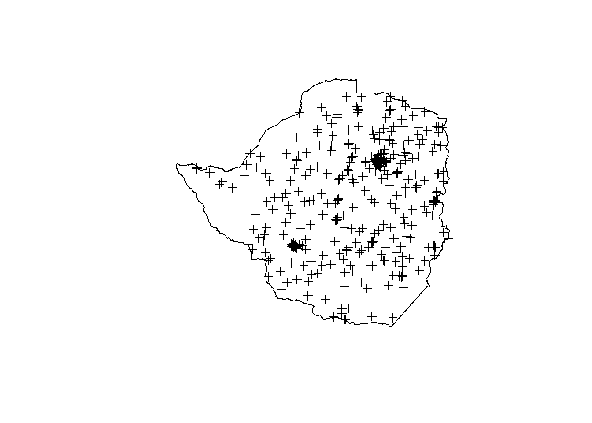
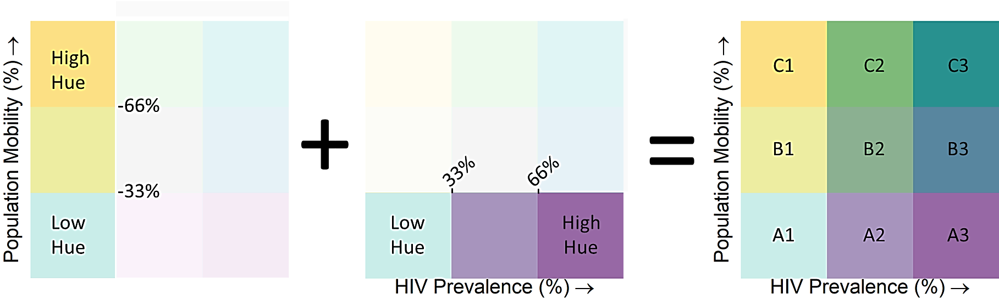

# Disease mapping 

Disease mapping is the process of visually depicting geographically indexed data in a spatial referenced distribution for explanatory purposes. Interpolation methods are commonly used to predict unknown values for any geographic data point. Classical methods such as Inverse Distance Weighting (IDW) interpolate the value at any location as a function of the distance to known values at observed locations. In other words, nearby points are weighted much higher than remote ones. Kriging is similar to IDW in that it weights the surrounding observed values to make a reliable prediction. However, Kriging also includes the spatial arrangement of points by determining the spatial autocorrelation (how correlated variables vary along distances) through a semi variogram calculation, accounting for data closeness, spatial continuity and redundancy. Consider the case of estimating the migration proportion at some unsampled location in Zimbabwe.

{width=150%,height=150%}

Now, consider the equation of a best linear unbiased predictor kriging and its covariance:

{width=30%}

<!-- $$ -->
<!-- y^{*}(\mu_{o}) = \sum_{\alpha = 1}^{n}w_{\alpha}y(\mu_{\alpha}) -->
<!-- $$ -->


<!-- $$ -->
<!-- \sigma_{\epsilon}^{2}(\mu)=C(0)+\sum_{\alpha = 1}^{n}w_{\alpha}C(\mu-\mu_{\alpha}) -->
<!-- $$ -->

The goal is to take and decompose the total variability of a spatial system in two components. One side we have the variable we want to model (migration, or HIV prevalence), and it is considered known $$\mu_{\alpha}$$. On the other side, we would have the residual component or the error of that interpolation. Residual is considered not known. Weights are unbiased and minimize the estimation variance. Then, the idea is to find the weights that minimize the variance (See Figure AC.2). The process of adapting variability, or heterogeneity, in the unknown process is of particular importance in spatial datasets. Therefore, the K-Bessel (also known as the Matern kernel) model has been used; this has become popular in the spatial statistics literature for gaussian processes. This model tends to produce surfaces that are on a very fine scale smoother than some other models (such as the exponential or spherical). For the range search, a fixed value of 50 km distance has been used for all countries. Each variogram has been tuned following that range. Then, a map is created joining estimated surfaces of two variables into a bivariate map.

# Pipeline summary 

Our visualization pipeline can be summarized as follows:

* Load datasets and extract variables of interest for the analysis
* Filter some unwanted individuals
* Perform some value recodes
* Create final files and export them

## Load datasets

Let's load our prepared dataset

```{r setup, include=TRUE, echo=TRUE, warning=FALSE,comment=FALSE,message=FALSE}
knitr::opts_chunk$set(comment="")
rm(list = ls())
library(foreign)
library(plyr)
library(tidyverse)
library(survey)
library(jtools)
library(kableExtra)
library(broom)
library(ggstance)
library(rgdal)
library(raster)
library(gstat)
library(leaflet)
library(leaflet.esri)
source("bivariate-helpers.R")
load("../data/zwe_dataset.RData")
```

## Prepare files 

Here we aggregate people by psu units and extimate the proportion of HIV+/- rates per psu. You can create female and male maps in similar way by avoiding the join of both datasets (rbind).

```{r}
all.mapped.data<-rbind(male.mapped.data,female.mapped.data)
summary(all.mapped.data$migstatus)
summary(all.mapped.data$hivStatus)

# 0_1y
table(all.mapped.data$hivStatus,all.mapped.data$migstatus)
sum(all.mapped.data$indivweight)
all.mapped.data$m0_1y.hiv<-0
all.mapped.data$m0_1y.hiv[all.mapped.data$migstatus=="0_1y" & all.mapped.data$hivStatus=="hiv+"]<-1*all.mapped.data$indivweight[all.mapped.data$migstatus=="0_1y" & all.mapped.data$hivStatus=="hiv+"]

all.mapped.data$m0_1y.nonhiv<-0
all.mapped.data$m0_1y.nonhiv[all.mapped.data$migstatus=="0_1y" & all.mapped.data$hivStatus=="hiv-"]<-1*all.mapped.data$indivweight[all.mapped.data$migstatus=="0_1y" & all.mapped.data$hivStatus=="hiv-"]

# 2+
all.mapped.data$gt1.hiv<-0
all.mapped.data$gt1.hiv[all.mapped.data$migstatus=="2+" & all.mapped.data$hivStatus=="hiv+"]<-1*all.mapped.data$indivweight[all.mapped.data$migstatus=="2+" & all.mapped.data$hivStatus=="hiv+"]

all.mapped.data$gt1.nonhiv<-0
all.mapped.data$gt1.nonhiv[all.mapped.data$migstatus=="2+" & all.mapped.data$hivStatus=="hiv-"]<-1*all.mapped.data$indivweight[all.mapped.data$migstatus=="2+" & all.mapped.data$hivStatus=="hiv-"]

# agregacion por cluster
all.psu <- as.data.frame.matrix(
  aggregate(cbind(
    all.mapped.data$m0_1y.hiv,
    all.mapped.data$m0_1y.nonhiv,
    all.mapped.data$gt1.hiv,
    all.mapped.data$gt1.nonhiv,
    all.mapped.data$indivweight) ~ all.mapped.data$PSU,
    FUN = sum, data = all.mapped.data))
names(all.psu) <- c(
  "DHSCLUST",
  "m0_1y_hiv",
  "m0_1y_nonhiv",
  "gt1_hiv",
  "gt1_nonhiv",
  "total_pop"
)

factor<-1

# 0_1y
all.psu$m0_1y_hiv_rate<-factor*all.psu$m0_1y_hiv/all.psu$total_pop # hiv migrants distribution

# gt1
all.psu$gt1_hiv_rate<-factor*(all.psu$gt1_hiv)/all.psu$total_pop
sum(all.psu$total_pop)

#all HIV
all.psu$allm0_1y_rate<-factor*(all.psu$m0_1y_hiv+all.psu$m0_1y_nonhiv)/all.psu$total_pop #all migrants distribution
all.psu$all_hiv_rate<-factor*(all.psu$m0_1y_hiv+all.psu$gt1_hiv)/all.psu$total_pop #all male hiv distribution
all.psu$pop_rate<-factor*(all.psu$total_pop)/sum(all.psu$total_pop) #all migrants distribution
# 
# write.csv(all.psu, paste0(Sys.Date(),"-zweall.csv"))
```

## Projection

We project our points to Wintripel in order to have a more balanced geometry (you can leave it as it comes).

```{r}
ZWE<-list(country="ZWE")
ZWE[["psu"]]<-all.psu
ZWE[["GPS"]]<-gpsData
ZWE[["ADM0"]]<-raster::getData('GADM', country='ZWE', level=0)
ZWE[["ADM1"]]<-raster::getData('GADM', country='ZWE', level=1)
ZWE[["epsg"]]<-crs("+proj=wintri +ellps=WGS84 +datum=WGS84 +units=km +no_defs +towgs84=0,0,0")


plot(ZWE$GPS)
plot(ZWE$ADM0,add=T)

# se eliminan psu por fuera del mapa
ZWE$GPS<-ZWE$GPS[ZWE$ADM0,]

ZWE[["GPS.prj"]]<-spTransform(ZWE$GPS, ZWE$epsg)
ZWE$ADM0.prj<-spTransform(ZWE$ADM0, ZWE$epsg)
ZWE$ADM1.prj<-spTransform(ZWE$ADM1, ZWE$epsg)

plot(ZWE$GPS.prj)
plot(ZWE$ADM0.prj,lwd=3,border="red",add=TRUE)

plot(ZWE$ADM1.prj,add=T)
```

## Grid creation

We need to define a grid where our interpolation method will infere values for unknown data. The lower the cell size the more cells you have and therefore the slower the calculation. 

```{r}
ZWE[["sp.psu"]]<-merge(ZWE$psu,data.frame(ZWE$GPS),by = "DHSCLUST") %>%
    dplyr::select(DHSCLUST,
            m0_1y_hiv,
            m0_1y_nonhiv,
            gt1_hiv,
            gt1_nonhiv,
            total_pop,
            m0_1y_hiv_rate,
            pop_rate,
            allm0_1y_rate,
            gt1_hiv_rate,
            all_hiv_rate,
            LATNUM,
            LONGNUM
            )


coordinates(ZWE$sp.psu) <- ~LONGNUM+LATNUM
proj4string(ZWE$sp.psu) <- proj4string(ZWE$GPS)
ZWE$sp.psu<-spTransform(ZWE$sp.psu,ZWE$epsg)
# we build an empty raster using ADM as template
ZWE[["rTemp"]]<- raster(ZWE$ADM0.prj)
cellSize<-10
res(ZWE$rTemp) <- cellSize  # 20 km if your CRS's units are in km
summary(ZWE$rTemp)
# convert raster to points
ZWE[["grid"]]<-rasterToPoints(ZWE$rTemp, spatial = TRUE)
# we create regular spatialized points from the raster
gridded(ZWE$grid) <- TRUE
st_grid <- as(ZWE$grid, "SpatialPixels")
plot(ZWE$grid)
plot(ZWE$ADM0.prj,lwt=2,lwd=3,
     # col="white",
     border="red",
     add=TRUE)

```

## Kriging for migration

We can create our kriging variogram (gstat) manually or proposing a predefined kernel. Mattern kernel is well suited for health analysis and it is commonly used in health-related interpolation problems as discussed above.


```{r}
##
ZWE[["myvg1"]] <- variogram(allm0_1y_rate~1, ZWE$sp.psu)
plot(ZWE$myvg1)
#check the range for small countries
range<-ifelse(ZWE$rTemp@ncols*cellSize>100 | ZWE$rTemp@nrows*cellSize>100,100,10)

ZWE[["vgmodel1"]]<-vgm(psill=1.0e-2, model="Mat", nugget=2.5e-4, range=range)
plot(ZWE$myvg1, model=ZWE$vgmodel1, main="Manual fit")

ZWE[["mat.fit1"]] <- fit.variogram(ZWE$myvg1,model=ZWE$vgmodel1,fit.ranges = F)
plot(ZWE$myvg1, model=ZWE$mat.fit1, main="Automatic fit")
############
ZWE[["krig1"]]<-krige(allm0_1y_rate~1,
                        ZWE$sp.psu,
                        ZWE$grid,
                        model = ZWE$mat.fit1,
                        nmin=2,
                        nmax=ifelse(nrow(ZWE$sp.psu)>1000,100,nrow(ZWE$sp.psu)/10)
                      )
ZWE[["krigM1"]] <- mask(raster(ZWE$krig1),ZWE$ADM0.prj)
plot(ZWE$krigM1,main='Migration rates (%)')
#ZWE[["lfLayer1"]]<-projectRasterForLeaflet(ZWE$krigM1,method = 'bilinear')
#ZWE$lfLayer1
```

## Kriging for hiv

```{r}
##
ZWE[["myvg2"]] <- variogram(all_hiv_rate~1, ZWE$sp.psu)
plot(ZWE$myvg2)
#check the range for small countries
range<-ifelse(ZWE$rTemp@ncols*5>100 | ZWE$rTemp@nrows*5>100,100,10)

ZWE[["vgmodel2"]]<-vgm(psill=1.0e-2, model="Mat", nugget=2.5e-4, range=range)
plot(ZWE$myvg2, model=ZWE$vgmodel2, main="Manual fit")

ZWE[["mat.fit2"]] <- fit.variogram(ZWE$myvg2,model=ZWE$vgmodel2,fit.ranges = F)
plot(ZWE$myvg2, model=ZWE$mat.fit2, main="Automatic fit")
############
ZWE[["krig2"]]<-krige(all_hiv_rate~1,
                        ZWE$sp.psu,
                        ZWE$grid,
                        model = ZWE$mat.fit2,
                        nmin=2,
                        nmax=ifelse(nrow(ZWE$sp.psu)>1000,100,nrow(ZWE$sp.psu)/10)
                      )
ZWE[["krigM2"]] <- mask(raster(ZWE$krig2),ZWE$ADM0.prj)
plot(ZWE$krigM2,main="HIV rates (%)")
# ZWE[["lfLayer2"]]<-projectRasterForLeaflet(ZWE$krigM2,method = 'bilinear')
# ZWE$lfLayer2
```


For both kriging maps, a bivariate palette has been designed to visually depict mobile individuals’ proportion and HIV prevalence in all countries. Each variable has been normalized and separated with an equal interval (Tertile) data classification type. In figure 2, the lowest value for both variables become A1, while the cell C3 represents the max for both Migration percent and HIV prevalence. Any combination of the two variables can be identified by its position in the color scheme. We now have a proper color scheme that we can use as categories to symbolize both continuous surfaces. Noteworthy is that extreme rates in bivariate maps could be misleading and insufficiently reliable due to some PSUs with small populations. Hence, map results should be interpreted with caution. The idea comes from [Joshua Stevens at NASA](https://www.joshuastevens.net/cartography/make-a-bivariate-choropleth-map/).

{width=150%,height=150%}

```{r}
# Define the number of breaks
nBreaks <- 3

# Create the colour matrix
col.matrix <- colmat(nquantiles = nBreaks, xlab = "HIV Prevalence (%)", ylab = "Population Mobility (%)", 
                     ## non default colours
                     upperleft = "#FEF287", upperright = "#21908D", bottomleft = "#E8F4F3", bottomright = "#9874A1",
                     #upperleft = "#BE64AC", upperright = "#3B4994", bottomleft = "#E8E8E8", bottomright = "#5AC8C8",
                     #upperleft = "#F7900A", upperright = "#993A65", bottomleft = "#44B360", bottomright = "#3A88B5",
                     #upperleft = "#64ACBE", upperright = "#574249", bottomleft = "#E8E8E8", bottomright = "#C85A5A",
                     saveLeg = TRUE, plotLeg = TRUE,fontSize = 20)

# create the bivariate raster
bivmap <- bivariate.map(rasterx = ZWE$krigM2, rastery = ZWE$krigM1,
                        export.colour.matrix = TRUE, outname = "bivMapCols",
                        colormatrix = col.matrix, nquantiles = nBreaks)
ZWE[["lfLayer"]]<-projectRasterForLeaflet(bivmap,method = 'ngb')
# Convert to dataframe for plotting with ggplot
bivMapDF <- as.data.frame(bivmap, xy = TRUE) %>%
  tbl_df() %>%
  dplyr::rename("BivValue" = 3) %>%
  gather(key = Variable, value = bivVal, na.rm = FALSE, BivValue)


```

## Mapping


```{r}
zLev=6
mapOptions<-leafletOptions(attributionControl=FALSE,
                           zoomControl = FALSE,
                           minZoom =zLev, maxZoom =zLev,
                           dragging = FALSE)

basemaps <- esriBasemapLayers
# basemaps
leafIcons <- icons(
  iconUrl = "img/north4.png",
  iconWidth = 40, iconHeight = 40,
  iconAnchorX=20, iconAnchorY = 20
)

legIcon <- icons(
  iconUrl = "bivLegend.png",
  iconWidth = 200, iconHeight = 200,
  iconAnchorX=100, iconAnchorY = 100
)

legBreaks <- icons(
  iconUrl = "breaksZWE.png",
  iconWidth = 430, iconHeight = 58,
  iconAnchorX=215, iconAnchorY = 29
)
invertPal<-T
selectedPal<-"Spectral" #RdPu   magma   Spectral viridis
centerLng<-28.5
centerLat<--19.2
```

```{r}
labelLon<-c(33.5,
            32.7,
            29.7,
            29.2,
            26.4,
            27.1)
labelLat<-c(-17.2,
            -17.6,
            -20.5,
            -20.8,
            -18.9,
            -19.2)

labels<-c("Mashonaland",
          "East",
          "Matabeleland",
          "South",
          "Matabeleland",
          "North")


map<-leaflet(options = mapOptions)%>%
  addProviderTiles(providers$Stamen.TonerLite,
                   options = providerTileOptions(opacity = 1,
                                                 detectRetina = TRUE)) %>%
  
  
  addRasterImage(ZWE$lfLayer,project = FALSE,maxBytes =  Inf,
                 colors = as.vector(col.matrix),opacity = 1
                )  %>%
  addPolygons(data=ZWE$ADM1, weight = 1, color="black",opacity = 0.3,fillOpacity = 0.0)%>%
  addMarkers(lng = centerLng+6.1, lat = centerLat-4, icon = leafIcons) %>%
  addMarkers(lng = centerLng-5.2, lat = centerLat-3.0, icon = legIcon) %>%
  # addProviderTiles(providers$Stamen.TonerLines,options = providerTileOptions(opacity = 0.65)) %>%
  # addProviderTiles(providers$Stamen.TonerLabels) %>%
  addLabelOnlyMarkers(
    lng = labelLon, lat =labelLat,
    label = labels,
    labelOptions = labelOptions(noHide = T, textOnly = T,
                                style = list(
                                  "color" = "black",
                                  "text-shadow"= "-1px 1px 0px white, 1px 1px 0 white,1px -1px 0 white,-1px -1px 0 white",
                                  "font-style" = "bold",
                                  "font-size" = "15px"
                                  ))) %>%
  addScaleBar(position = "topright") %>%
  setView( centerLng,centerLat,zoom = 6)

map

```

## References 

- Philip GM, Watson DF; A Precise Method for Determining Contoured Surfaces. The APPEA Journal 1982;22(1):205-212. doi: https://doi.org/10.1071/AJ81016.
- Stein ML. Interpolation of spatial data. New York: Springer-Verlag, 1999.
- Pebesma EJ; Multivariable geostatistics in S: the gstat package.

