Unit 3: Kriging & bivariate maps in R
================
Esteban Correa
November, 2019

# Disease mapping

Disease mapping is the process of visually depicting geographically
indexed data in a spatial referenced distribution for explanatory
purposes. Interpolation methods are commonly used to predict unknown
values for any geographic data point. Classical methods such as Inverse
Distance Weighting (IDW) interpolate the value at any location as a
function of the distance to known values at observed locations. In other
words, nearby points are weighted much higher than remote ones. Kriging
is similar to IDW in that it weights the surrounding observed values to
make a reliable prediction. However, Kriging also includes the spatial
arrangement of points by determining the spatial autocorrelation (how
correlated variables vary along distances) through a semi variogram
calculation, accounting for data closeness, spatial continuity and
redundancy. Consider the case of estimating the migration proportion at
some unsampled location in Zimbabwe.

<figure>
<figcaption aria-hidden="true">Sampling locations for Zimbabwe (PSU)</figcaption>
</figure>

Now, consider the equation of a best linear unbiased predictor kriging
and its covariance:


<!-- $$ -->
<!-- y^{*}(\mu_{o}) = \sum_{\alpha = 1}^{n}w_{\alpha}y(\mu_{\alpha}) -->
<!-- $$ -->
<!-- $$ -->
<!-- \sigma_{\epsilon}^{2}(\mu)=C(0)+\sum_{\alpha = 1}^{n}w_{\alpha}C(\mu-\mu_{\alpha}) -->
<!-- $$ -->

The goal is to take and decompose the total variability of a spatial
system in two components. One side we have the variable we want to model
(migration, or HIV prevalence), and it is considered known
*μ*<sub>*α*</sub>
. On the other side, we would have the residual component or the error
of that interpolation. Residual is considered not known. Weights are
unbiased and minimize the estimation variance. Then, the idea is to find
the weights that minimize the variance (See Figure AC.2). The process of
adapting variability, or heterogeneity, in the unknown process is of
particular importance in spatial datasets. Therefore, the K-Bessel (also
known as the Matern kernel) model has been used; this has become popular
in the spatial statistics literature for gaussian processes. This model
tends to produce surfaces that are on a very fine scale smoother than
some other models (such as the exponential or spherical). For the range
search, a fixed value of 50 km distance has been used for all countries.
Each variogram has been tuned following that range. Then, a map is
created joining estimated surfaces of two variables into a bivariate
map.

# Pipeline summary

Our visualization pipeline can be summarized as follows:

-   Load datasets and extract variables of interest for the analysis
-   Filter some unwanted individuals
-   Perform some value recodes
-   Create final files and export them

## Load datasets

Let’s load our prepared dataset

``` r
knitr::opts_chunk$set(comment="")
rm(list = ls())
library(foreign)
library(plyr)
library(tidyverse)
library(survey)
library(jtools)
library(kableExtra)
library(broom)
library(ggstance)
library(rgdal)
library(raster)
library(gstat)
library(leaflet)
library(leaflet.esri)
source("bivariate-helpers.R")
load("../data/zwe_dataset.RData")
```

## Prepare files

Here we aggregate people by psu units and extimate the proportion of
HIV+/- rates per psu. You can create female and male maps in similar way
by avoiding the join of both datasets (rbind).

``` r
all.mapped.data<-rbind(male.mapped.data,female.mapped.data)
summary(all.mapped.data$migstatus)
```

     0_1y    2+ 
     1312 14475 

``` r
summary(all.mapped.data$hivStatus)
```

     hiv-  hiv+ 
    13487  2300 

``` r
# 0_1y
table(all.mapped.data$hivStatus,all.mapped.data$migstatus)
```

          
            0_1y    2+
      hiv-  1141 12346
      hiv+   171  2129

``` r
sum(all.mapped.data$indivweight)
```

    [1] 15740.66

``` r
all.mapped.data$m0_1y.hiv<-0
all.mapped.data$m0_1y.hiv[all.mapped.data$migstatus=="0_1y" & all.mapped.data$hivStatus=="hiv+"]<-1*all.mapped.data$indivweight[all.mapped.data$migstatus=="0_1y" & all.mapped.data$hivStatus=="hiv+"]

all.mapped.data$m0_1y.nonhiv<-0
all.mapped.data$m0_1y.nonhiv[all.mapped.data$migstatus=="0_1y" & all.mapped.data$hivStatus=="hiv-"]<-1*all.mapped.data$indivweight[all.mapped.data$migstatus=="0_1y" & all.mapped.data$hivStatus=="hiv-"]

# 2+
all.mapped.data$gt1.hiv<-0
all.mapped.data$gt1.hiv[all.mapped.data$migstatus=="2+" & all.mapped.data$hivStatus=="hiv+"]<-1*all.mapped.data$indivweight[all.mapped.data$migstatus=="2+" & all.mapped.data$hivStatus=="hiv+"]

all.mapped.data$gt1.nonhiv<-0
all.mapped.data$gt1.nonhiv[all.mapped.data$migstatus=="2+" & all.mapped.data$hivStatus=="hiv-"]<-1*all.mapped.data$indivweight[all.mapped.data$migstatus=="2+" & all.mapped.data$hivStatus=="hiv-"]

# agregacion por cluster
all.psu <- as.data.frame.matrix(
  aggregate(cbind(
    all.mapped.data$m0_1y.hiv,
    all.mapped.data$m0_1y.nonhiv,
    all.mapped.data$gt1.hiv,
    all.mapped.data$gt1.nonhiv,
    all.mapped.data$indivweight) ~ all.mapped.data$PSU,
    FUN = sum, data = all.mapped.data))
names(all.psu) <- c(
  "DHSCLUST",
  "m0_1y_hiv",
  "m0_1y_nonhiv",
  "gt1_hiv",
  "gt1_nonhiv",
  "total_pop"
)

factor<-1

# 0_1y
all.psu$m0_1y_hiv_rate<-factor*all.psu$m0_1y_hiv/all.psu$total_pop # hiv migrants distribution

# gt1
all.psu$gt1_hiv_rate<-factor*(all.psu$gt1_hiv)/all.psu$total_pop
sum(all.psu$total_pop)
```

    [1] 15740.66

``` r
#all HIV
all.psu$allm0_1y_rate<-factor*(all.psu$m0_1y_hiv+all.psu$m0_1y_nonhiv)/all.psu$total_pop #all migrants distribution
all.psu$all_hiv_rate<-factor*(all.psu$m0_1y_hiv+all.psu$gt1_hiv)/all.psu$total_pop #all male hiv distribution
all.psu$pop_rate<-factor*(all.psu$total_pop)/sum(all.psu$total_pop) #all migrants distribution
# 
# write.csv(all.psu, paste0(Sys.Date(),"-zweall.csv"))
```

## Projection

We project our points to Wintripel in order to have a more balanced
geometry (you can leave it as it comes).

``` r
ZWE<-list(country="ZWE")
ZWE[["psu"]]<-all.psu
ZWE[["GPS"]]<-gpsData
ZWE[["ADM0"]]<-raster::getData('GADM', country='ZWE', level=0)
ZWE[["ADM1"]]<-raster::getData('GADM', country='ZWE', level=1)
ZWE[["epsg"]]<-crs("+proj=wintri +ellps=WGS84 +datum=WGS84 +units=km +no_defs +towgs84=0,0,0")


plot(ZWE$GPS)
plot(ZWE$ADM0,add=T)
```

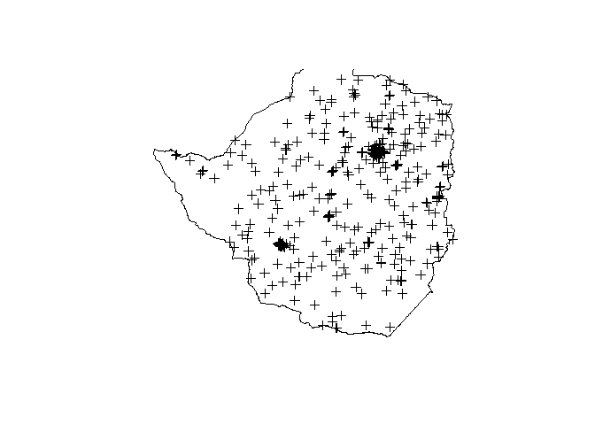<!-- -->

``` r
# se eliminan psu por fuera del mapa
ZWE$GPS<-ZWE$GPS[ZWE$ADM0,]

ZWE[["GPS.prj"]]<-spTransform(ZWE$GPS, ZWE$epsg)
ZWE$ADM0.prj<-spTransform(ZWE$ADM0, ZWE$epsg)
ZWE$ADM1.prj<-spTransform(ZWE$ADM1, ZWE$epsg)

plot(ZWE$GPS.prj)
plot(ZWE$ADM0.prj,lwd=3,border="red",add=TRUE)

plot(ZWE$ADM1.prj,add=T)
```

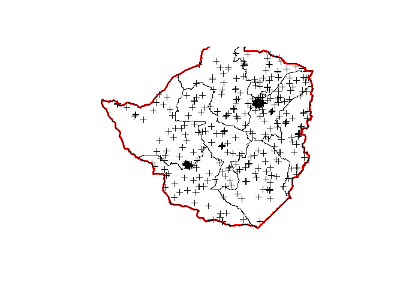<!-- -->

## Grid creation

We need to define a grid where our interpolation method will infere
values for unknown data. The lower the cell size the more cells you have
and therefore the slower the calculation.

``` r
ZWE[["sp.psu"]]<-merge(ZWE$psu,data.frame(ZWE$GPS),by = "DHSCLUST") %>%
    dplyr::select(DHSCLUST,
            m0_1y_hiv,
            m0_1y_nonhiv,
            gt1_hiv,
            gt1_nonhiv,
            total_pop,
            m0_1y_hiv_rate,
            pop_rate,
            allm0_1y_rate,
            gt1_hiv_rate,
            all_hiv_rate,
            LATNUM,
            LONGNUM
            )


coordinates(ZWE$sp.psu) <- ~LONGNUM+LATNUM
proj4string(ZWE$sp.psu) <- proj4string(ZWE$GPS)
```

    Warning in proj4string(ZWE$GPS): CRS object has comment, which is lost in output

``` r
ZWE$sp.psu<-spTransform(ZWE$sp.psu,ZWE$epsg)
# we build an empty raster using ADM as template
ZWE[["rTemp"]]<- raster(ZWE$ADM0.prj)
cellSize<-10
res(ZWE$rTemp) <- cellSize  # 20 km if your CRS's units are in km
summary(ZWE$rTemp)
```

            layer
    Min.       NA
    1st Qu.    NA
    Median     NA
    3rd Qu.    NA
    Max.       NA
    NA's       NA

``` r
# convert raster to points
ZWE[["grid"]]<-rasterToPoints(ZWE$rTemp, spatial = TRUE)
# we create regular spatialized points from the raster
gridded(ZWE$grid) <- TRUE
st_grid <- as(ZWE$grid, "SpatialPixels")
plot(ZWE$grid)
plot(ZWE$ADM0.prj,lwt=2,lwd=3,
     # col="white",
     border="red",
     add=TRUE)
```

    Warning in polypath(x = mcrds[, 1], y = mcrds[, 2], border = border, col =
    col, : "lwt" is not a graphical parameter

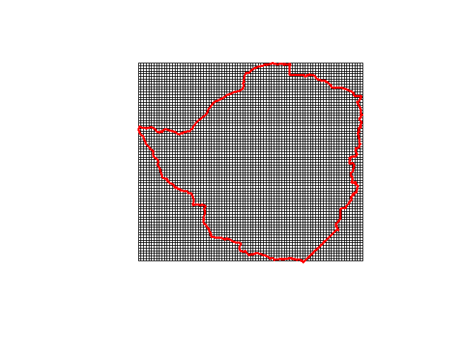<!-- -->

## Kriging for migration

We can create our kriging variogram (gstat) manually or proposing a
predefined kernel. Mattern kernel is well suited for health analysis and
it is commonly used in health-related interpolation problems as
discussed above.

``` r
##
ZWE[["myvg1"]] <- variogram(allm0_1y_rate~1, ZWE$sp.psu)
plot(ZWE$myvg1)
```

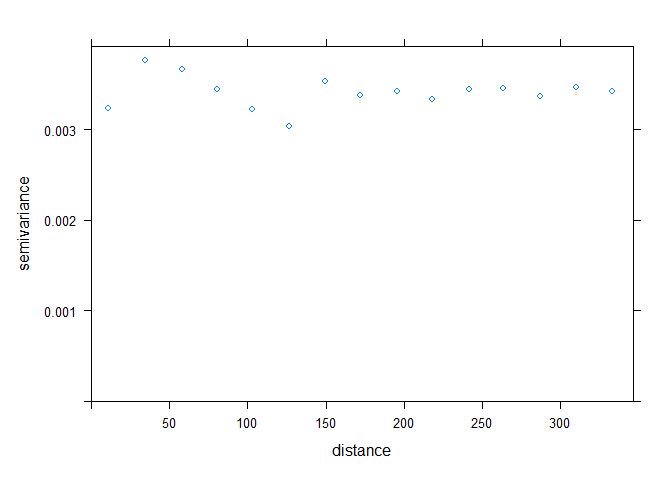<!-- -->

``` r
#check the range for small countries
range<-ifelse(ZWE$rTemp@ncols*cellSize>100 | ZWE$rTemp@nrows*cellSize>100,100,10)

ZWE[["vgmodel1"]]<-vgm(psill=1.0e-2, model="Mat", nugget=2.5e-4, range=range)
plot(ZWE$myvg1, model=ZWE$vgmodel1, main="Manual fit")
```

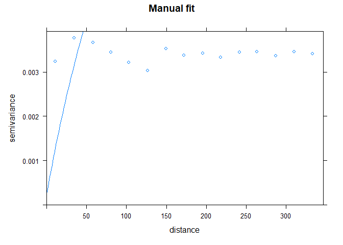<!-- -->

``` r
ZWE[["mat.fit1"]] <- fit.variogram(ZWE$myvg1,model=ZWE$vgmodel1,fit.ranges = F)
plot(ZWE$myvg1, model=ZWE$mat.fit1, main="Automatic fit")
```

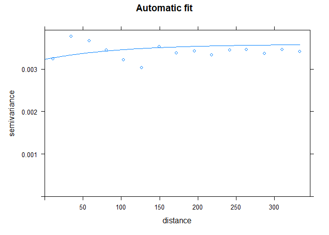<!-- -->

``` r
############
ZWE[["krig1"]]<-krige(allm0_1y_rate~1,
                        ZWE$sp.psu,
                        ZWE$grid,
                        model = ZWE$mat.fit1,
                        nmin=2,
                        nmax=ifelse(nrow(ZWE$sp.psu)>1000,100,nrow(ZWE$sp.psu)/10)
                      )
```

    [using ordinary kriging]

``` r
ZWE[["krigM1"]] <- mask(raster(ZWE$krig1),ZWE$ADM0.prj)
plot(ZWE$krigM1,main='Migration rates (%)')
```

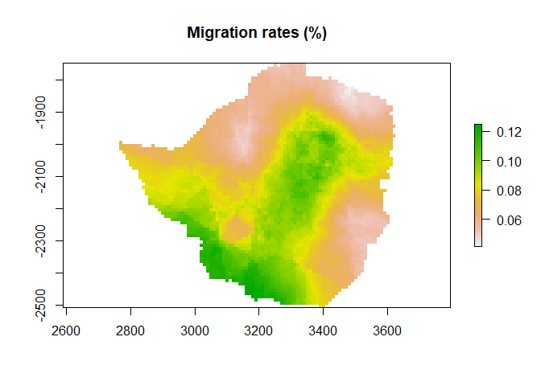<!-- -->

``` r
#ZWE[["lfLayer1"]]<-projectRasterForLeaflet(ZWE$krigM1,method = 'bilinear')
#ZWE$lfLayer1
```

## Kriging for hiv

``` r
##
ZWE[["myvg2"]] <- variogram(all_hiv_rate~1, ZWE$sp.psu)
plot(ZWE$myvg2)
```

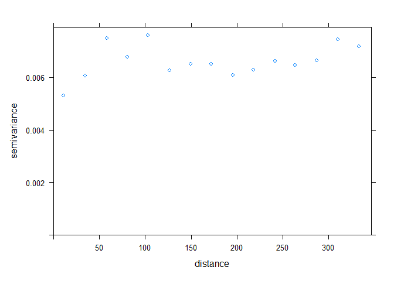<!-- -->

``` r
#check the range for small countries
range<-ifelse(ZWE$rTemp@ncols*5>100 | ZWE$rTemp@nrows*5>100,100,10)

ZWE[["vgmodel2"]]<-vgm(psill=1.0e-2, model="Mat", nugget=2.5e-4, range=range)
plot(ZWE$myvg2, model=ZWE$vgmodel2, main="Manual fit")
```

<!-- -->

``` r
ZWE[["mat.fit2"]] <- fit.variogram(ZWE$myvg2,model=ZWE$vgmodel2,fit.ranges = F)
plot(ZWE$myvg2, model=ZWE$mat.fit2, main="Automatic fit")
```

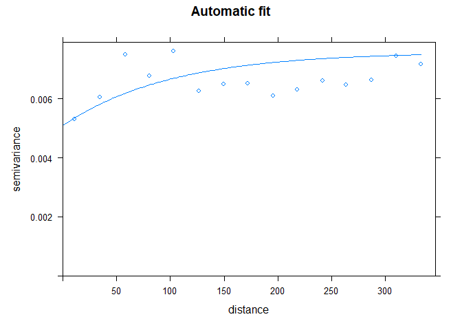<!-- -->

``` r
############
ZWE[["krig2"]]<-krige(all_hiv_rate~1,
                        ZWE$sp.psu,
                        ZWE$grid,
                        model = ZWE$mat.fit2,
                        nmin=2,
                        nmax=ifelse(nrow(ZWE$sp.psu)>1000,100,nrow(ZWE$sp.psu)/10)
                      )
```

    [using ordinary kriging]

``` r
ZWE[["krigM2"]] <- mask(raster(ZWE$krig2),ZWE$ADM0.prj)
plot(ZWE$krigM2,main="HIV rates (%)")
```

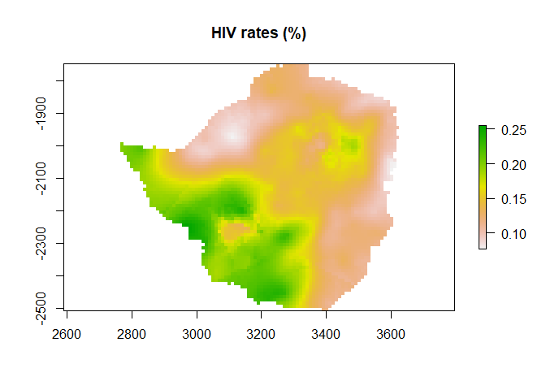<!-- -->

``` r
# ZWE[["lfLayer2"]]<-projectRasterForLeaflet(ZWE$krigM2,method = 'bilinear')
# ZWE$lfLayer2
```

For both kriging maps, a bivariate palette has been designed to visually
depict mobile individuals’ proportion and HIV prevalence in all
countries. Each variable has been normalized and separated with an equal
interval (Tertile) data classification type. In figure 2, the lowest
value for both variables become A1, while the cell C3 represents the max
for both Migration percent and HIV prevalence. Any combination of the
two variables can be identified by its position in the color scheme. We
now have a proper color scheme that we can use as categories to
symbolize both continuous surfaces. Noteworthy is that extreme rates in
bivariate maps could be misleading and insufficiently reliable due to
some PSUs with small populations. Hence, map results should be
interpreted with caution. The idea comes from [Joshua Stevens at
NASA](https://www.joshuastevens.net/cartography/make-a-bivariate-choropleth-map/).

<figure>
<figcaption aria-hidden="true">Tertile bivariate color scheme</figcaption>
</figure>

``` r
# Define the number of breaks
nBreaks <- 3

# Create the colour matrix
col.matrix <- colmat(nquantiles = nBreaks, xlab = "HIV Prevalence (%)", ylab = "Population Mobility (%)", 
                     ## non default colours
                     upperleft = "#FEF287", upperright = "#21908D", bottomleft = "#E8F4F3", bottomright = "#9874A1",
                     #upperleft = "#BE64AC", upperright = "#3B4994", bottomleft = "#E8E8E8", bottomright = "#5AC8C8",
                     #upperleft = "#F7900A", upperright = "#993A65", bottomleft = "#44B360", bottomright = "#3A88B5",
                     #upperleft = "#64ACBE", upperright = "#574249", bottomleft = "#E8E8E8", bottomright = "#C85A5A",
                     saveLeg = TRUE, plotLeg = TRUE,fontSize = 20)
```

    Loading required package: classInt

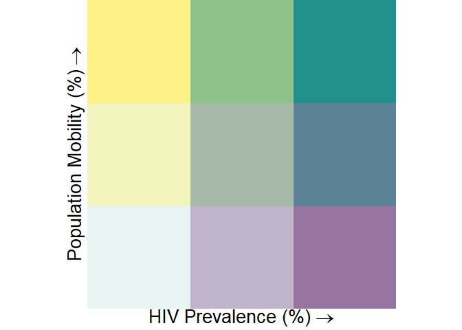<!-- -->

``` r
# create the bivariate raster
bivmap <- bivariate.map(rasterx = ZWE$krigM2, rastery = ZWE$krigM1,
                        export.colour.matrix = TRUE, outname = "bivMapCols",
                        colormatrix = col.matrix, nquantiles = nBreaks)
```

           0% 33.33333% 66.66667%      100% 
          7.7      12.5      16.3      25.5 
           0% 33.33333% 66.66667%      100% 
          4.2       6.9       8.8      12.5 

``` r
ZWE[["lfLayer"]]<-projectRasterForLeaflet(bivmap,method = 'ngb')
```

    Warning in showSRID(uprojargs, format = "PROJ", multiline = "NO", prefer_proj =
    prefer_proj): Discarded ellps WGS 84 in Proj4 definition: +proj=merc +a=6378137
    +b=6378137 +lat_ts=0 +lon_0=0 +x_0=0 +y_0=0 +k=1 +units=m +nadgrids=@null
    +wktext +no_defs +type=crs

    Warning in showSRID(uprojargs, format = "PROJ", multiline = "NO", prefer_proj =
    prefer_proj): Discarded datum World Geodetic System 1984 in Proj4 definition

``` r
# Convert to dataframe for plotting with ggplot
bivMapDF <- as.data.frame(bivmap, xy = TRUE) %>%
  tbl_df() %>%
  dplyr::rename("BivValue" = 3) %>%
  gather(key = Variable, value = bivVal, na.rm = FALSE, BivValue)
```

    Warning: `tbl_df()` was deprecated in dplyr 1.0.0.
    Please use `tibble::as_tibble()` instead.

## Mapping

``` r
zLev=6
mapOptions<-leafletOptions(attributionControl=FALSE,
                           zoomControl = FALSE,
                           minZoom =zLev, maxZoom =zLev,
                           dragging = FALSE)

basemaps <- esriBasemapLayers
# basemaps
leafIcons <- icons(
  iconUrl = "img/north4.png",
  iconWidth = 40, iconHeight = 40,
  iconAnchorX=20, iconAnchorY = 20
)

legIcon <- icons(
  iconUrl = "bivLegend.png",
  iconWidth = 200, iconHeight = 200,
  iconAnchorX=100, iconAnchorY = 100
)

legBreaks <- icons(
  iconUrl = "breaksZWE.png",
  iconWidth = 430, iconHeight = 58,
  iconAnchorX=215, iconAnchorY = 29
)
invertPal<-T
selectedPal<-"Spectral" #RdPu   magma   Spectral viridis
centerLng<-28.5
centerLat<--19.2
```

``` r
labelLon<-c(33.5,
            32.7,
            29.7,
            29.2,
            26.4,
            27.1)
labelLat<-c(-17.2,
            -17.6,
            -20.5,
            -20.8,
            -18.9,
            -19.2)

labels<-c("Mashonaland",
          "East",
          "Matabeleland",
          "South",
          "Matabeleland",
          "North")


map<-leaflet(options = mapOptions)%>%
  addProviderTiles(providers$Stamen.TonerLite,
                   options = providerTileOptions(opacity = 1,
                                                 detectRetina = TRUE)) %>%
  
  
  addRasterImage(ZWE$lfLayer,project = FALSE,maxBytes =  Inf,
                 colors = as.vector(col.matrix),opacity = 1
                )  %>%
  addPolygons(data=ZWE$ADM1, weight = 1, color="black",opacity = 0.3,fillOpacity = 0.0)%>%
  addMarkers(lng = centerLng+6.1, lat = centerLat-4, icon = leafIcons) %>%
  addMarkers(lng = centerLng-5.2, lat = centerLat-3.0, icon = legIcon) %>%
  # addProviderTiles(providers$Stamen.TonerLines,options = providerTileOptions(opacity = 0.65)) %>%
  # addProviderTiles(providers$Stamen.TonerLabels) %>%
  addLabelOnlyMarkers(
    lng = labelLon, lat =labelLat,
    label = labels,
    labelOptions = labelOptions(noHide = T, textOnly = T,
                                style = list(
                                  "color" = "black",
                                  "text-shadow"= "-1px 1px 0px white, 1px 1px 0 white,1px -1px 0 white,-1px -1px 0 white",
                                  "font-style" = "bold",
                                  "font-size" = "15px"
                                  ))) %>%
  addScaleBar(position = "topright") %>%
  setView( centerLng,centerLat,zoom = 6)
```

    Warning in showSRID(uprojargs, format = "PROJ", multiline = "NO", prefer_proj =
    prefer_proj): Discarded ellps WGS 84 in Proj4 definition: +proj=merc +a=6378137
    +b=6378137 +lat_ts=0 +lon_0=0 +x_0=0 +y_0=0 +k=1 +units=m +nadgrids=@null
    +wktext +no_defs +type=crs

    Warning in showSRID(uprojargs, format = "PROJ", multiline = "NO", prefer_proj =
    prefer_proj): Discarded datum World Geodetic System 1984 in Proj4 definition

``` r
map
```

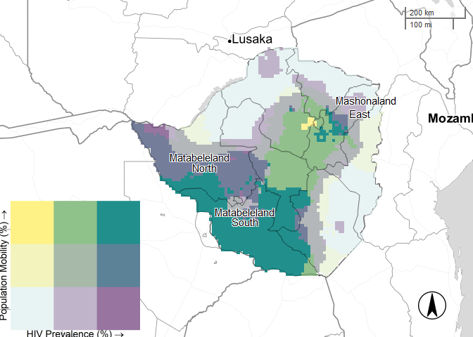<!-- -->

## References

-   Philip GM, Watson DF; A Precise Method for Determining Contoured
    Surfaces. The APPEA Journal 1982;22(1):205-212. doi:
    <a href="https://doi.org/10.1071/AJ81016" class="uri">https://doi.org/10.1071/AJ81016</a>.
-   Stein ML. Interpolation of spatial data. New York:
    Springer-Verlag, 1999.
-   Pebesma EJ; Multivariable geostatistics in S: the gstat package.
